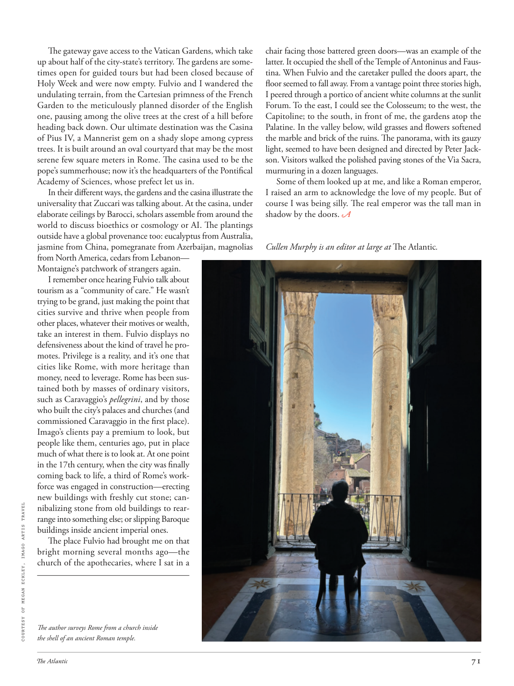

# The Atlantic — August 2026

## Page 73

---

The gateway gave access to the Vatican Gardens, which take up about half of the city-state’s territory. The gardens are sometimes open for guided tours but had been closed because of Holy Week and were now empty. Fulvio and I wandered the undulating terrain, from the Cartesian primness of the French Garden to the meticulously planned disorder of the English one, pausing among the olive trees at the crest of a hill before heading back down. Our ultimate destination was the Casina of Pius IV, a Mannerist gem on a shady slope among cypress trees. It is built around an oval courtyard that may be the most serene few square meters in Rome. The casina used to be the pope’s summerhouse; now it’s the headquarters of the Pontifical Academy of Sciences, whose prefect let us in.

**【中文翻译】** 该门户可通往梵蒂冈花园，该花园占据了该城邦约一半的领土。花园有时会开放供导游参观，但由于圣周而关闭，现在空无一人。富尔维奥和我在起伏的地形中漫步，从法国花园的笛卡尔式拘谨到英国花园精心设计的混乱，在山顶的橄榄树丛中停了下来，然后返回。我们的最终目的地是庇护四世的卡西纳 (Casina of Pius IV)，这是一座风格主义的瑰宝，坐落在柏树林荫的斜坡上。它围绕着一个椭圆形庭院而建，这可能是罗马最宁静的几平方米。该赌场曾经是教皇的避暑别墅。现在是罗马教皇科学院的总部，院长让我们进去的。

In their different ways, the gardens and the casina illustrate the universality that Zuccari was talking about. At the casina, under elaborate ceilings by Barocci, scholars assemble from around the world to discuss bioethics or cosmology or AI. The plantings outside have a global provenance too: eucalyptus from Australia, jasmine from China, pomegranate from Azerbaijan, magnolias from North America, cedars from Lebanon— Montaigne’s patchwork of strangers again.

**【中文翻译】** 花园和赌场以不同的方式说明了祖卡里所说的普遍性。在赌场里，在巴洛奇精心设计的天花板下，来自世界各地的学者聚集在一起讨论生物伦理学、宇宙学或人工智能。外面的植物也有全球来源：来自澳大利亚的桉树、来自中国的茉莉花、来自阿塞拜疆的石榴、来自北美的木兰、来自​​黎巴嫩的雪松——蒙田又是陌生人的拼凑而成。

I remember once hearing Fulvio talk about tourism as a “community of care.” He wasn’t trying to be grand, just making the point that cities survive and thrive when people from other places, whatever their motives or wealth, take an interest in them. Fulvio displays no defensiveness about the kind of travel he promotes. Privilege is a reality, and it’s one that cities like Rome, with more heritage than money, need to leverage. Rome has been sustained both by masses of ordinary visitors, such as Caravaggio’s pellegrini , and by those who built the city’s palaces and churches (and commissioned Caravaggio in the first place).

**【中文翻译】** 我记得有一次听富尔维奥谈论旅游业是一个“关怀社区”。他并不是想夸大其词，只是指出，当来自其他地方的人们，无论他们的动机或财富如何，对城市感兴趣时，城市就会生存和繁荣。富尔维奥对他所提倡的旅行方式没有表现出任何防御态度。特权是一种现实，像罗马这样拥有更多遗产而不是金钱的城市需要利用这一点。罗马的维持既靠大批普通游客，如卡拉瓦乔的佩莱格里尼，也靠那些建造这座城市的宫殿和教堂的人（首先是卡拉瓦乔委托建造的）。

Imago’s clients pay a premium to look, but people like them, centuries ago, put in place much of what there is to look at. At one point in the 17th century, when the city was finally coming back to life, a third of Rome’s workforce was engaged in construction—erecting new buildings with freshly cut stone; can-

**【中文翻译】** Imago 的客户需要支付额外费用才能观看，但像他们这样的人在几个世纪前就已经把大部分可供观看的东西都准备好了。 17 世纪的某个时刻，当这座城市终于恢复生机时，罗马三分之一的劳动力从事建筑工作——用新切割的石头建造新建筑；能-

*COURTESY OF MEGAN ECKLEY, IMAGO ARTIS TRAVEL*

*【图注与署名】由 IMAGO ARTIS TRAVEL 梅根·埃克利 (MEGAN ECKLEY) 提供*

nibalizing stone from old buildings to rearrange into something else; or slipping Baroque buildings inside ancient imperial ones. The place Fulvio had brought me on that bright morning several months ago—the church of the apothecaries, where I sat in a The author surveys Rome from a church inside the shell of an ancient Roman temple. chair facing those battered green doors—was an example of the latter. It occupied the shell of the Temple of Antoninus and Faustina. When Fulvio and the caretaker pulled the doors apart, the floor seemed to fall away. From a vantage point three stories high, I peered through a portico of ancient white columns at the sunlit Forum. To the east, I could see the Colosseum; to the west, the Capitoline; to the south, in front of me, the gardens atop the Palatine. In the valley below, wild grasses and flowers softened the marble and brick of the ruins. The panorama, with its gauzy light, seemed to have been designed and directed by Peter Jackson. Visitors walked the polished paving stones of the Via Sacra, murmuring in a dozen languages.

**【中文翻译】** 将旧建筑中的石头啃食以重新排列成其他东西；或者将巴洛克式建筑塞进古老的皇家建筑中。几个月前那个明媚的早晨，富尔维奥带我去的地方是药剂师教堂，我坐在一座古罗马神庙外壳内的教堂里，俯瞰着罗马。面向那些破旧的绿色门的椅子——就是后者的一个例子。它占据了安东尼努斯和福斯蒂娜神庙的外壳。当富尔维奥和看门人把门拉开时，地板似乎脱落了。我站在三层楼高的有利位置，透过古老的白色柱廊凝视着阳光明媚的论坛。向东，我可以看到罗马斗兽场；向东，我可以看到罗马斗兽场。西边是卡比托利欧；向南，在我面前，是帕拉丁山顶上的花园。下面的山谷里，野草和野花软化了废墟的大理石和砖块。这张全景图，带着轻纱般的光线，似乎是由彼得·杰克逊设计和导演的。游客们走在神圣之路（Via Sacra）抛光的铺路石上，用十几种语言低语。

Some of them looked up at me, and like a Roman emperor, I raised an arm to acknowledge the love of my people. But of course I was being silly. The real emperor was the tall man in shadow by the doors. Cullen Murphy is an editor at large at The Atlantic .

**【中文翻译】** 他们中的一些人抬头看着我，我像罗马皇帝一样举起手臂来表达对我人民的爱。但当然我很傻。真正的皇帝是门边阴影中的高个子男人。卡伦·墨菲 (Cullen Murphy) 是《大西洋月刊》的特约编辑。
