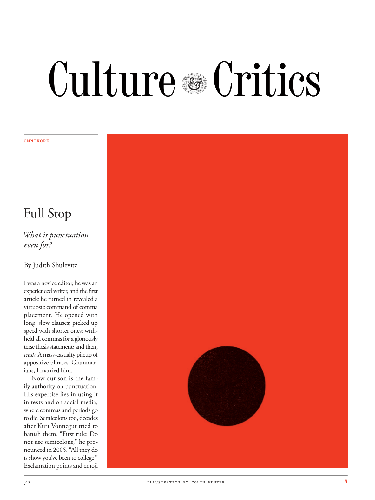

# The Atlantic — August 2026

## Page 74

---

### Full Stop

**【标题翻译】** 句号

What is punctuation even for? By Judith Shulevitz I was a novice editor, he was an experienced writer, and the first article he turned in revealed a virtuosic command of comma placement. He opened with long, slow clauses; picked up speed with shorter ones; withheld all commas for a gloriously terse thesis statement; and then, crash ! A mass-casualty pileup of appositive phrases. Grammarians, I married him.

**【中文翻译】** 标点符号到底有什么用？作者：朱迪思·舒莱维茨（Judith Shulevitz） 我是一名新手编辑，他是一位经验丰富的作家，他提交的第一篇文章展现了他对逗号放置的高超技巧。他以长而缓慢的从句开始；较短的速度加快；保留所有逗号以实现极其简洁的论文陈述；然后，崩溃！同位语短语堆积如山，造成大量人员伤亡。语法学家，我嫁给了他。

Now our son is the family authority on punctuation. His expertise lies in using it in texts and on social media, where commas and periods go to die. Semicolons too, decades after Kurt Vonnegut tried to banish them. “First rule: Do not use semi colons,” he pronounced in 2005. “All they do is show you’ve been to college.”

**【中文翻译】** 现在我们的儿子是标点符号方面的家庭权威。他的专长在于在文本和社交媒体上使用它，其中逗号和句号会消失。分号也是如此，几十年前库尔特·冯内古特（Kurt Vonnegut）试图消除分号。 “第一条规则：不要使用分号，”他在 2005 年宣称。“它们所做的只是表明你上过大学。”

Exclamation points and emoji

**【中文翻译】** 感叹号和表情符号

*ILLUSTRATION BY COLIN HUNTER*

*【图注与署名】科林·亨特绘制的插图*
