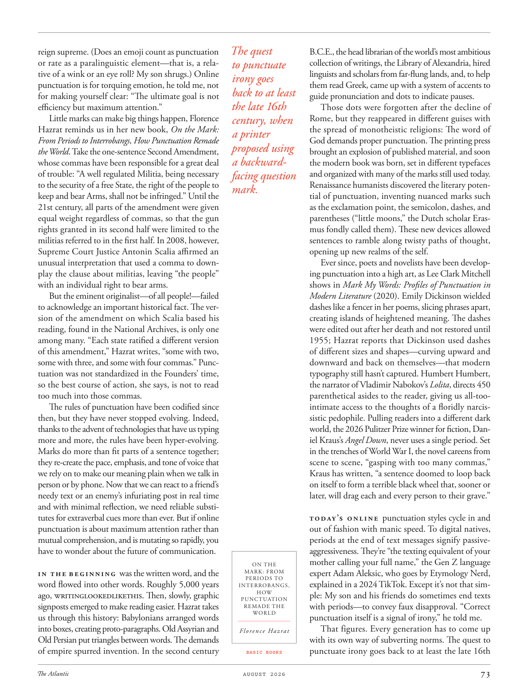

# The Atlantic — August 2026

## Page 75

---

reign supreme. (Does an emoji count as punctuation or rate as a paralinguistic element—that is, a relative of a wink or an eye roll? My son shrugs.) Online punctuation is for torquing emotion, he told me, not for making yourself clear: “The ultimate goal is not efficiency but maximum attention.”

**【中文翻译】** 统治至高无上。 （表情符号是否算作标点符号或速率作为副语言元素，即眨眼或翻白眼的亲戚？我儿子耸耸肩。）他告诉我，在线标点符号是为了扭转情绪，而不是为了让自己清楚：“最终目标不是效率，而是最大程度的关注。”

Little marks can make big things happen, Florence Hazrat reminds us in her new book, On the Mark: From Periods to Interrobangs, How Punctuation Remade the World . Take the onesentence Second Amendment, whose commas have been responsible for a great deal of trouble: “A well regulated Militia, being necessary to the security of a free State, the right of the people to keep and bear Arms, shall not be infringed.” Until the 21st century, all parts of the amendment were given equal weight regardless of commas, so that the gun rights granted in its second half were limited to the militias referred to in the first half. In 2008, however, Supreme Court Justice Antonin Scalia affirmed an unusual interpretation that used a comma to downplay the clause about militias, leaving “the people” with an individual right to bear arms.

**【中文翻译】** 弗洛伦斯·哈兹拉特（Florence Hazrat）在她的新书《论标记：从句号到问号，标点符号如何重塑世界》中提醒我们，小标记可以成就大事。以第二修正案中的一句话为例，其中的逗号造成了很多麻烦：“一支管理良好的民兵对于自由州的安全是必要的，人民持有和携带武器的权利不得受到侵犯。”直到21世纪，修正案的所有部分无论逗号如何都被赋予同等的权重，因此后半部分授予的持枪权仅限于前半部分提到的民兵。然而，2008 年，最高法院法官安东宁·斯卡利亚 (Antonin Scalia) 确认了一种不同寻常的解释，即使用逗号淡化有关民兵的条款，让“人民”拥有携带武器的个人权利。

But the eminent originalist—of all people!—failed to acknowledge an important historical fact. The version of the amendment on which Scalia based his reading, found in the National Archives, is only one among many. “Each state ratified a different version of this amendment,” Hazrat writes, “some with two, some with three, and some with four commas.” Punctuation was not standardized in the Founders’ time, so the best course of action, she says, is not to read too much into those commas.

**【中文翻译】** 但这位杰出的原旨主义者——所有人中的一位！——未能承认一个重要的历史事实。斯卡利亚在国家档案馆中找到的修正案版本只是其中之一。 “每个州都批准了这项修正案的不同版本，”哈兹拉特写道，“有些有两个逗号，有些有三个逗号，有些有四个逗号。”在创始人时代，标点符号尚未标准化，因此她说，最好的做法是不要过多解读这些逗号。

The rules of punctuation have been codified since then, but they have never stopped evolving. Indeed, thanks to the advent of technologies that have us typing more and more, the rules have been hyper-evolving.

**【中文翻译】** 从那时起，标点符号的规则就被编纂成文，但它们从未停止发展。事实上，由于技术的出现让我们打字越来越多，规则也在不断发展。

Marks do more than fit parts of a sentence together; they re-create the pace, emphasis, and tone of voice that we rely on to make our meaning plain when we talk in person or by phone. Now that we can react to a friend’s needy text or an enemy’s infuriating post in real time and with minimal reflection, we need reliable substitutes for extra verbal cues more than ever. But if online punctuation is about maximum attention rather than mutual comprehension, and is mutating so rapidly, you have to wonder about the future of communication.

**【中文翻译】** 标记的作用不仅仅是将句子的各个部分组合在一起；它们重新创造了我们面对面或通过电话交谈时用来表达意思的节奏、重点和语气。现在，我们可以对朋友的急需短信或敌人的令人愤怒的帖子做出实时反应，并且只需最少的思考，我们比以往任何时候都更需要可靠的替代品来替代额外的口头提示。但如果在线标点符号是为了最大程度地关注而不是相互理解，并且变化如此之快，那么你不得不对交流的未来感到怀疑。

In the beginning was the written word, and the word flowed into other words. Roughly 5,000 years ago, WRITINGLOOKEDLIKETHIS. Then, slowly, graphic signposts emerged to make reading easier. Hazrat takes us through this history: Babylonians arranged words into boxes, creating protoparagraphs. Old Assyrian and Old Persian put triangles between words. The demands of empire spurred invention. In the second century The quest B.C.E., the head librarian of the world’s most ambitious collection of writings, the Library of Alexandria, hired to punctuate linguists and scholars from far-flung lands, and, to help irony goes them read Greek, came up with a system of accents to back to at least guide pronunciation and dots to indicate pauses. the late 16th Those dots were forgotten after the decline of Rome, but they reappeared in different guises with century, when the spread of monotheistic religions: The word of a printer God demands proper punctuation. The printing press proposed using brought an explosion of published material, and soon a backwardthe modern book was born, set in different typefaces and organized with many of the marks still used today. facing question Renaissance humanists discovered the literary potenmark. tial of punctuation, inventing nuanced marks such as the exclamation point, the semicolon, dashes, and parentheses (“little moons,” the Dutch scholar Erasmus fondly called them). These new devices allowed sentences to ramble along twisty paths of thought, opening up new realms of the self.

**【中文翻译】** 起初是文字，文字逐渐演变为其他文字。大约 5000 年前，文字看起来就是这样的。然后，慢慢地，图形路标出现了，使阅读变得更容易。 Hazrat 带领我们回顾这段历史：巴比伦人将单词排列在方框中，创建原型段落。古亚述语和古波斯语在单词之间放置三角形。帝国的需求刺激了发明。在公元前二世纪，世界上最雄心勃勃的著作收藏馆——亚历山大图书馆——的首席图书馆员受雇为来自遥远国度的语言学家和学者添加标点符号，为了帮助他们阅读希腊语，讽刺的是，他们想出了一套重音系统来至少指导发音，并用点来表示停顿。 16世纪末，罗马衰落后，这些点被遗忘了，但随着一神论宗教的传播，它们以不同的形式重新出现：印刷者上帝的文字要求正确的标点符号。印刷机的出现带来了出版材料的爆炸式增长，很快一本落后的现代书籍就诞生了，它采用不同的字体，并使用至今仍在使用的许多标记进行组织。文艺复兴时期的人文主义者发现了文学的潜力。标点符号的精髓，发明了微妙的标记，如感叹号、分号、破折号和括号（荷兰学者伊拉斯谟亲切地称它们为“小月亮”）。这些新设备允许句子沿着曲折的思维路径漫步，开辟自我的新领域。

Ever since, poets and novelists have been developing punctuation into a high art, as Lee Clark Mitchell shows in Mark My Words: Profiles of Punctuation in Modern Literature (2020). Emily Dickinson wielded dashes like a fencer in her poems, slicing phrases apart, creating islands of heightened meaning. The dashes were edited out after her death and not restored until 1955; Hazrat reports that Dickinson used dashes of different sizes and shapes—curving upward and downward and back on themselves—that modern typography still hasn’t captured. Humbert Humbert, the narrator of Vladimir Nabokov’s Lolita , directs 450 parenthetical asides to the reader, giving us all-toointimate access to the thoughts of a floridly narcissistic pedophile. Pulling readers into a different dark world, the 2026 Pulitzer Prize winner for fiction, Daniel Kraus’s Angel Down , never uses a single period. Set in the trenches of World War I, the novel careens from scene to scene, “gasping with too many commas,” Kraus has written, “a sentence doomed to loop back on itself to form a terrible black wheel that, sooner or later, will drag each and every person to their grave.”

**【中文翻译】** 从那时起，诗人和小说家就一直在将标点符号发展为一门高雅艺术，正如李·克拉克·米切尔在《标记我的话：现代文学中标点符号的概况》（2020）中所展示的那样。艾米莉·狄金森在她的诗歌中像击剑手一样挥舞着破折号，将短语分割开来，创造出意义重大的岛屿。她去世后，这些破折号被删除，直到 1955 年才恢复；哈兹拉特报道说，狄金森使用了不同大小和形状的破折号——向上、向下和向后弯曲——现代印刷术仍然没有捕捉到这一点。弗拉基米尔·纳博科夫 (Vladimir Nabokov) 的《洛丽塔》(Lolita) 的叙述者亨伯特·亨伯特 (Humbert Humbert) 为读者提供了 450 个附加旁白，让我们能够非常近距离地了解一个华丽的自恋恋童癖者的想法。 2026 年普利策小说奖得主丹尼尔·克劳斯 (Daniel Kraus) 的《天使坠落》(Angel Down) 将读者带入一个不同的黑暗世界，从未使用过任何句点。这部小说以第一次世界大战的战壕为背景，从一个场景到另一个场景，“喘着粗气，用了太多的逗号，”克劳斯写道，“这句话注定会自我循环，形成一个可怕的黑色轮子，迟早会把每个人拖进坟墓。”

Today’s online punctuation styles cycle in and out of fashion with manic speed. To digital natives, periods at the end of text messages signify passiveaggressiveness. They’re “the texting equivalent of your mother calling your full name,” the Gen Z language ON THE MARK: FROM expert Adam Aleksic, who goes by Etymology Nerd, PERIODS TO explained in a 2024 TikTok. Except it’s not that simINTERROBANGS, HOW ple: My son and his friends do sometimes end texts PUNCTUATION with periods—to convey faux disapproval. “Correct REMADE THE WORLD punctuation itself is a signal of irony,” he told me.

**【中文翻译】** 当今的在线标点符号样式以疯狂的速度循环流行和过时。对于数字原住民来说，短信末尾的句号意味着被动攻击性。它们“相当于你母亲叫你全名的短信”，这是 Z 世代的语言。不过，这并不是那么简单的互问，怎么样：我的儿子和他的朋友有时确实会在文本中用句号结束​​标点符号——以表达虚假的不满。 “正确的 REMADE THE WORLD 标点符号本身就是一种讽刺信号，”他告诉我。

That figures. Every generation has to come up Florence Hazrat with its own way of subverting norms. The quest to punctuate irony goes back to at least the late 16th BASIC BOOKS

**【中文翻译】** 这数字。每一代人都必须以自己的方式颠覆弗洛伦斯·哈兹拉特（Florence Hazrat）。对讽刺的追求至少可以追溯到第 16 世纪末《基础书籍》
