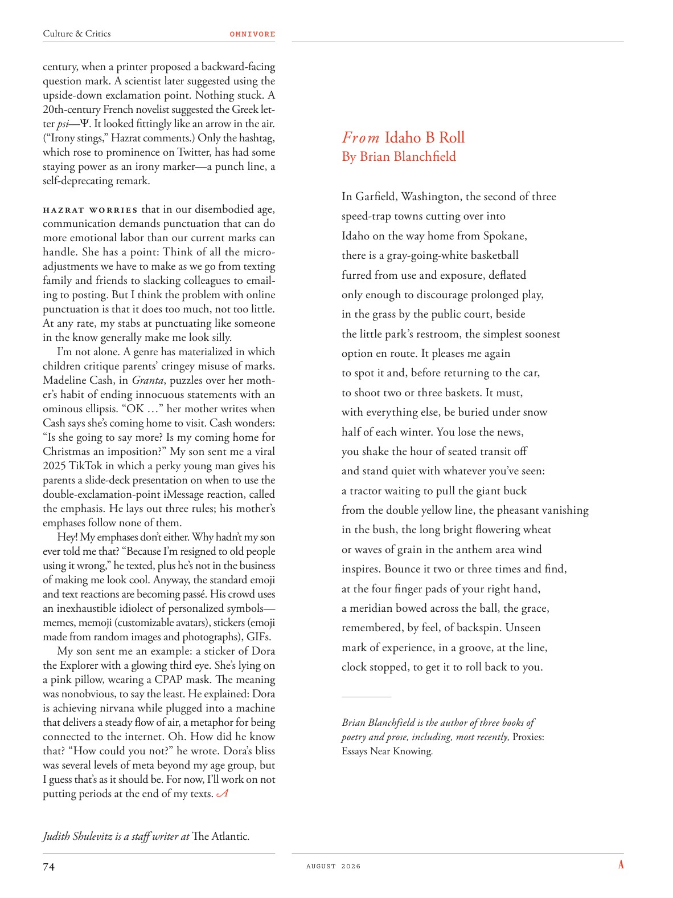

# The Atlantic — August 2026

## Page 76

---

century, when a printer proposed a backward-facing question mark. A scientist later suggested using the upside-down exclamation point. Nothing stuck. A 20th-century French novelist suggested the Greek letter psi — . It looked fittingly like an arrow in the air.

**【中文翻译】** 世纪，一位印刷商提出了一个朝后的问号。一位科学家后来建议使用颠倒的感叹号。没有什么卡住的。一位 20 世纪的法国小说家提出了希腊字母 psi — 。它看起来恰如空中的一支箭。

(“Irony stings,” Hazrat comments.) Only the hashtag, which rose to prominence on Twitter, has had some staying power as an irony marker—a punch line, a self-deprecating remark.

**【中文翻译】** （“讽刺刺痛，”哈兹拉特评论道。）只有在推特上声名鹊起的主题标签作为讽刺标记具有一定的持久力——一句妙语，一句自嘲的话。

Hazrat worries that in our disembodied age, communication demands punctuation that can do more emotional labor than our current marks can handle. She has a point: Think of all the microadjustments we have to make as we go from texting family and friends to slacking colleagues to emailing to posting. But I think the problem with online punctuation is that it does too much, not too little.

**【中文翻译】** 哈兹拉特担心，在我们这个脱离实体的时代，交流需要标点符号，而标点符号可能会造成比我们当前的标记所能处理的更多的情感劳动。她说得有道理：想想当我们从给家人和朋友发短信到放松同事，再到发电子邮件到发帖时，我们必须做出的所有微调。但我认为在线标点符号的问题在于它做得太多，而不是太少。

At any rate, my stabs at punctuating like someone in the know generally make me look silly. I’m not alone. A genre has materialized in which children critique parents’ cringey misuse of marks.

**【中文翻译】** 无论如何，我像知情人一样使用标点符号通常会让我看起来很傻。我并不孤单。一种流派已经形成，孩子们批评父母对标记的令人尴尬的滥用。

Madeline Cash, in Granta , puzzles over her mother’s habit of ending innocuous statements with an ominous ellipsis. “OK …” her mother writes when Cash says she’s coming home to visit. Cash wonders: “Is she going to say more? Is my coming home for Christmas an imposition?” My son sent me a viral 2025 TikTok in which a perky young man gives his parents a slide-deck presentation on when to use the double-exclamation-point iMessage reaction, called the emphasis. He lays out three rules; his mother’s emphases follow none of them.

**【中文翻译】** 《格兰塔》中的玛德琳·卡什对她母亲习惯用不祥的省略号结束无害的陈述感到困惑。 “好吧……”当卡什说她要回家探望时，她的母亲写道。卡什想知道：“她还会说更多吗？我回家过圣诞节是一种强迫吗？”我儿子给我发了一段火爆的 2025 TikTok，其中一位活泼的年轻人向他的父母做了幻灯片演示，告诉他们何时使用双感叹号 iMessage 反应（称为强调）。他制定了三项规则：他母亲的重点却没有跟上他们。

Hey! My emphases don’t either. Why hadn’t my son ever told me that? “Because I’m resigned to old people using it wrong,” he texted, plus he’s not in the business of making me look cool. Anyway, the standard emoji and text reactions are becoming passé. His crowd uses an in exhaustible idiolect of personalized symbols— memes, memoji (customizable avatars), stickers (emoji made from random images and photographs), GIFs.

**【中文翻译】** 嘿！我的重点也不是。为什么我儿子从来没有告诉过我这些？ “因为我已经接受了老年人错误地使用它，”他发短信说，而且他的职责并不是让我看起来很酷。不管怎样，标准的表情符号和文字反应已经过时了。他的支持者使用了一种无穷无尽的个性化符号——模因、拟我表情（可定制的头像）、贴纸（由随机图像和照片制成的表情符号）、GIF。

My son sent me an example: a sticker of Dora the Explorer with a glowing third eye. She’s lying on a pink pillow, wearing a CPAP mask. The meaning was nonobvious, to say the least. He explained: Dora is achieving nirvana while plugged into a machine that delivers a steady flow of air, a metaphor for being connected to the internet. Oh. How did he know that? “How could you not?” he wrote. Dora’s bliss was several levels of meta beyond my age group, but I guess that’s as it should be. For now, I’ll work on not putting periods at the end of my texts.

**【中文翻译】** 我儿子给我发了一个例子：一张带有发光第三只眼的探险家朵拉的贴纸。她躺在粉红色的枕头上，戴着 CPAP 面罩。至少可以说，其含义并不明显。他解释说：朵拉在连接到一台提供稳定空气流的机器时实现了涅槃，这是连接到互联网的隐喻。哦。他怎么知道的？ “你怎么能不呢？”他写道。朵拉的幸福程度超出了我的年龄组，但我想这就是应该的。现在，我将努力不在文本末尾添加句号。

*— Judith Shulevitz is a staff writer at The Atlantic .*

*【作者署名】朱迪思·舒莱维茨 (Judith Shulevitz) 是《大西洋月刊》的特约撰稿人。*

#### From Idaho B Roll

**【副标题翻译】** 来自爱达荷州 B 卷

By Brian Blanchfield In Garfield, Washington, the second of three speed-trap towns cutting over into Idaho on the way home from Spokane, there is a gray-going-white basketball furred from use and exposure, deflated only enough to discourage prolonged play, in the grass by the public court, beside the little park’s restroom, the simplest soonest option en route. It pleases me again to spot it and, before returning to the car, to shoot two or three baskets. It must, with everything else, be buried under snow half of each winter. You lose the news, you shake the hour of seated transit off and stand quiet with whatever you’ve seen: a tractor waiting to pull the giant buck from the double yellow line, the pheasant vanishing in the bush, the long bright flowering wheat or waves of grain in the anthem area wind inspires. Bounce it two or three times and find, at the four finger pads of your right hand, a meridian bowed across the ball, the grace, remembered, by feel, of backspin. Unseen mark of experience, in a groove, at the line, clock stopped, to get it to roll back to you.

**【中文翻译】** 作者：布莱恩·布兰奇菲尔德 (Brian Blanchfield) 华盛顿州加菲尔德是从斯波坎回家途中进入爱达荷州的三个速度陷阱城镇中的第二个，在公共球场旁的草地上，小公园的洗手间旁边，有一个因使用和暴露而变得灰白的篮球，泄气的程度仅足以阻止长时间比赛，这是途中最简单、最快的选择。我再次高兴地发现了它，并在回到车上之前投了两三个篮子。每年冬天，它和其他一切东西一样，必须有一半的时间被雪掩埋。你失去了这个消息，你摆脱了坐着的交通时间，安静地站着，面对你所看到的一切：一辆拖拉机等待着从双黄线拉出巨大的雄鹿，消失在灌木丛中的野鸡，长长的明亮的开花小麦或风吹过的国歌区的谷物波浪。弹起球两到三下，你就会发现，在你右手的四个指腹处，有一条经线弓过球，这是通过感觉记住的后旋的优雅。看不见的经验标记，在凹槽中，在队列中，时钟停止，让它滚回给你。

*— Brian Blanchfield is the author of three books of*

*【作者署名】布莱恩·布兰奇菲尔德 (Brian Blanchfield) 是三本书的作者*

poetry and prose, including, most recently, Proxies: Essays Near Knowing .

**【中文翻译】** 诗歌和散文，包括最近的《代理：近知散文》。
