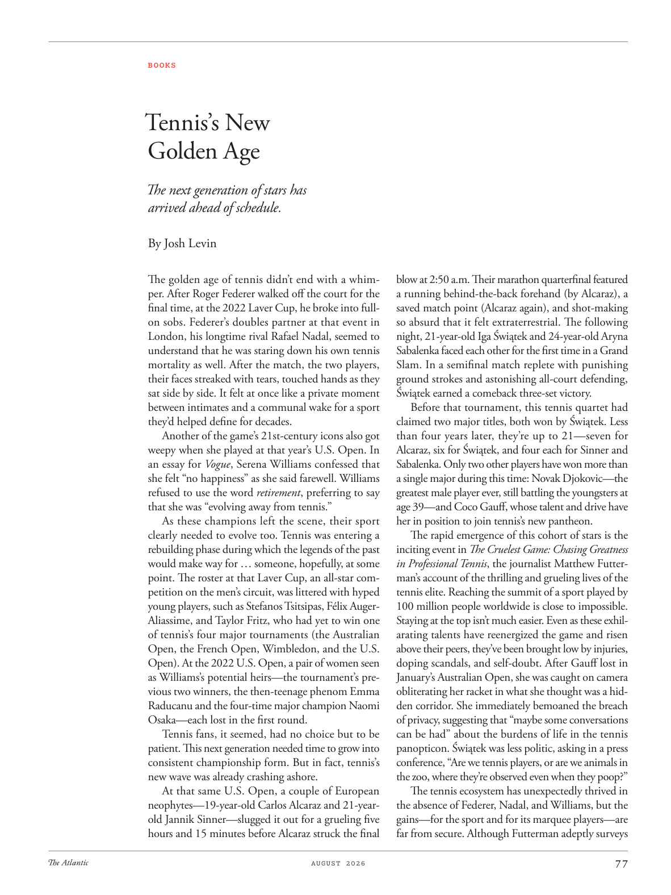

# The Atlantic — August 2026

## Page 79

---

### Tennis’s New

**【标题翻译】** 网球新

### Golden Age

**【标题翻译】** 黄金时代

The next generation of stars has arrived ahead of schedule. By Josh Levin The golden age of tennis didn’t end with a whimper. After Roger Federer walked off the court for the final time, at the 2022 Laver Cup, he broke into fullon sobs. Federer’s doubles partner at that event in London, his longtime rival Rafael Nadal, seemed to understand that he was staring down his own tennis mortality as well. After the match, the two players, their faces streaked with tears, touched hands as they sat side by side. It felt at once like a private moment between intimates and a communal wake for a sport they’d helped define for decades.

**【中文翻译】** 下一代明星提前到来。作者：乔什·莱文 网球的黄金时代并没有以呜咽结束。 2022 年拉沃尔杯上，罗杰·费德勒最后一次走下球场后，他失声痛哭。费德勒在伦敦那场比赛中的双打搭档、他的长期竞争对手拉斐尔·纳达尔似乎明白，他也在关注自己的网球死亡率。比赛结束后，两位球员并肩而坐，脸上挂着泪水，手拉着手。这既像是亲密朋友之间的私人时刻，又像是一场他们几十年来帮助定义的运动的集体守灵活动。

Another of the game’s 21stcentury icons also got weepy when she played at that year’s U.S. Open. In an essay for Vogue , Serena Williams confessed that she felt “no happiness” as she said farewell. Williams refused to use the word retirement , preferring to say that she was “evolving away from tennis.”

**【中文翻译】** 另一位 21 世纪网球界的偶像在参加当年的美国公开赛时也落泪了。在《Vogue》杂志的一篇文章中，瑟琳娜·威廉姆斯承认，在告别时她“没有感到幸福”。威廉姆斯拒绝使用“退役”这个词，更愿意说她“正在远离网球”。

As these champions left the scene, their sport clearly needed to evolve too. Tennis was entering a rebuilding phase during which the legends of the past would make way for … someone, hopefully, at some point. The roster at that Laver Cup, an all-star competition on the men’s circuit, was littered with hyped young players, such as Stefanos Tsitsipas, Félix AugerAliassime, and Taylor Fritz, who had yet to win one of tennis’s four major tournaments (the Australian Open, the French Open, Wimbledon, and the U.S.

**【中文翻译】** 随着这些冠军的离开，他们的运动显然也需要发展。网球正在进入重建阶段，在此期间，过去的传奇人物将为……某人让路，希望在某个时候。拉沃尔杯是男子巡回赛的全明星赛事，名单上充斥着备受瞩目的年轻球员，如斯特凡诺斯·西西帕斯、费利克斯·奥格·阿利亚西姆和泰勒·弗里茨，他们尚未赢得网球四大赛事（澳大利亚网球公开赛、法国网球公开赛、温布尔登网球公开赛和美国网球公开赛）之一。

Open). At the 2022 U.S. Open, a pair of women seen as Williams’s potential heirs—the tournament’s previous two winners, the then-teenage phenom Emma Raducanu and the four-time major champion Naomi Osaka—each lost in the first round.

**【中文翻译】** 打开）。在 2022 年美国公开赛上，两位被视为威廉姆斯潜在继承人的女性——赛事的前两届冠军、当时的青少年天才艾玛·拉杜卡努和四届大满贯冠军大阪直美——均在第一轮失利。

Tennis fans, it seemed, had no choice but to be patient. This next generation needed time to grow into consistent champion ship form. But in fact, tennis’s new wave was already crashing ashore.

**【中文翻译】** 网球迷们似乎别无选择，只能保持耐心。下一代需要时间才能成长为稳定的冠军形态。但事实上，网球的新浪潮已经席卷而来。

At that same U.S. Open, a couple of European neophytes—19-year-old Carlos Alcaraz and 21-yearold Jannik Sinner—slugged it out for a grueling five hours and 15 minutes before Alcaraz struck the final blow at 2:50 a.m. Their marathon quarter final featured a running behind-the-back forehand (by Alcaraz), a saved match point (Alcaraz again), and shot-making so absurd that it felt extra terrestrial. The following night, 21-year-old Iga Świątek and 24-year-old Aryna Sabalenka faced each other for the first time in a Grand Slam. In a semifinal match replete with punishing ground strokes and astonishing all-court defending, Świątek earned a comeback three-set victory.

**【中文翻译】** 在同一场美国公开赛上，两位欧洲新人——19 岁的卡洛斯·阿尔卡拉兹和 21 岁的詹尼克·辛纳——在阿尔卡拉兹于凌晨 2:50 打出最后一击之前，苦战了 5 小时 15 分钟。他们的马拉松式四分之一决赛的特点是背后跑动的正手（阿尔卡拉兹）、挽救赛点（又是阿尔卡拉兹）和投篮。如此荒唐，以至于让人感觉超凡脱俗。第二天晚上，21 岁的伊加·斯维泰克 (Iga Świątek) 和 24 岁的阿琳娜·萨巴伦卡 (Aryna Sabalenka) 首次在大满贯赛事中交锋。在一场充满惩罚性的地面击球和令人惊叹的全场防守的半决赛中，斯维泰克以三盘逆转获胜。

Before that tournament, this tennis quartet had claimed two major titles, both won by Świątek. Less than four years later, they’re up to 21—seven for Alcaraz, six for Świątek, and four each for Sinner and Sabalenka. Only two other players have won more than a single major during this time: Novak Djokovic—the greatest male player ever, still battling the youngsters at age 39—and Coco Gauff, whose talent and drive have her in position to join tennis’s new pantheon.

**【中文翻译】** 在那场比赛之前，这支网球四重奏已经获得了两项大满贯冠军，均由斯维泰克赢得。不到四年后，他们的数量达到了 21 人——Alcaraz 7 人，Swiątek 6 人，Sinner 和 Sabalenka 各 4 人。在此期间，只有另外两名球员赢得了超过一个大满贯赛的冠军：诺瓦克·德约科维奇（Novak Djokovic）——有史以来最伟大的男性球员，在 39 岁时仍在与年轻球员竞争——以及可可·高夫（Coco Gauff），她的天赋和动力使她有能力加入网球新万神殿。

The rapid emergence of this cohort of stars is the inciting event in The Cruelest Game: Chasing Greatness in Professional Tennis , the journalist Matthew Futterman’s account of the thrilling and grueling lives of the tennis elite. Reaching the summit of a sport played by 100 million people worldwide is close to im possible.

**【中文翻译】** 这群明星的迅速崛起是《最残酷的游戏：在职业网球中追逐伟大》中最激动人心的事件，该书由记者马修·富特曼（Matthew Futterman）描述了网球精英们惊心动魄且艰苦的生活。对于一项全世界有 1 亿人参与的运动来说，达到顶峰几乎是不可能的。

Staying at the top isn’t much easier. Even as these exhilarating talents have reenergized the game and risen above their peers, they’ve been brought low by injuries, doping scandals, and self-doubt. After Gauff lost in January’s Australian Open, she was caught on camera obliterating her racket in what she thought was a hidden corridor. She immediately bemoaned the breach of privacy, suggesting that “maybe some conversations can be had” about the burdens of life in the tennis panopticon. Świątek was less politic, asking in a press conference, “Are we tennis players, or are we animals in the zoo, where they’re observed even when they poop?”

**【中文翻译】** 保持领先地位并不容易。尽管这些令人振奋的天才们重新为这项运动注入了活力，并超越了同龄人，但他们却因伤病、兴奋剂丑闻和自我怀疑而陷入低谷。高夫在一月份的澳大利亚网球公开赛上失利后，镜头拍到她在她认为是隐蔽的走廊里擦掉球拍。她立即​​对侵犯隐私表示遗憾，并建议“也许可以就网球圆形监狱中的生活负担进行一些对话”。斯维泰克则不那么政治化，他在新闻发布会上问道：“我们是网球运动员，还是动物园里的动物，即使它们大便时也会被观察到？”

The tennis ecosystem has unexpectedly thrived in the absence of Federer, Nadal, and Williams, but the gains— for the sport and for its marquee players— are far from secure. Although Futterman adeptly surveys

**【中文翻译】** 在费德勒、纳达尔和威廉姆斯缺席的情况下，网球生态系统出人意料地蓬勃发展，但对于这项运动及其明星球员来说，收益远非安全。尽管富特曼熟练地进行了调查
