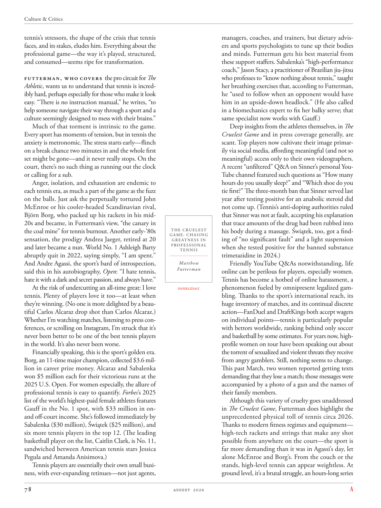

# The Atlantic — August 2026

## Page 80

---

tennis’s stressors, the shape of the crisis that tennis faces, and its stakes, eludes him. Everything about the professional game—the way it’s played, structured, and consumed—seems ripe for transformation.

**【中文翻译】** 他不明白网球运动的压力源、网球运动所面临的危机的形式及其赌注。职业比赛的一切——比赛方式、结构和消费方式——似乎都已经成熟，可以进行变革。

Futterman, who covers the pro circuit for The Athletic , wants us to understand that tennis is incredibly hard, perhaps especially for those who make it look easy. “There is no instruction manual,” he writes, “to help someone navigate their way through a sport and a culture seemingly designed to mess with their brains.”

**【中文翻译】** 福特曼（Futterman）负责《The Athletic》职业巡回赛的报道，他希望我们明白网球是非常困难的，也许尤其是对于那些看起来很容易的人来说。 “没有指导手册，”他写道，“可以帮助人们在一项运动和一种似乎旨在扰乱他们大脑的文化中找到方向。”

Much of that torment is intrinsic to the game. Every sport has moments of tension, but in tennis the anxiety is metronomic. The stress starts early—flinch on a break chance two minutes in and the whole first set might be gone—and it never really stops. On the court, there’s no such thing as running out the clock or calling for a sub.

**【中文翻译】** 大部分折磨都是游戏固有的。每项运动都有紧张的时刻，但在网球运动中，焦虑是有节奏的。压力很早就开始了——在两分钟后的破发机会面前退缩，整个第一盘可能就消失了——而且它永远不会真正停止。在球场上，不存在时间耗尽或要求替补的情况。

Anger, isolation, and exhaustion are endemic to each tennis era, as much a part of the game as the fuzz on the balls. Just ask the perpetually tortured John McEnroe or his cooler-headed Scandinavian rival, Björn Borg, who packed up his rackets in his mid20s and became, in Futterman’s view, “the canary in the coal mine” for tennis burnout. Another early-’80s sensation, the prodigy Andrea Jaeger, retired at 20 and later became a nun. World No. 1 Ashleigh Barty abruptly quit in 2022, saying simply, “I am spent.”

**【中文翻译】** 愤怒、孤立和疲惫是每个网球时代的通病，就像球上的绒毛一样，都是比赛的一部分。只要问问永远饱受折磨的约翰·麦肯罗或他冷静的斯堪的纳维亚对手比约恩·博格就知道了。博格在 20 多岁的时候就收起了球拍，在富特曼看来，他成为了网球倦怠的“煤矿里的金丝雀”。另一位 80 年代初的轰动人物是神童安德里亚·耶格 (Andrea Jaeger)，她 20 岁时退休，后来成为一名修女。世界排名第一的阿什利·巴蒂 (Ashleigh Barty) 在 2022 年突然退出，简单地说：“我已经精疲力尽了。”

And Andre Agassi, the sport’s bard of introspection, said this in his autobiography, Open : “I hate tennis, hate it with a dark and secret passion, and always have.”

**【中文翻译】** 这项运动的内省吟游诗人安德烈·阿加西在他的自传《Open》中这样说道：“我讨厌网球，带着一种黑暗而秘密的热情讨厌它，而且一直如此。”

At the risk of undercutting an all-time great: I love tennis. Plenty of players love it too—at least when they’re winning. (No one is more delighted by a beautiful Carlos Alcaraz drop shot than Carlos Alcaraz.) Whether I’m watching matches, listening to press conferences, or scrolling on Instagram, I’m struck that it’s never been better to be one of the best tennis players in the world. It’s also never been worse.

**【中文翻译】** 冒着削弱历史伟人的风险：我热爱网球。很多玩家也喜欢它——至少当他们获胜时。 （没有人比卡洛斯·阿尔卡拉斯 (Carlos Alcaraz) 更欣赏卡洛斯·阿尔卡拉斯 (Carlos Alcaraz) 的漂亮击球。）无论我是在观看比赛、听新闻发布会，还是在 Instagram 上浏览，我都会惊讶地发现，成为世界上最好的网球运动员之一从未如此美好。情况也从未如此糟糕。

Financially speaking, this is the sport’s golden era. Borg, an 11-time major champion, collected $3.6 million in career prize money. Alcaraz and Sabalenka won $5 million each for their victorious runs at the 2025 U.S. Open. For women especially, the allure of professional tennis is easy to quantify. Forbes ’s 2025 list of the world’s highest-paid female athletes features Gauff in the No. 1 spot, with $33 million in onand off-court income. She’s followed immediately by Sabalenka ($30 million), Świątek ($25 million), and six more tennis players in the top 12. (The leading basketball player on the list, Caitlin Clark, is No. 11, sandwiched between American tennis stars Jessica Pegula and Amanda Anisimova.) Tennis players are essentially their own small business, with ever-expanding retinues—not just agents, managers, coaches, and trainers, but dietary advisers and sports psychologists to tune up their bodies and minds. Futterman gets his best material from these support staffers. Sabalenka’s “high-performance coach,” Jason Stacy, a practitioner of Brazilian jiu-jitsu who professes to “know nothing about tennis,” taught her breathing exercises that, according to Futterman, he “used to follow when an opponent would have him in an upside-down headlock.” (He also called in a biomechanics expert to fix her balky serve; that same specialist now works with Gauff.) Deep insights from the athletes themselves, in The Cruelest Game and in press coverage generally, are scant. Top players now cultivate their image primarily via social media, affording meaningful (and not so meaning ful) access only to their own videographers.

**【中文翻译】** 从经济角度来说，这是这项运动的黄金时代。博格曾 11 次获得大满贯赛冠军，职业生涯奖金高达 360 万美元。阿尔卡拉兹和萨巴伦卡在 2025 年美国公开赛上获胜，各赢得了 500 万美元。尤其是对于女性来说，职业网球的吸引力很容易量化。在《福布斯》2025 年全球收入最高女运动员排行榜中，高夫位居第一，场内场外收入达 3300 万美元。紧随其后的是 Sabalenka（3000 万美元）、Świątek（2500 万美元）和前 12 名中的另外 6 名网球运动员。（名单上领先的篮球运动员凯特琳·克拉克排名第 11，夹在美国网球明星杰西卡·佩古拉和阿曼达·阿尼西莫娃之间。）网球运动员本质上是他们自己的小企业，其随从不断扩大——不仅仅是经纪人、经理、教练和经纪人。教练，但饮食顾问和运动心理学家来调整他们的身体和思想。富特曼从这些支持人员那里得到了最好的材料。萨巴伦卡的“高性能教练”贾森·史黛西是一名巴西柔术练习者，自​​称“对网球一无所知”，他教她呼吸练习，据富特曼说，他“过去常常在对手将他的头朝下锁住时跟随”。 （他还请来一位生物力学专家来解决她发球不稳的问题；这位专家现在与高夫一起工作。）在《最残酷的比赛》和一般媒体报道中，运动员本身的深刻见解很少。顶级玩家现在主要通过社交媒体来培养自己的形象，只向自己的摄像师提供有意义的（和不太有意义的）访问。

A recent “unfiltered” Q&A on Sinner’s personal YouTube channel featured such questions as “How many hours do you usually sleep?” and “Which shoe do you tie first?” The three-month ban that Sinner served last year after testing positive for an anabolic steroid did not come up. (Tennis’s anti-doping authorities ruled that Sinner was not at fault, accepting his explanation that trace amounts of the drug had been rubbed into his body during a massage. Świątek, too, got a findTHE CRUELEST GAME: CHASING ing of “no significant fault” and a light suspension GREATNESS IN PROFESSIONAL when she tested positive for the banned substance TENNIS trimetazidine in 2024.) Friendly YouTube Q&As notwithstanding, life Matthew Futterman online can be perilous for players, especially women.

**【中文翻译】** Sinner 的个人 YouTube 频道最近进行了一次“未经过滤”的问答，其中包括“你通常睡几个小时？”等问题。和“你先系哪只鞋？”辛纳去年因合成代谢类固醇检测呈阳性而被禁赛三个月，但这一禁令并未出现。 （网球反兴奋剂机构裁定辛纳没有过错，接受了他的解释，即在按摩过程中微量药物被擦入了他的身体。斯维泰克也发现了最残酷的游戏：追逐“无重大过错”，并在 2024 年对违禁物质网球曲美他嗪检测呈阳性时被轻度停赛。）尽管有问答，马修·富特曼的在线生活对于玩家来说可能是危险的，尤其是女性。

Tennis has become a hotbed of online harassment, a phenomenon fueled by omnipresent legalized gamDOUBLEDAY bling. Thanks to the sport’s international reach, its huge inventory of matches, and its continual discrete action—FanDuel and DraftKings both accept wagers on individual points—tennis is particularly popular with bettors worldwide, ranking behind only soccer and basketball by some estimates. For years now, highprofile women on tour have been speaking out about the torrent of sexualized and violent threats they receive from angry gamblers. Still, nothing seems to change.

**【中文翻译】** 网球已经成为网络骚扰的温床，这种现象是由无所不在的合法化赌博DOUBLEDAY bling推动的。由于这项运动的国际影响力、大量的比赛以及持续的离散行动（FanDuel 和 DraftKings 都接受对个人积分的投注），网球在世界各地的投注者中特别受欢迎，据估计，其排名仅次于足球和篮球。多年来，巡回演出中的知名女性一直在公开谈论她们从愤怒的赌徒那里收到的大量性威胁和暴力威胁。尽管如此，似乎一切都没有改变。

This past March, two women reported getting texts demanding that they lose a match; those messages were accompanied by a photo of a gun and the names of their family members.

**【中文翻译】** 今年三月，两名女性报告称收到短信要求她们输掉一场比赛；这些信息附有一张枪的照片和他们家人的名字。

Although this variety of cruelty goes unaddressed in The Cruelest Game , Futterman does highlight the unprecedented physical toll of tennis circa 2026.

**【中文翻译】** 尽管这种残酷行为在《最残酷的比赛》中没有得到解决，但富特曼确实强调了 2026 年左右网球运动对身体造成的前所未有的伤害。

Thanks to modern fitness regimes and equipment— high-tech rackets and strings that make any shot possible from anywhere on the court—the sport is far more demanding than it was in Agassi’s day, let alone McEnroe and Borg’s. From the couch or the stands, high-level tennis can appear weightless. At ground level, it’s a brutal struggle, an hours-long series

**【中文翻译】** 得益于现代的健身制度和设备——高科技球拍和球线，可以在球场上的任何地方进行任何投篮——这项运动比阿加西时代的要求要高得多，更不用说麦肯罗和博格的时代了。无论是在沙发上还是看台上，高水平的网球比赛都会显得失重。在地面上，这是一场残酷的斗争，一场长达数小时的系列赛
