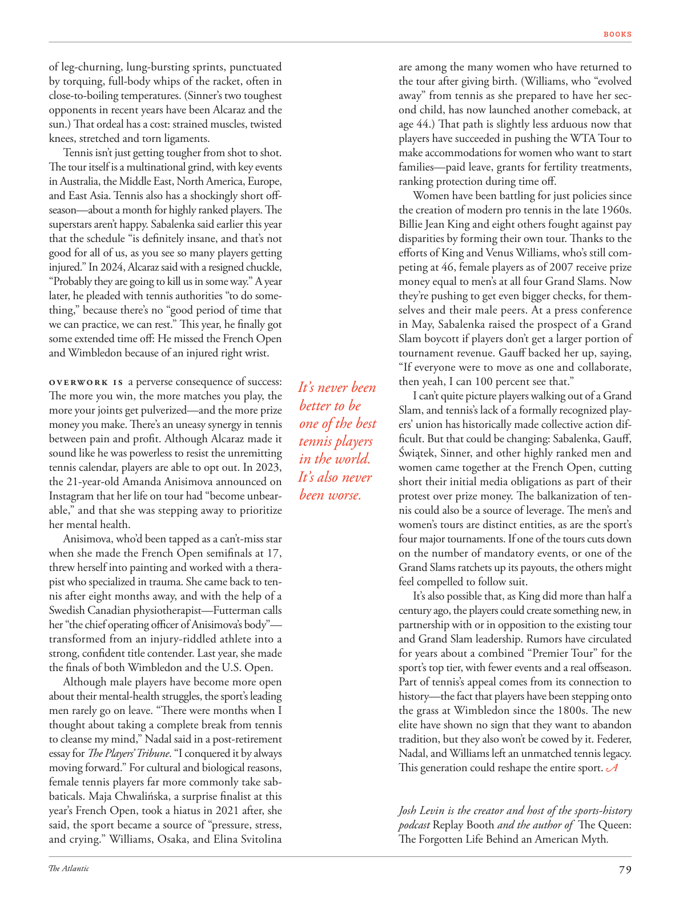

# The Atlantic — August 2026

## Page 81

---

of leg-churning, lung-bursting sprints, punctuated by torquing, full-body whips of the racket, often in close-to-boiling temperatures. (Sinner’s two toughest opponents in recent years have been Alcaraz and the sun.) That ordeal has a cost: strained muscles, twisted knees, stretched and torn ligaments.

**【中文翻译】** 令人腿翻腾、肺部爆裂的冲刺，不时被球拍的扭转、全身鞭打所打断，通常在接近沸腾的温度下。 （辛纳近年来最难对付的两个对手是阿尔卡拉斯和太阳。）这种考验是有代价的：肌肉拉伤、膝盖扭伤、韧带拉伸和撕裂。

Tennis isn’t just getting tougher from shot to shot. The tour itself is a multinational grind, with key events in Australia, the Middle East, North America, Europe, and East Asia. Tennis also has a shockingly short offseason—about a month for highly ranked players. The superstars aren’t happy. Sabalenka said earlier this year that the schedule “is definitely insane, and that’s not good for all of us, as you see so many players getting injured.” In 2024, Alcaraz said with a resigned chuckle, “Probably they are going to kill us in some way.” A year later, he pleaded with tennis authorities “to do something,” because there’s no “good period of time that we can practice, we can rest.” This year, he finally got some extended time off: He missed the French Open and Wimbledon because of an injured right wrist.

**【中文翻译】** 网球运动不仅仅会随着击球次数的增加而变得越来越难。这次巡演本身就是一项跨国活动，在澳大利亚、中东、北美、欧洲和东亚都有重要活动。网球的休赛期也短得惊人——对于排名靠前的球员来说大约一个月。超级明星们不高兴了。萨巴伦卡今年早些时候表示，这个赛程“绝对是疯狂的，这对我们所有人都不好，因为你会看到这么多球员受伤。” 2024 年，阿尔卡拉兹无奈地笑着说道：“他们可能会以某种方式杀死我们。”一年后，他恳求网球当局“做点什么”，因为没有“我们可以练习、休息的好时间”。今年，他终于得到了一段较长的休息时间：因为右手腕受伤，他错过了法网和温网。

Overwork is a perverse consequence of success: The more you win, the more matches you play, the more your joints get pulverized— and the more prize money you make. There’s an uneasy synergy in tennis between pain and profit. Although Alcaraz made it sound like he was powerless to resist the unremitting tennis calendar, players are able to opt out. In 2023, the 21-year-old Amanda Anisimova announced on Instagram that her life on tour had “become unbearable,” and that she was stepping away to prioritize her mental health.

**【中文翻译】** 过度劳累是成功的反常后果：你赢的越多，参加的比赛越多，你的关节受到的伤害就越多——你赚到的奖金也就越多。在网球运动中，痛苦与利润之间存在着令人不安的协同作用。尽管阿尔卡拉斯听起来似乎无力抵抗无休无止的网球赛程，但球员们可以选择退出。 2023 年，21 岁的阿曼达·阿尼西莫娃 (Amanda Anisimova) 在 Instagram 上宣布，她的巡演生活“变得难以忍受”，她将退出巡演，优先考虑自己的心理健康。

Anisimova, who’d been tapped as a can’t-miss star when she made the French Open semifinals at 17, threw herself into painting and worked with a therapist who specialized in trauma. She came back to tennis after eight months away, and with the help of a Swedish Canadian physiotherapist—Futterman calls her “the chief operating officer of Anisimova’s body”— transformed from an injury-riddled athlete into a strong, confident title contender. Last year, she made the finals of both Wimbledon and the U.S. Open.

**【中文翻译】** 阿尼西莫娃 17 岁时打入法网半决赛，被视为不可错过的明星，她全身心投入绘画，并与一位专门治疗创伤的治疗师一起工作。离开八个月后，她重返网球界，并在一位瑞典裔加拿大物理治疗师（富特曼称她为“阿尼西莫娃身体的首席运营官”）的帮助下，从一名饱受伤病困扰的运动员转变为一名强大、自信的冠军争夺者。去年，她进入了温网和美国公开赛的决赛。

Although male players have become more open about their mental-health struggles, the sport’s leading men rarely go on leave. “There were months when I thought about taking a complete break from tennis to cleanse my mind,” Nadal said in a post-retirement essay for The Players’ Tribune . “I conquered it by always moving forward.” For cultural and biological reasons, female tennis players far more commonly take sabbaticals. Maja Chwalińska, a surprise finalist at this year’s French Open, took a hiatus in 2021 after, she said, the sport became a source of “pressure, stress, and crying.” Williams, Osaka, and Elina Svitolina are among the many women who have returned to the tour after giving birth. (Williams, who “evolved away” from tennis as she prepared to have her second child, has now launched another comeback, at age 44.) That path is slightly less arduous now that players have succeeded in pushing the WTA Tour to make accommodations for women who want to start families— paid leave, grants for fertility treatments, ranking protection during time off.

**【中文翻译】** 尽管男性运动员对自己的心理健康问题变得更加开放，但这项运动的领军人物很少休假。 “有几个月，我考虑彻底离开网球，以净化我的思想，”纳达尔在《球员论坛报》退役后的一篇文章中说道。 “我通过不断前进来征服它。”由于文化和生物学原因，女性网球运动员休假的情况要普遍得多。玛雅·查瓦林斯卡 (Maja Chwalińska) 意外入围今年法网决赛，她表示，这项运动成为“压力、压力和哭泣”的根源，她在 2021 年中断了比赛。威廉姆斯、大阪和埃琳娜·斯维托丽娜是众多产后重返巡回赛的女性之一。 （威廉姆斯在准备生第二个孩子时“逐渐远离”网球，现在44岁再次卷土重来。）既然球员们已经成功推动WTA巡回赛为想要组建家庭的女性提供便利——带薪休假、生育治疗补助、休息期间的排名保护，那么这条道路就稍微不那么艰难了。

Women have been battling for just policies since the creation of modern pro tennis in the late 1960s. Billie Jean King and eight others fought against pay disparities by forming their own tour. Thanks to the efforts of King and Venus Williams, who’s still competing at 46, female players as of 2007 receive prize money equal to men’s at all four Grand Slams. Now they’re pushing to get even bigger checks, for themselves and their male peers. At a press conference in May, Sabalenka raised the prospect of a Grand Slam boycott if players don’t get a larger portion of tournament revenue. Gauff backed her up, saying, “If everyone were to move as one and collaborate, then yeah, I can 100 percent see that.”

**【中文翻译】** 自 20 世纪 60 年代末现代职业网球运动诞生以来，女性一直在为争取正义政策而奋斗。比莉·简·金 (Billie Jean King) 和其他八人通过组建自己的巡演来对抗薪酬不平等。感谢金和 46 岁仍在参赛的维纳斯·威廉姆斯的努力，截至 2007 年，女选手在所有四项大满贯赛事中获得的奖金与男选手相同。现在，她们正在努力为自己和男性同龄人争取更大的支票。在五月的新闻发布会上，萨巴伦卡提出，如果球员不能获得更大一部分的赛事收入，那么他将抵制大满贯。高夫支持她，说道：“如果每个人都团结一致并进行协作，那么我百分百可以看到这一点。”

It’s never been I can’t quite picture players walking out of a Grand better to be Slam, and tennis’s lack of a formally recognized playone of the best ers’ union has historically made collective action difficult. But that could be changing: Sabalenka, Gauff, tennis players Świątek, Sinner, and other highly ranked men and in the world. women came together at the French Open, cutting It’s also never short their initial media obligations as part of their been worse. protest over prize money. The balkanization of tennis could also be a source of leverage. The men’s and women’s tours are distinct entities, as are the sport’s four major tournaments. If one of the tours cuts down on the number of mandatory events, or one of the Grand Slams ratchets up its payouts, the others might feel compelled to follow suit.

**【中文翻译】** 我从来都无法想象球员们走出大满贯会更好地成为大满贯，而网球界缺乏一个正式认可的最佳球员联盟球员，这在历史上使得集体行动变得困难。但这种情况可能正在改变：萨巴伦卡、高夫、网球运动员斯维泰克、辛纳以及其他世界排名靠前的男人。女性在法国网球公开赛上齐聚一堂，这也永远不会缩短她们最初的媒体义务，因为她们的情况更糟。抗议奖金。网球运动的分裂也可能是一个杠杆来源。男子和女子巡回赛是不同的实体，这项运动的四项主要赛事也是如此。如果其中一项巡回赛减少了强制性赛事的数量，或者其中一项大满贯赛事增加了奖金，其他赛事可能会觉得有必要效仿。

It’s also possible that, as King did more than half a century ago, the players could create something new, in partnership with or in opposition to the existing tour and Grand Slam leadership. Rumors have circulated for years about a combined “Premier Tour” for the sport’s top tier, with fewer events and a real offseason.

**【中文翻译】** 也有可能，就像金在半个多世纪前所做的那样，球员们可以创造一些新的东西，与现有的巡回赛和大满贯领导层合作或反对。关于这项运动顶级赛事将举行联合“超级巡回赛”的传言已经流传多年，赛事数量较少，并且有一个真正的休赛期。

Part of tennis’s appeal comes from its connection to history—the fact that players have been stepping onto the grass at Wimbledon since the 1800s. The new elite have shown no sign that they want to abandon tradition, but they also won’t be cowed by it. Federer, Nadal, and Williams left an unmatched tennis legacy.

**【中文翻译】** 网球运动的部分吸引力来自于它与历史的联系——自 1800 年代以来，球员们就一直踏上温布尔登的草地。新精英没有表现出要放弃传统的迹象，但他们也不会被传统吓倒。费德勒、纳达尔和威廉姆斯留下了无与伦比的网球遗产。

This generation could reshape the entire sport. Josh Levin is the creator and host of the sports-history podcast Replay Booth and the author of The Queen: The Forgotten Life Behind an American Myth .

**【中文翻译】** 这一代人可能会重塑整个运动。乔什·莱文 (Josh Levin) 是体育历史播客 Replay Booth 的创始人和主持人，也是《女王：美国神话背后被遗忘的生活》一书的作者。
