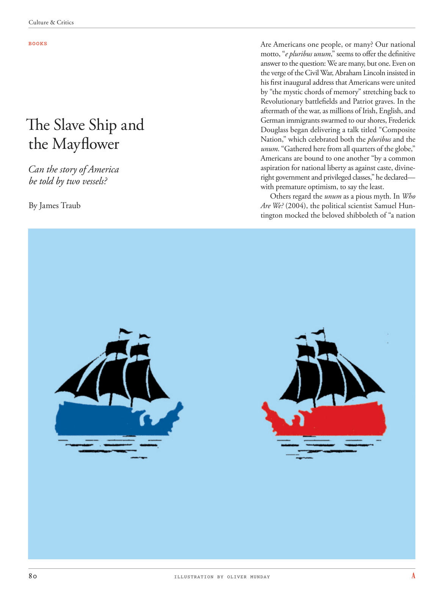

# The Atlantic — August 2026

## Page 82

---

### The Slave Ship and

**【标题翻译】** 奴隶船和

### the Mayflower

**【标题翻译】** 五月花号

Can the story of America be told by two vessels? By James Traub Are Americans one people, or many? Our national motto, “ e pluribus unum ,” seems to offer the definitive answer to the question: We are many, but one. Even on the verge of the Civil War, Abraham Lincoln insisted in his first inaugural address that Americans were united by “the mystic chords of memory” stretching back to Revolutionary battlefields and Patriot graves. In the aftermath of the war, as millions of Irish, English, and German immigrants swarmed to our shores, Frederick Douglass began delivering a talk titled “Composite Nation,” which celebrated both the pluribus and the unum . “Gathered here from all quarters of the globe,” Americans are bound to one another “by a common aspiration for national liberty as against caste, divineright government and privileged classes,” he declared— with premature optimism, to say the least.

**【中文翻译】** 两艘船能讲述美国的故事吗？作者：詹姆斯·特劳布 美国人是一个人，还是多个人？我们的国家座右铭“e pluribus unum”似乎为这个问题提供了明确的答案：我们很多，但只有一个。即使在内战的边缘，亚伯拉罕·林肯在他的第一次就职演说中也坚持认为，美国人通过“记忆的神秘和弦”团结在一起，这些记忆可以追溯到革命战场和爱国者坟墓。战后，随着数百万爱尔兰、英国和德国移民涌入我们的海岸，弗雷德里克·道格拉斯开始发表题为“复合国家”的演讲，庆祝合众国和统一。他宣称，“来自世界各地的美国人聚集在这里，”他们“怀着对民族自由的共同渴望，反对种姓、神权政府和特权阶层”，彼此团结在一起——至少可以说，这是一种过早的乐观。

Others regard the unum as a pious myth. In Who Are We? (2004), the political scientist Samuel Huntington mocked the beloved shibboleth of “a nation

**【中文翻译】** 其他人则认为 unum 是一个虔诚的神话。在《我们是谁？》 （2004），政治学家塞缪尔·亨廷顿（Samuel Huntington）嘲笑了“一个国家

*ILLUSTRATION BY OLIVER MUNDAY*

*【图注与署名】奥利弗·蒙迪插图*
