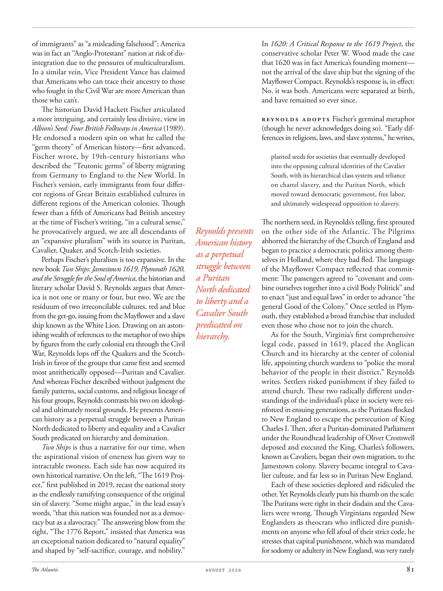

# The Atlantic — August 2026

## Page 83

---

of immigrants” as “a misleading falsehood”; America was in fact an “Anglo-Protestant” nation at risk of disintegration due to the pressures of multi culturalism.

**【中文翻译】** 美国实际上是一个“盎格鲁新教”国家，由于多元文化主义的压力而面临解体的危险。

In a similar vein, Vice President Vance has claimed that Americans who can trace their ancestry to those who fought in the Civil War are more American than those who can’t.

**【中文翻译】** 同样，副总统万斯声称，能够追溯到内战参战者祖先的美国人比那些不能追溯祖先的美国人更加美国人化。

The historian David Hackett Fischer articulated a more intriguing, and certainly less divisive, view in Albion’s Seed: Four British Folkways in America (1989).

**【中文翻译】** 历史学家大卫·哈克特·费舍尔（David Hackett Fischer）在《阿尔比恩的种子：美国的四种英国民俗》（1989）中阐述了一种更有趣、也更不那么分裂的观点。

He endorsed a modern spin on what he called the “germ theory” of American history—first advanced, Fischer wrote, by 19th-century historians who described the “Teutonic germs” of liberty migrating from Germany to England to the New World. In Fischer’s version, early immigrants from four different regions of Great Britain established cultures in different regions of the American colonies. Though fewer than a fifth of Americans had British ancestry at the time of Fischer’s writing, “in a cultural sense,” he provocatively argued, we are all descendants of an “expansive pluralism” with its source in Puritan, Cavalier, Quaker, and Scotch-Irish societies.

**【中文翻译】** 他赞同对他所谓的美国历史“细菌理论”进行现代诠释——费舍尔写道，该理论首先由 19 世纪的历史学家提出，他们描述了自由的“条顿细菌”从德国迁移到英国再到新大陆。在费舍尔的版本中，来自英国四个不同地区的早期移民在美洲殖民地的不同地区建立了文化。尽管在费舍尔写作时，只有不到五分之一的美国人有英国血统，但他挑衅地指出，“从文化意义上”，我们都是“广泛的多元化”的后裔，其根源在于清教徒、骑士、贵格会和苏格兰-爱尔兰社会。

Perhaps Fischer’s pluralism is too expansive. In the new book Two Ships: Jamestown 1619, Plymouth 1620, and the Struggle for the Soul of America , the historian and literary scholar David S. Reynolds argues that America is not one or many or four, but two. We are the residuum of two irreconcilable cultures, red and blue from the get-go, issuing from the Mayflower and a slave ship known as the White Lion. Drawing on an astonishing wealth of references to the metaphor of two ships by figures from the early colonial era through the Civil War, Reynolds lops off the Quakers and the ScotchIrish in favor of the groups that came first and seemed most antithetically opposed—Puritan and Cavalier.

**【中文翻译】** 也许费舍尔的多元主义过于宽泛。在新书《两艘船：詹姆斯敦 1619 年、普利茅斯 1620 年和美国灵魂的斗争》中，历史学家和文学学者大卫·S·雷诺兹 (David S. Reynolds) 认为，美国不是一个、多个或四个，而是两个。我们是两种不可调和的文化的残余，从一开始就是红色和蓝色，从五月花号和被称为白狮号的奴隶船发出。雷诺兹引用了从早期殖民时代到内战时期的人物对两艘船的隐喻的惊人丰富的参考资料，他抛弃了贵格会和苏格兰爱尔兰人，转而支持最先出现且似乎最对立的群体——清教徒和骑士。

And whereas Fischer described without judgment the family patterns, social customs, and religious lineage of his four groups, Reynolds contrasts his two on ideological and ultimately moral grounds. He presents American history as a perpetual struggle between a Puritan North dedicated to liberty and equality and a Cavalier South predicated on hierarchy and domination.

**【中文翻译】** 费舍尔不加判断地描述了他的四个群体的家庭模式、社会习俗和宗教血统，而雷诺兹则在意识形态和最终的道德基础上对他的两个群体进行了对比。他将美国历史描述为致力于自由和平等的清教徒北方与以等级制度和统治为基础的骑士南方之间的永恒斗争。

Two Ships is thus a narrative for our time, when the aspirational vision of oneness has given way to intractable twoness. Each side has now acquired its own historical narrative. On the left, “The 1619 Project,” first published in 2019, recast the national story as the endlessly ramifying consequence of the original sin of slavery. “Some might argue,” in the lead essay’s words, “that this nation was founded not as a democracy but as a slavocracy.” The answering blow from the right, “The 1776 Report,” insisted that America was an exceptional nation dedicated to “natural equality” and shaped by “self-sacrifice, courage, and nobility.”

**【中文翻译】** 因此，《两艘船》是对我们这个时代的叙述，当时对一体性的渴望愿景已经让位于棘手的双重性。现在双方都获得了自己的历史叙述。左边的是 2019 年首次出版的《1619 计划》，将这个国家故事重新塑造为奴隶制原罪的无尽后果。用主要文章的话来说，“有些人可能会争辩说，这个国家不是作为民主国家而是作为奴隶制国家而建立的。”来自右翼的反击——《1776年报告》坚称美国是一个致力于“自然平等”并受到“自我牺牲、勇气和高尚”塑造的杰出国家。

In 1620: A Critical Response to the 1619 Project , the conservative scholar Peter W. Wood made the case that 1620 was in fact America’s founding moment— not the arrival of the slave ship but the signing of the Mayflower Compact. Reynolds’s response is, in effect: No, it was both. Americans were separated at birth, and have remained so ever since.

**【中文翻译】** 在《1620：对 1619 计划的批判性回应》一书中，保守派学者彼得·伍德 (Peter W. Wood) 指出，1620 年实际上是美国的建国时刻——不是奴隶船的到来，而是《五月花号公约》的签署。事实上，雷诺兹的回答是：不，两者都是。美国人一出生就被分开，并且从那时起就一直如此。

Reynolds adopts Fischer’s germinal metaphor (though he never acknowledges doing so). “Early differences in religions, laws, and slave systems,” he writes, planted seeds for societies that eventually developed into the opposing cultural identities of the Cavalier South, with its hierarchical class system and reliance on chattel slavery, and the Puritan North, which moved toward democratic government, free labor, and ultimately widespread opposition to slavery.

**【中文翻译】** 雷诺兹采用了费舍尔的生发隐喻（尽管他从未承认这样做过）。他写道，“宗教、法律和奴隶制度的早期差异”为社会播下了种子，这些社会最终发展成为对立的文化身份：骑士南方，其等级制度和对动产奴隶制的依赖；清教徒北方，走向民主政府、自由劳动力，并最终广泛反对奴隶制。

The northern seed, in Reynolds’s telling, first sprouted Reynolds presents on the other side of the Atlantic. The Pilgrims abhorred the hierarchy of the Church of England and American history began to practice a democratic politics among themas a perpetual selves in Holland, where they had fled. The language struggle between of the Mayflower Compact reflected that commita Puritan ment: The passengers agreed to “covenant and combine ourselves together into a civil Body Politick” and North dedicated to enact “just and equal laws” in order to advance “the to liberty and a general Good of the Colony.” Once settled in PlymCavalier South outh, they established a broad franchise that included predicated on even those who chose not to join the church.

**【中文翻译】** 按照雷诺兹的说法，北方的种子首先在大西洋的另一边发芽。清教徒们憎恶英国教会的等级制度，美国历史开始在他们逃往荷兰的他们之间实行民主政治。 《五月花号公约》之间的语言斗争反映了清教徒的承诺：乘客们同意“立约并将我们联合起来形成一个公民政治体”，而诺斯则致力于制定“公正和平等的法律”，以推进“殖民地的自由和普遍利益”。一旦在普利姆骑士南区定居下来，他们就建立了广泛的特许权，其中甚至包括那些选择不加入教会的人。

As for the South, Virginia’s first comprehensive hierarchy. legal code, passed in 1619, placed the Anglican Church and its hierarchy at the center of colonial life, appointing church wardens to “police the moral behavior of the people in their district,” Reynolds writes. Settlers risked punishment if they failed to attend church. These two radically different understandings of the individual’s place in society were reinforced in ensuing generations, as the Puritans flocked to New England to escape the persecution of King Charles I. Then, after a Puritan-dominated Parliament under the Roundhead leadership of Oliver Cromwell deposed and executed the King, Charles’s followers, known as Cavaliers, began their own migration, to the Jamestown colony. Slavery became integral to Cavalier culture, and far less so in Puritan New England.

**【中文翻译】** 至于南方，弗吉尼亚州是第一个全面的等级制度。雷诺兹写道，1619 年通过的法律将英国圣公会及其等级制度置于殖民生活的中心，任命教堂管理员来“监督所在地区人民的道德行为”。如果定居者不去教堂，他们将面临受到惩罚的风险。这两种对个人在社会中地位的截然不同的理解在随后的几代人中得到了强化，清教徒纷纷涌向新英格兰以逃避国王查理一世的迫害。然后，在奥利弗·克伦威尔的圆头党领导下的清教徒主导的议会废黜并处决了国王后，查尔斯的追随者（被称为骑士）开始了自己的移民，前往詹姆斯敦殖民地。奴隶制已成为骑士文化不可或缺的一部分，而在清教徒新英格兰则不然。

Each of these societies deplored and ridiculed the other. Yet Reynolds clearly puts his thumb on the scale: The Puritans were right in their disdain and the Cavaliers were wrong. Though Virginians regarded New Englanders as theocrats who inflicted dire punishments on anyone who fell afoul of their strict code, he stresses that capital punishment, which was mandated for sodomy or adultery in New England, was very rarely

**【中文翻译】** 这些社会中的每一个都对对方感到遗憾和嘲笑。然而雷诺兹显然把拇指放在了天平上：清教徒的蔑视是正确的，而骑士队的蔑视是错误的。尽管弗吉尼亚人将新英格兰人视为神权主义者，他们对任何违反他们严格准则的人施加可怕的惩罚，但他强调，在新英格兰，对鸡奸或通奸规定的死刑很少见。
