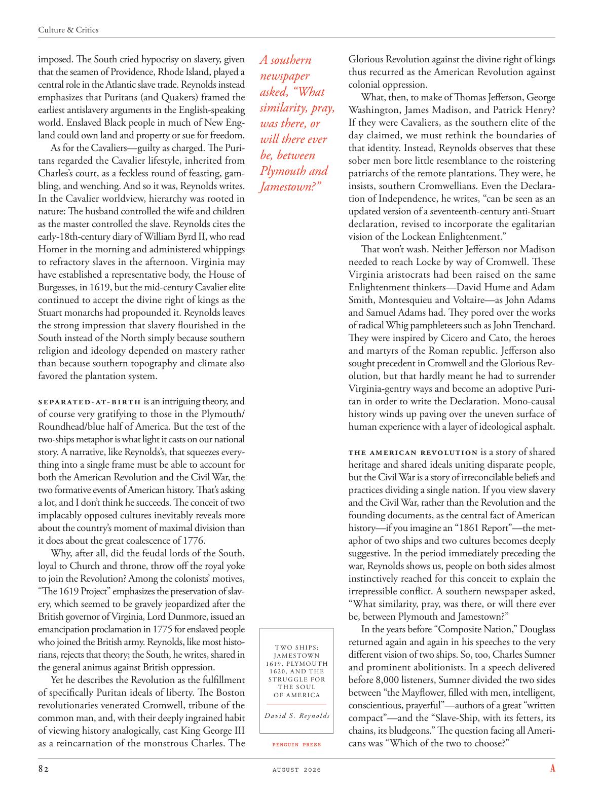

# The Atlantic — August 2026

## Page 84

---

imposed. The South cried hypocrisy on slavery, given that the seamen of Providence, Rhode Island, played a central role in the Atlantic slave trade. Reynolds instead emphasizes that Puritans (and Quakers) framed the earliest anti slavery arguments in the English-speaking world. Enslaved Black people in much of New England could own land and property or sue for freedom.

**【中文翻译】** 强加的。鉴于罗德岛州普罗维登斯的海员在大西洋奴隶贸易中发挥了核心作用，南方对奴隶制表示虚伪。相反，雷诺兹强调清教徒（和贵格会）在英语世界提出了最早的反奴隶制论点。新英格兰大部分地区的被奴役黑人可以拥有土地和财产，也可以诉诸自由。

As for the Cavaliers—guilty as charged. The Puritans regarded the Cavalier lifestyle, inherited from Charles’s court, as a feckless round of feasting, gambling, and wenching. And so it was, Reynolds writes.

**【中文翻译】** 至于骑士队——被指控有罪。清教徒认为从查理宫廷继承下来的骑士生活方式是一种不负责任的宴会、赌博和嫖娼。雷诺兹写道，情况确实如此。

In the Cavalier worldview, hierarchy was rooted in nature: The husband controlled the wife and children as the master controlled the slave. Reynolds cites the early-18th-century diary of William Byrd II, who read Homer in the morning and administered whippings to refractory slaves in the afternoon. Virginia may have established a representative body, the House of Burgesses, in 1619, but the mid-century Cavalier elite continued to accept the divine right of kings as the Stuart monarchs had propounded it. Reynolds leaves the strong impression that slavery flourished in the South instead of the North simply because southern religion and ideology depended on mastery rather than because southern topography and climate also favored the plantation system.

**【中文翻译】** 在骑士世界观中，等级制度根植于本质：丈夫控制妻子和孩子，就像主人控制奴隶一样。雷诺兹引用了威廉·伯德二世 (William Byrd II) 18 世纪早期的日记，他早上读荷马史诗，下午对顽固的奴隶进行鞭打。弗吉尼亚可能在 1619 年建立了一个代表机构，即众议院，但中世纪的骑士精英继续接受斯图亚特君主所提出的国王神圣权利。雷诺兹给人留下了深刻的印象，即奴隶制在南方而不是北方盛行，仅仅是因为南方的宗教和意识形态依赖于掌握，而不是因为南方的地形和气候也有利于种植园制度。

Separated-at-birth is an intriguing theory, and of course very gratifying to those in the Plymouth/ Roundhead/blue half of America. But the test of the two-ships metaphor is what light it casts on our national story. A narrative, like Reynolds’s, that squeezes everything into a single frame must be able to account for both the American Revolution and the Civil War, the two formative events of American history. That’s asking a lot, and I don’t think he succeeds. The conceit of two implacably opposed cultures inevitably reveals more about the country’s moment of maximal division than it does about the great coalescence of 1776.

**【中文翻译】** 出生时分居是一个有趣的理论，当然对于美国普利茅斯/圆头/蓝一半的人来说非常令人满意。但对两艘船的比喻的检验是它对我们国家故事的启发。像雷诺兹这样将一切都压缩到一个框架中的叙事必须能够解释美国革命和内战这两个美国历史的形成事件。这个要求太高了，我认为他不会成功。两种不可调和的对立文化的自负不可避免地更多地揭示了这个国家最大分裂的时刻，而不是1776年的伟大融合。

Why, after all, did the feudal lords of the South, loyal to Church and throne, throw off the royal yoke to join the Revolution? Among the colonists’ motives, “The 1619 Project” emphasizes the preservation of slavery, which seemed to be gravely jeopardized after the British governor of Virginia, Lord Dunmore, issued an emancipation proclamation in 1775 for enslaved people who joined the British army. Reynolds, like most historians, rejects that theory; the South, he writes, shared in the general animus against British oppression.

**【中文翻译】** 毕竟，为什么忠于教会和王位的南方封建领主会摆脱王室的枷锁而加入革命呢？在殖民者的动机中，“1619计划”强调保留奴隶制，自从英国弗吉尼亚总督邓莫尔勋爵于1775年为加入英国军队的奴隶发布解放宣言后，奴隶制似乎受到严重威胁。雷诺兹和大多数历史学家一样，拒绝接受这一理论。他写道，南方普遍对英国的压迫抱有敌意。

Yet he describes the Revolution as the fulfillment of specifically Puritan ideals of liberty. The Boston revolutionaries venerated Cromwell, tribune of the common man, and, with their deeply ingrained habit of viewing history analogically, cast King George III as a reincarnation of the monstrous Charles. The A southern Glorious Revolution against the divine right of kings thus recurred as the American Revolution against newspaper colonial oppression. asked, “What What, then, to make of Thomas Jefferson, George similarity, pray, Washington, James Madison, and Patrick Henry? was there, or If they were Cavaliers, as the southern elite of the day claimed, we must rethink the boundaries of will there ever that identity. Instead, Reynolds observes that these be, between sober men bore little resemblance to the roistering Plymouth and patriarchs of the remote plantations. They were, he Jamestown?” insists, southern Cromwellians. Even the Declaration of Independence, he writes, “can be seen as an updated version of a seventeenth-century anti-Stuart declaration, revised to incorporate the egalitarian vision of the Lockean Enlightenment.”

**【中文翻译】** 然而他将革命描述为清教徒特有的自由理想的实现。波士顿革命者崇敬克伦威尔，这位普通人的护民官，并以其根深蒂固的类比历史习惯，将国王乔治三世视为可怕的查尔斯的转世。反对国王神圣权利的南方光荣革命因此再次成为反对报纸殖民压迫的美国革命。问道：“那么，托马斯·杰斐逊、乔治·华盛顿、詹姆斯·麦迪逊和帕特里克·亨利的相似之处是什么？如果他们是骑士队，正如当时南方精英所声称的那样，我们必须重新思考这种身份的界限。相反，雷诺兹观察到，这些清醒的人与喧闹的普利茅斯和偏远种植园的族长们几乎没有相似之处。他们是，他詹姆斯敦？”南方克伦威尔人坚持认为。他写道，甚至《独立宣言》“也可以被视为 17 世纪反斯图亚特宣言的更新版本，经过修订以纳入洛克启蒙运动的平等主义愿景。”

That won’t wash. Neither Jefferson nor Madison needed to reach Locke by way of Cromwell. These Virginia aristocrats had been raised on the same Enlightenment thinkers—David Hume and Adam Smith, Montesquieu and Voltaire—as John Adams and Samuel Adams had. They pored over the works of radical Whig pamphleteers such as John Trenchard.

**【中文翻译】** 这样就洗不掉了。杰斐逊和麦迪逊都不需要通过克伦威尔到达洛克。这些弗吉尼亚贵族与约翰·亚当斯和塞缪尔·亚当斯一样，都是在同样的启蒙思想家——大卫·休谟和亚当·斯密、孟德斯鸠和伏尔泰——的熏陶下长大的。他们仔细研究了约翰·特伦查德等激进辉格党小册子作者的作品。

They were inspired by Cicero and Cato, the heroes and martyrs of the Roman republic. Jefferson also sought precedent in Cromwell and the Glorious Revolution, but that hardly meant he had to surrender Virginia-gentry ways and become an adoptive Puritan in order to write the Declaration. Mono-causal history winds up paving over the uneven surface of human experience with a layer of ideological asphalt.

**【中文翻译】** 他们的灵感来自罗马共和国的英雄和烈士西塞罗和加图。杰斐逊也在克伦威尔和光荣革命中寻求先例，但这并不意味着他必须放弃弗吉尼亚绅士的方式并成为一个收养的清教徒才能撰写宣言。单因历史最终在人类经验的不平坦表面上铺上了一层意识形态沥青。

The American Revolution is a story of shared heritage and shared ideals uniting disparate people, but the Civil War is a story of irreconcilable beliefs and practices dividing a single nation. If you view slavery and the Civil War, rather than the Revolution and the founding documents, as the central fact of American history—if you imagine an “1861 Report”—the metaphor of two ships and two cultures becomes deeply suggestive. In the period immediately preceding the war, Reynolds shows us, people on both sides almost instinctively reached for this conceit to explain the ir repressible conflict. A southern newspaper asked, “What similarity, pray, was there, or will there ever be, between Plymouth and Jamestown?”

**【中文翻译】** 美国革命是一个将不同人民团结在一起的共同遗产和共同理想的故事，但内战则是一个分裂一个国家的不可调和的信仰和做法的故事。如果你将奴隶制和内战而不是革命和建国文件视为美国历史的核心事实——如果你想象一份“1861年报告”——两艘船和两种文化的隐喻就会变得具有深刻的启发性。雷诺兹向我们展示，在战争爆发前夕，双方的人们几乎本能地用这种自负来解释他们无法压抑的冲突。南方一家报纸问道：“请问，普利茅斯和詹姆斯敦之间曾经或将来有什么相似之处？”

In the years before “Composite Nation,” Douglass returned again and again in his speeches to the very TWO SHIPS: different vision of two ships. So, too, Charles Sumner JAMESTOWN 1619, PLYMOUTH and prominent abolitionists. In a speech delivered 1620, AND THE before 8,000 listeners, Sumner divided the two sides STRUGGLE FOR THE SOUL between “the Mayflower, filled with men, intelligent, OF AMERICA conscientious, prayerful”—authors of a great “written David S. Reynolds compact”—and the “Slave-Ship, with its fetters, its chains, its bludgeons.” The question facing all Americans was “Which of the two to choose?” PENGUIN PRESS

**【中文翻译】** 在“复合国家”之前的几年里，道格拉斯在演讲中一次又一次地回到“两艘船”：两艘船的不同愿景。查尔斯·萨姆纳 (Charles Sumner) 詹姆斯敦 1619 年、普利茅斯和著名废奴主义者也是如此。在 1620 年向 8,000 名听众发表的演讲中，萨姆纳将《为灵魂的斗争》分为“五月花号，载满了人，聪明，有责任心，虔诚的美国”——伟大的“大卫·S·雷诺兹书面契约”的作者——和“带着脚镣、锁链和棍棒的奴隶船”。所有美国人面临的问题是“两者选哪一个？”企鹅出版社
