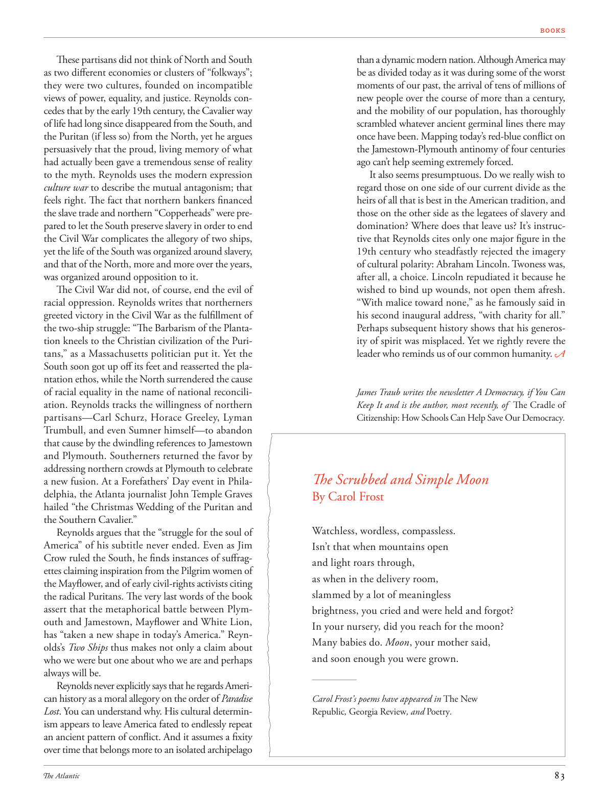

# The Atlantic — August 2026

## Page 85

---

These partisans did not think of North and South as two different economies or clusters of “folkways”; they were two cultures, founded on incompatible views of power, equality, and justice. Reynolds concedes that by the early 19th century, the Cavalier way of life had long since dis appeared from the South, and the Puritan (if less so) from the North, yet he argues persuasively that the proud, living memory of what had actually been gave a tremendous sense of reality to the myth. Reynolds uses the modern expression culture war to describe the mutual antagonism; that feels right. The fact that northern bankers financed the slave trade and northern “Copperheads” were prepared to let the South preserve slavery in order to end the Civil War complicates the allegory of two ships, yet the life of the South was organized around slavery, and that of the North, more and more over the years, was organized around opposition to it.

**【中文翻译】** 这些游击队并不认为北方和南方是两个不同的经济体或“民风”集群；它们是两种文化，建立在对权力、平等和正义的不相容的观点之上。雷诺兹承认，到了 19 世纪初，骑士的生活方式早已从南方消失了，而清教徒的生活方式（如果不是这样的话）也早已从北方消失了，但他令人信服地指出，对实际发生的事情的骄傲、鲜活的记忆给这个神话带来了巨大的现实感。雷诺兹用现代表达文化战争来形容相互对抗；感觉不错。事实上，北方银行家为奴隶贸易提供资金，北方“铜头党”准备让南方保留奴隶制以结束内战，这使两艘船的寓言变得更加复杂，但南方的生活是围绕奴隶制组织的，而北方的生活多年来越来越多地围绕奴隶制组织起来。

The Civil War did not, of course, end the evil of racial oppression. Reynolds writes that northerners greeted victory in the Civil War as the fulfillment of the two-ship struggle: “The Barbarism of the Plantation kneels to the Christian civilization of the Puri-

**【中文翻译】** 当然，内战并没有结束种族压迫的罪恶。雷诺兹写道，北方人将内战的胜利视为两船斗争的完成：“种植园的野蛮行为屈服于普里的基督教文明，

*— tans,” as a Massachusetts politician put it. Yet the*

*【作者署名】正如马萨诸塞州的一位政客所说的那样。*

South soon got up off its feet and reasserted the plantation ethos, while the North surrendered the cause of racial equality in the name of national reconciliation. Reynolds tracks the willingness of northern partisans— Carl Schurz, Horace Greeley, Lyman Trumbull, and even Sumner himself—to abandon that cause by the dwindling references to Jamestown and Plymouth. Southerners returned the favor by addressing northern crowds at Plymouth to celebrate a new fusion. At a Forefathers’ Day event in Philadelphia, the Atlanta journalist John Temple Graves hailed “the Christmas Wedding of the Puritan and the Southern Cavalier.”

**【中文翻译】** 南方很快站起来并重申了种植园精神，而北方则以民族和解的名义放弃了种族平等的事业。雷诺兹追踪了北方游击队——卡尔·舒尔茨、霍勒斯·格里利、莱曼·特朗布尔，甚至萨姆纳本人——通过减少对詹姆斯敦和普利茅斯的提及而放弃这一事业的意愿。作为回报，南方人在普利茅斯向北方人群发表讲话，庆祝新的融合。在费城举行的父亲节活动上，亚特兰大记者约翰·坦普尔·格雷夫斯盛赞“清教徒和南方骑士的圣诞婚礼”。

Reynolds argues that the “struggle for the soul of America” of his subtitle never ended. Even as Jim Crow ruled the South, he finds instances of suffragettes claiming inspiration from the Pilgrim women of the Mayflower, and of early civil-rights activists citing the radical Puritans. The very last words of the book assert that the metaphorical battle between Plymouth and Jamestown, Mayflower and White Lion, has “taken a new shape in today’s America.” Reynolds’s Two Ships thus makes not only a claim about who we were but one about who we are and perhaps always will be.

**【中文翻译】** 雷诺兹认为，他的副标题中的“为美国灵魂而战”从未结束。即使在吉姆·克劳统治南方的时候，他也发现了妇女参政论者声称受到五月花号清教徒妇女启发的例子，以及早期民权活动家引用激进清教徒的例子。该书的最后一句话断言，普利茅斯和詹姆斯敦、五月花号和白狮之间的隐喻战争“在当今的美国形成了新的形态”。因此，雷诺兹的《两艘船》不仅声称我们是谁，而且还声称我们是谁，也许永远是谁。

Reynolds never explicitly says that he regards American history as a moral allegory on the order of Paradise Lost . You can understand why. His cultural determinism appears to leave America fated to endlessly repeat an ancient pattern of conflict. And it assumes a fixity over time that belongs more to an isolated archipelago than a dynamic modern nation. Although America may be as divided today as it was during some of the worst moments of our past, the arrival of tens of millions of new people over the course of more than a century, and the mobility of our population, has thoroughly scrambled whatever ancient germinal lines there may once have been. Mapping today’s red-blue conflict on the Jamestown-Plymouth antinomy of four centuries ago can’t help seeming extremely forced.

**【中文翻译】** 雷诺兹从未明确表示，他将美国历史视为一部类似《失乐园》的道德寓言。你可以理解为什么。他的文化决定论似乎让美国注定要无休止地重复古老的冲突模式。而且它假定随着时间的推移具有固定性，这更多地属于一个孤立的群岛，而不是一个充满活力的现代国家。尽管今天的美国可能像过去一些最糟糕的时刻一样分裂，但一个多世纪以来数以千万计的新移民的到来以及我们人口的流动性已经彻底扰乱了曾经存在的古老的生发系。将今天的红蓝冲突与四个世纪前的詹姆斯敦-普利茅斯二律背反联系起来，不免显得极其牵强。

It also seems presumptuous. Do we really wish to regard those on one side of our current divide as the heirs of all that is best in the American tradition, and those on the other side as the legatees of slavery and domination? Where does that leave us? It’s instructive that Reynolds cites only one major figure in the 19th century who steadfastly rejected the imagery of cultural polarity: Abraham Lincoln. Twoness was, after all, a choice. Lincoln repudiated it because he wished to bind up wounds, not open them afresh.

**【中文翻译】** 这也显得很冒昧。我们真的希望将我们当前分歧的一侧的人视为美国传统中最好的一切的继承人，而将另一侧的人视为奴隶制和统治的继承人吗？那我们会怎样呢？雷诺兹只引用了 19 世纪一位坚定拒绝文化极性形象的重要人物：亚伯拉罕·林肯，这一点颇具启发性。毕竟，双重性是一种选择。林肯否认了这一点，因为他希望包扎伤口，而不是重新打开伤口。

“With malice toward none,” as he famously said in his second inaugural address, “with charity for all.” Perhaps subsequent history shows that his generosity of spirit was misplaced. Yet we rightly revere the leader who reminds us of our common humanity.

**【中文翻译】** 正如他在第二次就职演说中所说的那样，“对任何人都没有恶意，为所有人提供慈善。”也许后来的历史表明他的慷慨精神是错误的。然而，我们正确地尊敬这位提醒我们共同人性的领导人。

James Traub writes the newsletter A Democracy, if You Can Keep It and is the author, most recently, of The Cradle of Citizenship: How Schools Can Help Save Our Democracy .

**【中文翻译】** 詹姆斯·特劳布 (James Traub) 撰写时事通讯《民主，如果你能保留它》，最近还撰写了《公民的摇篮：学校如何帮助拯救我们的民主》一书。

#### The Scrubbed and Simple Moon

**【副标题翻译】** 擦洗而简单的月亮

By Carol Frost Watchless, wordless, compassless. Isn’t that when mountains open and light roars through, as when in the delivery room, slammed by a lot of meaningless brightness, you cried and were held and forgot?

**【中文翻译】** 作者：卡罗尔·弗罗斯特 目不转睛，无言无语，没有指南针。难道不是当群山敞开、光线呼啸而过的时候，就像在产房里，被大量无意义的光猛击中时，你哭了，被抱着然后忘记了？

In your nursery, did you reach for the moon? Many babies do. Moon , your mother said, and soon enough you were grown. Carol Frost’s poems have appeared in The New Republic , Georgia Review , and Poetry .

**【中文翻译】** 在你的托儿所里，你伸手去够月亮了吗？很多宝宝都会这样。月亮，你妈妈说，很快你就长大了。卡罗尔·弗罗斯特的诗歌曾发表在《新共和》、《乔治亚评论》和《诗歌》上。
