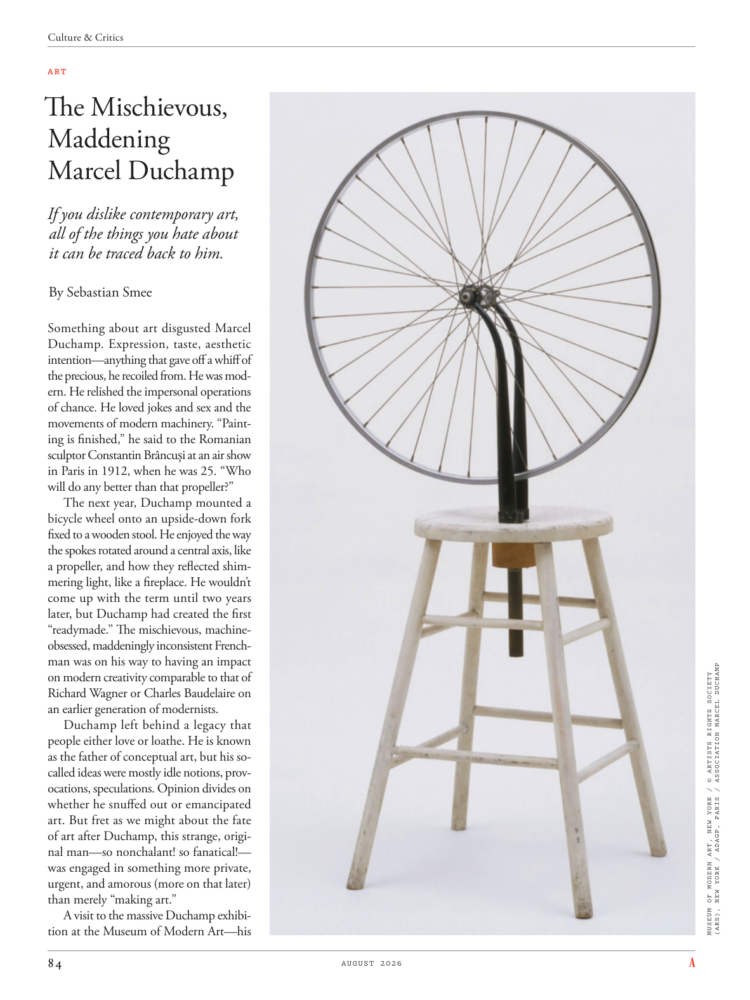

# The Atlantic — August 2026

## Page 86

---

ART

**【中文翻译】** 艺术

### The Mischievous,

**【标题翻译】** 顽皮的，

### Maddening

**【标题翻译】** 令人发狂

### Marcel Duchamp

**【标题翻译】** 马塞尔·杜尚

If you dislike contemporary art, all of the things you hate about it can be traced back to him. By Sebastian Smee Something about art disgusted Marcel Duchamp. Expression, taste, aesthetic intention—anything that gave off a whiff of the precious, he recoiled from. He was modern. He relished the impersonal operations of chance. He loved jokes and sex and the movements of modern machinery. “Painting is finished,” he said to the Romanian sculptor Constantin Brâncuși at an air show in Paris in 1912, when he was 25. “Who will do any better than that propeller?”

**【中文翻译】** 如果你不喜欢当代艺术，那么所有你讨厌当代艺术的东西都可以追溯到他身上。作者：塞巴斯蒂安·斯米 艺术中的某些东西让马塞尔·杜尚感到厌恶。表达、品味、审美意图——任何散发出珍贵气息的东西，他都会退缩。他很现代。他喜欢偶然的客观操作。他喜欢笑话、性和现代机械的运动。 1912 年，25 岁​​的他在巴黎的一次航空展上对罗马尼亚雕塑家康斯坦丁·布朗库西 (Constantin Brancuşi) 说：“绘画完成了。谁能比那个螺旋桨做得更好呢？”

The next year, Duchamp mounted a bicycle wheel onto an upside-down fork fixed to a wooden stool. He enjoyed the way the spokes rotated around a central axis, like a propeller, and how they reflected shimmering light, like a fireplace. He wouldn’t come up with the term until two years later, but Duchamp had created the first “readymade.” The mischievous, machineobsessed, maddeningly inconsistent Frenchman was on his way to having an impact on modern creativity comparable to that of Richard Wagner or Charles Baudelaire on an earlier generation of modernists.

**【中文翻译】** 第二年，杜尚将自行车车轮安装在固定在木凳上的倒置叉上。他喜欢辐条绕中心轴旋转的方式，就像螺旋桨一样，以及它们如何反射闪烁的光线，就像壁炉一样。直到两年后，他才提出这个词，但杜尚创造了第一个“现成品”。这位顽皮、痴迷于机器、反复无常的法国人正在对现代创造力产生影响，其影响堪比理查德·瓦格纳或查尔斯·波德莱尔对上一代现代主义者的影响。

Duchamp left behind a legacy that people either love or loathe. He is known as the father of conceptual art, but his socalled ideas were mostly idle notions, provocations, speculations. Opinion divides on whether he snuffed out or emancipated art. But fret as we might about the fate of art after Duchamp, this strange, original man—so nonchalant! so fanatical!— was engaged in something more private, urgent, and amorous (more on that later) than merely “making art.”

**【中文翻译】** 杜尚留下了人们要么喜爱要么厌恶的遗产。他被称为观念艺术之父，但他的所谓想法大多是空想、挑衅、猜测。对于他是扼杀还是解放了艺术，人们的看法存在分歧。但是，尽管我们可能会为杜尚之后艺术的命运而烦恼，但这个奇怪的、原创的人——如此漠不关心！太狂热了！——他从事的事情比单纯的“创作艺术”更私人、更紧迫、更多情（稍后会详细介绍）。

A visit to the massive Duchamp exhibition at the Museum of Modern Art—his (ARS), NEW YORK / ADAGP, PARIS / ASSOCIATION MARCEL DUCHAMP MUSEUM OF MODERN ART, NEW YORK / © ARTISTS RIGHTS SOCIETY

**【中文翻译】** 参观纽约现代艺术博物馆 (ARS) 举办的大型杜尚展览 / ADAGP，巴黎 / 马塞尔·杜尚现代艺术博物馆协会，纽约 / © ARTISTS RIGHTS SOCIETY
