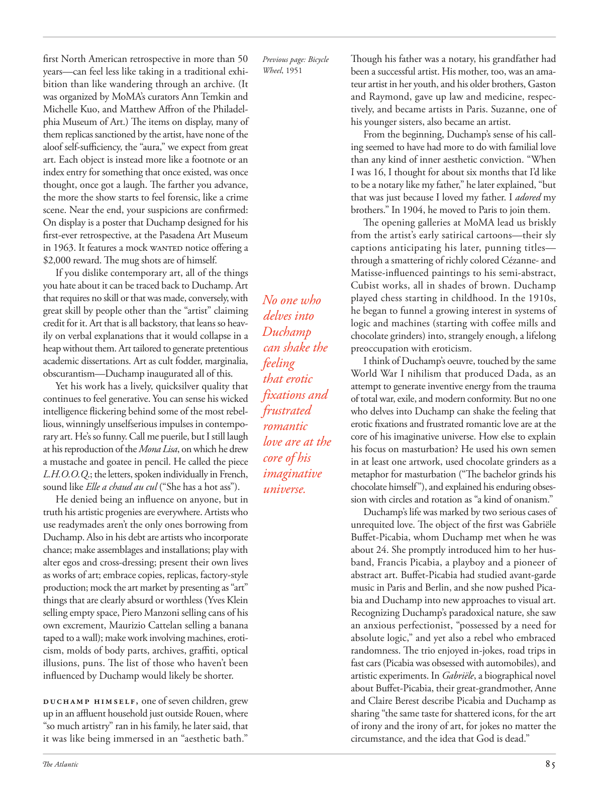

# The Atlantic — August 2026

## Page 87

---

first North American retrospective in more than 50 years—can feel less like taking in a traditional exhibition than like wandering through an archive. (It was organized by MoMA’s curators Ann Temkin and Michelle Kuo, and Matthew Affron of the Philadelphia Museum of Art.) The items on display, many of them replicas sanctioned by the artist, have none of the aloof self-sufficiency, the “aura,” we expect from great art. Each object is instead more like a footnote or an index entry for something that once existed, was once thought, once got a laugh. The farther you advance, the more the show starts to feel forensic, like a crime scene. Near the end, your suspicions are confirmed: On display is a poster that Duchamp designed for his first-ever retro spective, at the Pasadena Art Museum in 1963. It features a mock WANTED notice offering a $2,000 reward. The mug shots are of himself.

**【中文翻译】** 这是 50 多年来首次在北美举办的回顾展——感觉不像是在观看传统展览，而更像是在档案馆中漫步。 （这次展览是由现代艺术博物馆策展人安·特姆金（Ann Temkin）、米歇尔·郭（Michelle Kuo）以及费城艺术博物馆的马修·阿夫隆（Matthew Affron）组织的。）展出的物品，其中许多是经过艺术家认可的复制品，完全没有我们对伟大艺术所期望的那种超然自足的“光环”。相反，每个对象更像是曾经存在、曾经被思考、曾经被嘲笑的事物的脚注或索引条目。你走得越远，这部剧就越有法医的感觉，就像犯罪现场一样。接近尾声时，你的怀疑得到了证实：展出的是杜尚为 1963 年在帕萨迪纳艺术博物馆举办的首次复古展览设计的海报。海报上有一张模拟通缉令，悬赏 2,000 美元。这些照片是他自己的。

If you dislike contemporary art, all of the things you hate about it can be traced back to Duchamp. Art that requires no skill or that was made, conversely, with great skill by people other than the “artist” claiming credit for it. Art that is all backstory, that leans so heavily on verbal explanations that it would collapse in a heap without them. Art tailored to generate pretentious academic dissertations. Art as cult fodder, marginalia, obscurantism—Duchamp inaugurated all of this.

**【中文翻译】** 如果你不喜欢当代艺术，那么所有你讨厌它的东西都可以追溯到杜尚。不需要技巧的艺术，或者相反，是由“艺术家”以外的其他人以高超的技巧创作的艺术。艺术都是背景故事，严重依赖口头解释，如果没有它们，它就会崩溃成一堆。专为生成自命不凡的学术论文而设计的艺术。艺术作为邪教素材、旁注、蒙昧主义——杜尚开创了这一切。

Yet his work has a lively, quick silver quality that continues to feel generative. You can sense his wicked intelligence flickering behind some of the most rebellious, winningly unselfserious impulses in contemporary art. He’s so funny. Call me puerile, but I still laugh at his reproduction of the Mona Lisa , on which he drew a mustache and goatee in pencil. He called the piece L.H.O.O.Q .; the letters, spoken individually in French, sound like Elle a chaud au cul (“She has a hot ass”).

**【中文翻译】** 然而，他的作品却具有一种活泼、敏捷的银色品质，让人感觉持续富有创造力。你可以感觉到他在当代艺术中一些最叛逆、最无私的冲动背后闪烁着邪恶的智慧。他太有趣了。你可以说我很幼稚，但我仍然嘲笑他对《蒙娜丽莎》的复制品，他用铅笔在上面画了小胡子和山羊胡。他称这首曲子为“L.H.O.O.Q”；这些字母单独用法语发音，听起来像 Elle a chaud au cul（“她的屁股很性感”）。

He denied being an influence on anyone, but in truth his artistic progenies are everywhere. Artists who use readymades aren’t the only ones borrowing from Duchamp. Also in his debt are artists who incorporate chance; make assemblages and installations; play with alter egos and crossdressing; present their own lives as works of art; embrace copies, replicas, factory-style production; mock the art market by presenting as “art” things that are clearly absurd or worthless (Yves Klein selling empty space, Piero Manzoni selling cans of his own excrement, Maurizio Cattelan selling a banana taped to a wall); make work involving machines, eroticism, molds of body parts, archives, graffiti, optical illusions, puns. The list of those who haven’t been influenced by Du champ would likely be shorter.

**【中文翻译】** 他否认对任何人有影响，但事实上他的艺术后代无处不在。使用现成品的艺术家并不是唯一借鉴杜尚作品的艺术家。他还感谢那些将机遇融入其中的艺术家。进行组装和安装；玩弄另一个自我和变装；将自己的生活呈现为艺术品；拥抱复制品、复制品、工厂式生产；通过将明显荒谬或毫无价值的东西呈现为“艺术”来嘲笑艺术市场（伊夫·克莱因（Yves Klein）出售空地，皮耶罗·曼佐尼（Piero Manzoni）出售他自己的粪便罐，毛里齐奥·卡特兰（Maurizio Cattelan）出售贴在墙上的香蕉）；创作涉及机器、色情、身体部位模具、档案、涂鸦、视错觉、双关语的作品。没有受到杜冠军影响的人名单可能会更短。

Duchamp himself, one of seven children, grew up in an affluent household just outside Rouen, where “so much artistry” ran in his family, he later said, that it was like being immersed in an “aesthetic bath.”

**【中文翻译】** 杜尚本人是七个孩子之一，在鲁昂郊外的一个富裕家庭长大，他的家庭充满了“艺术气息”，他后来说，就像沉浸在“美学浴”中一样。

Though his father was a notary, his grandfather had Previous page: Bicycle Wheel , 1951 been a successful artist. His mother, too, was an amateur artist in her youth, and his older brothers, Gaston and Raymond, gave up law and medicine, respectively, and became artists in Paris. Suzanne, one of his younger sisters, also became an artist.

**【中文翻译】** 尽管他的父亲是一名公证人，但他的祖父却是一位成功的艺术家。 上一页：自行车车轮，1951他的母亲年轻时也是一位业余艺术家，他的哥哥加斯顿和雷蒙德分别放弃了法律和医学，在巴黎成为了艺术家。他的妹妹苏珊娜也成为了一名艺术家。

From the beginning, Duchamp’s sense of his calling seemed to have had more to do with familial love than any kind of inner aesthetic conviction. “When I was 16, I thought for about six months that I’d like to be a notary like my father,” he later explained, “but that was just because I loved my father. I adored my brothers.” In 1904, he moved to Paris to join them.

**【中文翻译】** 从一开始，杜尚对自己使命的感觉似乎更多地与家庭之爱有关，而不是任何内在的审美信念。 “当我 16 岁的时候，我花了大约六个月的时间想成为像我父亲一样的公证人，”他后来解释道，“但这只是因为我爱我的父亲。我崇拜我的兄弟。” 1904年，他搬到巴黎加入他们。

The opening galleries at MoMA lead us briskly from the artist’s early satirical cartoons—their sly captions anticipating his later, punning titles— through a smattering of richly colored Cézanneand Matisse-influenced paintings to his semi-abstract, Cubist works, all in shades of brown. Duchamp played chess starting in childhood. In the 1910s, No one who he began to funnel a growing interest in systems of delves into logic and machines (starting with coffee mills and Duchamp chocolate grinders) into, strangely enough, a lifelong can shake the pre occupation with eroticism.

**【中文翻译】** 现代艺术博物馆的开幕画廊带领我们轻快地从艺术家早期的讽刺漫画（其狡猾的标题预示着他后来的双关语标题）到一些色彩丰富的塞尚和马蒂斯影响的画作，再到他的半抽象立体主义作品，所有作品都是棕色色调的。杜尚从小就开始下棋。奇怪的是，在 1910 年代，他开始将人们对逻辑和机器系统（从咖啡磨和杜尚巧克力研磨机开始）的兴趣日益增长，并终其一生都无法动摇对色情的关注。

I think of Duchamp’s oeuvre, touched by the same feeling World War I nihilism that produced Dada, as an that erotic attempt to generate inventive energy from the trauma fixations and of total war, exile, and modern conformity. But no one frustrated who delves into Duchamp can shake the feeling that erotic fixations and frustrated romantic love are at the romantic core of his imaginative universe. How else to explain love are at the his focus on masturbation? He used his own semen core of his in at least one artwork, used chocolate grinders as a imaginative metaphor for masturbation (“The bachelor grinds his chocolate himself”), and explained his enduring obsesuniverse. sion with circles and rotation as “a kind of onanism.”

**【中文翻译】** 我认为杜尚的作品受到了第一次世界大战产生达达主义的虚无主义的影响，作为一种色情尝试，从创伤固着、全面战争、流亡和现代顺从中产生创造性能量。但是，任何一个深入研究杜尚的失意者都无法摆脱这样一种感觉：情色迷恋和失意的浪漫爱情是他富有想象力的宇宙的浪漫核心。否则如何解释他对自慰的关注？他在至少一件艺术品中使用了自己的精液核心，使用巧克力研磨机作为自慰的富有想象力的隐喻（“单身汉自己研磨巧克力”），并解释了他持久的痴迷宇宙。与圆圈和旋转的结合被称为“一种手淫”。

Duchamp’s life was marked by two serious cases of unrequited love. The object of the first was Gabriële Buffet-Picabia, whom Duchamp met when he was about 24. She promptly introduced him to her husband, Francis Picabia, a playboy and a pioneer of abstract art. Buffet-Picabia had studied avant-garde music in Paris and Berlin, and she now pushed Picabia and Duchamp into new approaches to visual art.

**【中文翻译】** 杜尚的一生以两起严重的单恋事件为标志。第一个对象是杜尚在 24 岁左右认识的加布里埃尔·巴菲特-皮卡比亚 (Gabriële Buffet-Picabia)。她立即将杜尚介绍给了她的丈夫弗朗西斯·皮卡比亚 (Francis Picabia)，他是一位花花公子，也是抽象艺术的先驱。巴菲特-皮卡比亚曾在巴黎和柏林学习前卫音乐，现在她推动毕卡比亚和杜尚进入视觉艺术的新途径。

Recognizing Duchamp’s paradoxical nature, she saw an anxious perfectionist, “possessed by a need for absolute logic,” and yet also a rebel who embraced randomness. The trio enjoyed in-jokes, road trips in fast cars (Picabia was obsessed with automobiles), and artistic experiments. In Gabriële , a biographical novel about Buffet-Picabia, their great-grandmother, Anne and Claire Berest describe Picabia and Duchamp as sharing “the same taste for shattered icons, for the art of irony and the irony of art, for jokes no matter the circumstance, and the idea that God is dead.”

**【中文翻译】** 认识到杜尚的矛盾本质，她看到了一个焦虑的完美主义者，“被绝对逻辑的需要所占据”，但同时也是一个拥抱随机性的叛逆者。三人组喜欢开玩笑、开快车公路旅行（皮卡比亚痴迷于汽车）和艺术实验。在关于巴菲特·毕卡比亚的传记小说《加布里埃尔》中，他们的曾祖母安妮·贝雷斯特和克莱尔·贝雷斯特描述毕卡比亚和杜尚“对破碎的偶像、讽刺的艺术和艺术的讽刺、无论在什么情况下都喜欢笑话以及上帝已死的想法有着相同的品味”。
