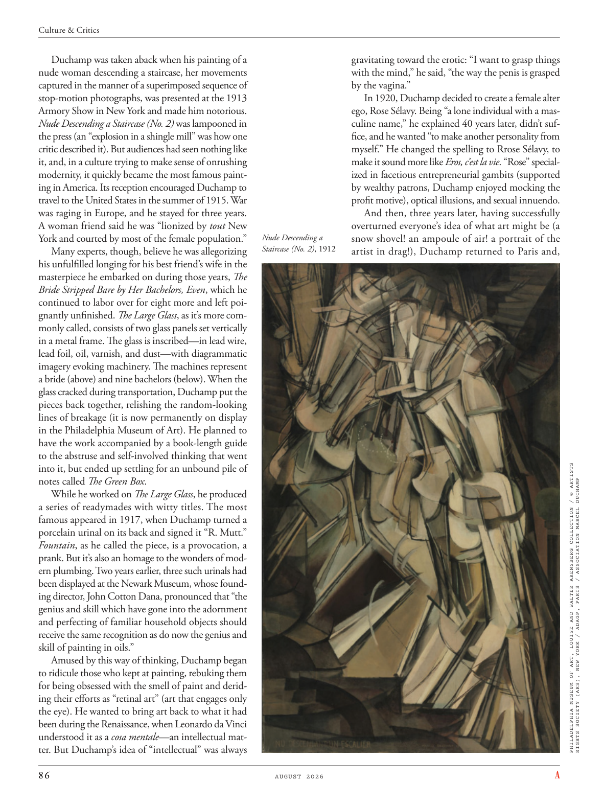

# The Atlantic — August 2026

## Page 88

---

Duchamp was taken aback when his painting of a nude woman descending a staircase, her movements captured in the manner of a superimposed sequence of stop-motion photographs, was presented at the 1913 Armory Show in New York and made him notorious.

**【中文翻译】** 1913 年，杜尚在纽约军械库艺博会上展出了一幅描绘一名裸体女人走下楼梯的画作，并以一系列叠加的定格动画照片的方式捕捉了她的动作，这让杜尚大吃一惊，并让他声名狼藉。

Nude Descending a Staircase (No. 2) was lampooned in the press (an “explosion in a shingle mill” was how one critic described it). But audiences had seen nothing like it, and, in a culture trying to make sense of onrushing modernity, it quickly became the most famous painting in America. Its reception encouraged Duchamp to travel to the United States in the summer of 1915. War was raging in Europe, and he stayed for three years.

**【中文翻译】** 《裸体下楼梯》（No. 2）受到媒体的讽刺（一位评论家将其描述为“木瓦磨坊中的爆炸”）。但观众从未见过类似的作品，而且，在一种试图理解汹涌而来的现代性的文化中，它很快成为美国最著名的画作。它的接待鼓励杜尚于 1915 年夏天前往美国。当时欧洲正值战争，他在那里待了三年。

A woman friend said he was “lionized by tout New York and courted by most of the female population.” Many experts, though, believe he was allegorizing his unfulfilled longing for his best friend’s wife in the masterpiece he embarked on during those years, The Bride Stripped Bare by Her Bachelors, Even , which he continued to labor over for eight more and left poignantly unfinished. The Large Glass , as it’s more commonly called, consists of two glass panels set vertically in a metal frame. The glass is inscribed—in lead wire, lead foil, oil, varnish, and dust—with diagrammatic imagery evoking machinery. The machines represent a bride (above) and nine bachelors (below). When the glass cracked during transportation, Duchamp put the pieces back together, relishing the random-looking lines of breakage (it is now permanently on display in the Philadelphia Museum of Art). He planned to have the work accompanied by a book-length guide to the abstruse and self-involved thinking that went into it, but ended up settling for an unbound pile of notes called The Green Box .

**【中文翻译】** 一位女性朋友说，他“受到纽约的追捧，并受到大多数女性的追捧”。然而，许多专家认为，他在那些年开始创作的杰作《新娘被她的单身汉们剥光了衣服》中寓言了他对最好朋友的妻子未实现的渴望，甚至，他继续努力完成了另外八部作品，但令人心酸地未完成。大玻璃，正如它更常见的那样，由两块垂直设置在金属框架中的玻璃面板组成。玻璃上刻有铅线、铅箔、油、清漆和灰尘，上面刻有令人想起机械的图解图像。这些机器代表一位新娘（上图）和九个单身汉（下图）。当玻璃在运输过程中破裂时，杜尚将碎片重新组装在一起，欣赏那些看起来随机的破损线条（它现在永久陈列在费城艺术博物馆）。他计划为这部作品附上一本长达一本书的指南，介绍其中的深奥和自我参与的思想，但最终满足于一堆未装订的笔记，名为《绿盒子》。

While he worked on The Large Glass , he produced a series of readymades with witty titles. The most famous appeared in 1917, when Duchamp turned a porcelain urinal on its back and signed it “R. Mutt.”

**【中文翻译】** 在创作《大玻璃》时，他制作了一系列带有诙谐标题的现成品。最著名的一次出现在 1917 年，当时杜尚将一个瓷制小便池翻转过来，并在上面署名“R. Mutt”。

Fountain , as he called the piece, is a provocation, a prank. But it’s also an homage to the wonders of modern plumbing. Two years earlier, three such urinals had been displayed at the Newark Museum, whose founding director, John Cotton Dana, pronounced that “the genius and skill which have gone into the adornment and perfecting of familiar household objects should receive the same recognition as do now the genius and skill of painting in oils.”

**【中文翻译】** 正如他所称的《喷泉》，这是一种挑衅，一个恶作剧。但这也是对现代管道奇迹的致敬。两年前，纽瓦克博物馆展出了三个这样的小便池，该博物馆的创始馆长约翰·科顿·达纳 (John Cotton Dana) 宣称，“装饰和完善熟悉的家居用品的天才和技巧应该得到与现在油画天才和技巧同样的认可。”

Amused by this way of thinking, Duchamp began to ridicule those who kept at painting, rebuking them for being obsessed with the smell of paint and deriding their efforts as “retinal art” (art that engages only the eye). He wanted to bring art back to what it had been during the Renaissance, when Leonardo da Vinci understood it as a cosa mentale —an intellectual matter. But Duchamp’s idea of “intellectual” was always gravitating toward the erotic: “I want to grasp things with the mind,” he said, “the way the penis is grasped by the vagina.”

**【中文翻译】** 杜尚被这种思维方式逗乐了，他开始嘲笑那些坚持绘画的人，斥责他们沉迷于油漆的气味，嘲笑他们的努力是“视网膜艺术”（只涉及眼睛的艺术）。他想让艺术回到文艺复兴时期的状态，当时达芬奇将艺术理解为“cosa mentale”——一种智力问题。但杜尚的“知识分子”观念总是倾向于色情：“我想用思想来抓住事物，”他说，“就像阴道抓住阴茎一样。”

In 1920, Duchamp decided to create a female alter ego, Rose Sélavy. Being “a lone individual with a masculine name,” he explained 40 years later, didn’t suffice, and he wanted “to make another personality from myself.” He changed the spelling to Rrose Sélavy, to make it sound more like Eros, c’est la vie . “Rose” specialized in facetious entrepreneurial gambits (supported by wealthy patrons, Duchamp enjoyed mocking the profit motive), optical illusions, and sexual innuendo.

**【中文翻译】** 1920年，杜尚决定创造一个女性另一个自我，罗丝·塞拉维（Rose Sélavy）。 40 年后，他解释说，“一个拥有男性名字的孤独个体”还不够，他想“让自己成为另一种人格”。他将拼写改为 Rrose Sélavy，使其听起来更像 Eros, c’est la vie。 《玫瑰》专注于滑稽的创业策略（在富有的赞助人的支持下，杜尚喜欢嘲笑利润动机）、视错觉和性暗示。

And then, three years later, having successfully overturned everyone’s idea of what art might be (a Nude Descending a snow shovel! an ampoule of air! a portrait of the Staircase (No. 2) , 1912 artist in drag!), Duchamp returned to Paris and, PHILADELPHIA MUSEUM OF ART, LOUISE AND WALTER ARENSBERG COLLECTION / © ARTISTS RIGHTS SOCIETY (ARS), NEW YORK / ADAGP, PARIS / ASSOCIATION MARCEL DUCHAMP

**【中文翻译】** 然后，三年后，杜尚成功地颠覆了每个人对艺术的看法（从雪铲下落的裸体！一瓶空气！楼梯肖像（第 2 号），1912 年变装艺术家！），杜尚返回巴黎，并在费城艺术博物馆路易斯和沃尔特·阿伦斯伯格收藏 / © ARTISTS RIGHTS协会 (ARS)，纽约 / ADAGP，巴黎 / 马塞尔·杜尚协会
