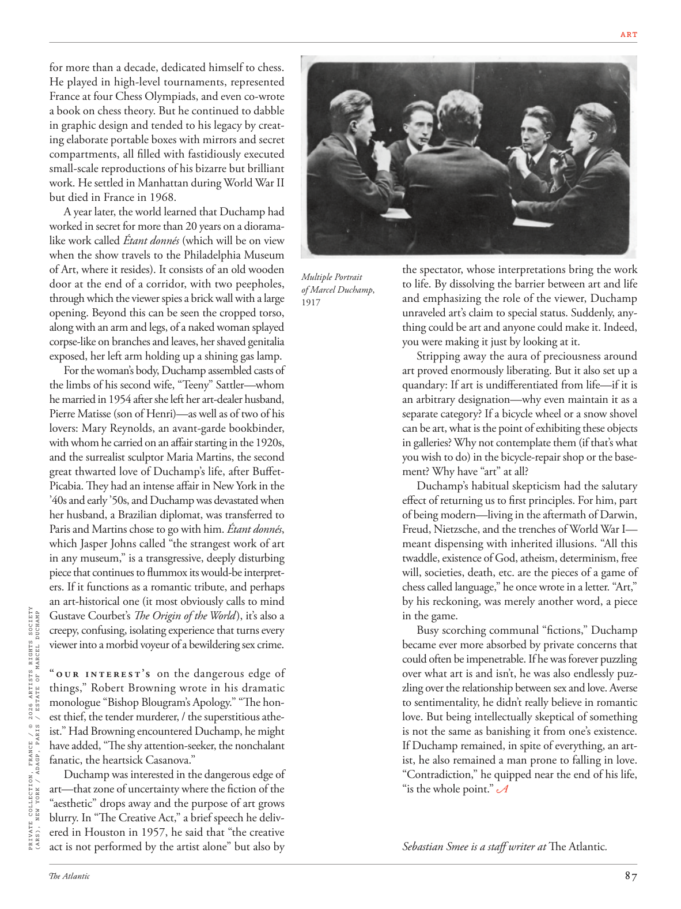

# The Atlantic — August 2026

## Page 89

---

for more than a decade, dedicated himself to chess. He played in high-level tournaments, represented France at four Chess Olympiads, and even co-wrote a book on chess theory. But he continued to dabble in graphic design and tended to his legacy by creating elaborate portable boxes with mirrors and secret compartments, all filled with fastidiously executed small-scale reproductions of his bizarre but brilliant work. He settled in Manhattan during World War II but died in France in 1968.

**【中文翻译】** 十多年来，致力于国际象棋。他参加过高级别比赛，代表法国参加了四届国际象棋奥林匹克比赛，甚至与人合着了一本有关国际象棋理论的书。但他继续涉足平面设计，并通过创造带有镜子和秘密隔间的精致便携式盒子来继承他的遗产，所有盒子里都装满了他奇异而精彩的作品的精心制作的小规模复制品。第二次世界大战期间，他定居曼哈顿，但 1968 年在法国去世。

A year later, the world learned that Du champ had worked in secret for more than 20 years on a dioramalike work called Étant donnés (which will be on view when the show travels to the Philadelphia Museum of Art, where it resides). It consists of an old wooden door at the end of a corridor, with two peepholes, through which the viewer spies a brick wall with a large opening. Beyond this can be seen the cropped torso, along with an arm and legs, of a naked woman splayed corpse-like on branches and leaves, her shaved genitalia exposed, her left arm holding up a shining gas lamp.

**【中文翻译】** 一年后，全世界得知杜尚普秘密创作了一件名为《Étant donnés》的立体模型作品（该作品将在其所在的费城艺术博物馆展出时展出），并已秘密创作了 20 多年。它由走廊尽头的一扇旧木门组成，门上有两个窥视孔，观众可以通过它看到一堵带有大开口的砖墙。除此之外，还可以看到一个裸体女人的躯干，连同手臂和腿，像尸体一样张开在树枝和树叶上，她剃光的生殖器暴露在外，她的左臂举着一盏闪亮的煤气灯。

For the woman’s body, Duchamp assembled casts of the limbs of his second wife, “Teeny” Sattler—whom he married in 1954 after she left her art-dealer husband, Pierre Matisse (son of Henri)—as well as of two of his lovers: Mary Reynolds, an avant-garde bookbinder, with whom he carried on an affair starting in the 1920s, and the surrealist sculptor Maria Martins, the second great thwarted love of Duchamp’s life, after BuffetPicabia. They had an intense affair in New York in the ’40s and early ’50s, and Duchamp was devastated when her husband, a Brazilian diplomat, was transferred to Paris and Martins chose to go with him. Étant donnés , which Jasper Johns called “the strangest work of art in any museum,” is a transgressive, deeply disturbing piece that continues to flummox its would-be interpreters. If it functions as a romantic tribute, and perhaps an art-historical one (it most obviously calls to mind PRIVATE COLLECTION, FRANCE / © 2026 ARTISTS RIGHTS SOCIETY (ARS), NEW YORK / ADAGP, PARIS / ESTATE OF MARCEL DUCHAMP Gustave Courbet’s The Origin of the World ), it’s also a creepy, confusing, isolating experience that turns every viewer into a morbid voyeur of a bewildering sex crime.

**【中文翻译】** 为了制作这个女人的身体，杜尚组装了他的第二任妻子“蒂妮”萨特勒（Teeny Sattler）的四肢模型——他于 1954 年与她结婚，当时她离开了她的艺术品经销商丈夫皮埃尔·马蒂斯（亨利的儿子）——以及他的两个情人：前卫装订师玛丽·雷诺兹（Mary Reynolds）和超现实主义雕塑家玛丽亚（Maria Reynolds）的四肢模型。马丁斯是杜尚一生中继巴菲特·皮卡比亚之后第二个受挫的伟大爱情。他们在 40 年代和 50 年代初在纽约有过一段激烈的恋情，当她的巴西外交官丈夫被调到巴黎而马丁斯选择和他一起去时，杜尚感到非常震惊。 《Étant donnés》被贾斯珀·琼斯称为“所有博物馆中最奇怪的艺术作品”，这是一件越界的、令人深感不安的作品，继续让潜在的解读者感到困惑。如果它是一种浪漫的致敬，也许是一种艺术历史的致敬（它最明显地让人想起法国私人收藏/©2026 ARTISTS RIGHTS SOCIETY (ARS)，纽约/ADAGP，巴黎/马塞尔·杜尚古斯塔夫·库尔贝的庄园《世界的起源》），那么它也是一种令人毛骨悚然、令人困惑、孤立的体验，让每个观众都感到震惊变成一个令人困惑的性犯罪的病态偷窥狂。

“ O u r i n t e re s t’s on the dangerous edge of things,” Robert Browning wrote in his dramatic monologue “Bishop Blougram’s Apology.” “The honest thief, the tender murderer, / the superstitious atheist.” Had Browning encountered Duchamp, he might have added, “The shy attention-seeker, the nonchalant fanatic, the heartsick Casanova.”

**【中文翻译】** “我们的兴趣处于事物的危险边缘，”罗伯特·勃朗宁在他的戏剧性独白“布卢格拉姆主教的道歉”中写道。 “诚实的小偷，温柔的杀人犯，/迷信的无神论者。”如果布朗宁遇到了杜尚，他可能会补充道，“害羞的寻求关注的人，冷漠的狂热分子，伤心欲绝的卡萨诺瓦。”

Duchamp was interested in the dangerous edge of art—that zone of uncertainty where the fiction of the “aesthetic” drops away and the purpose of art grows blurry. In “The Creative Act,” a brief speech he delivered in Houston in 1957, he said that “the creative act is not performed by the artist alone” but also by the spectator, whose interpretations bring the work Multiple Portrait to life. By dissolving the barrier between art and life of Marcel Duchamp , and emphasizing the role of the viewer, Duchamp 1917 un raveled art’s claim to special status. Suddenly, anything could be art and anyone could make it. Indeed, you were making it just by looking at it.

**【中文翻译】** 杜尚对艺术的危险边缘感兴趣——在这个不确定的区域，“美学”的虚构性逐渐消失，艺术的目的变得模糊。 1957 年，他在休斯敦发表了简短的演讲“创造性的行为”，他说“创造性的行为不是由艺术家独自完成的”，也由观众来完成，观众的诠释使作品《多重肖像》变得栩栩如生。通过消除马塞尔·杜尚艺术与生活之间的障碍，并强调观众的角色，《杜尚 1917》揭示了艺术的特殊地位。突然之间，任何东西都可以成为艺术，任何人都可以制作它。事实上，你只是看着它就成功了。

Stripping away the aura of preciousness around art proved enormously liberating. But it also set up a quandary: If art is undifferentiated from life—if it is an arbitrary designation—why even maintain it as a separate category? If a bicycle wheel or a snow shovel can be art, what is the point of exhibiting these objects in galleries? Why not contemplate them (if that’s what you wish to do) in the bicycle-repair shop or the basement? Why have “art” at all?

**【中文翻译】** 事实证明，剥去艺术的珍贵光环是一种巨大的解放。但它也带来了一个难题：如果艺术与生活没有区别——如果它是一个任意的名称——为什么还要将它维持为一个单独的类别？如果自行车车轮或雪铲都可以是艺术品，那么在画廊中展示这些物品还有什么意义呢？为什么不在自行车修理店或地下室考虑它们（如果这是您想要做的）？为什么要有“艺术”？

Duchamp’s habitual skepticism had the salutary effect of returning us to first principles. For him, part of being modern—living in the aftermath of Darwin, Freud, Nietzsche, and the trenches of World War I— meant dispensing with inherited illusions. “All this twaddle, existence of God, atheism, determinism, free will, societies, death, etc. are the pieces of a game of chess called language,” he once wrote in a letter. “Art,” by his reckoning, was merely another word, a piece in the game.

**【中文翻译】** 杜尚习惯性的怀疑主义产生了有益的效果，让我们回归第一原则。对他来说，成为现代人的一部分——生活在达尔文、弗洛伊德、尼采和第一次世界大战战壕的余波中——意味着放弃继承的幻想。 “所有这些废话，上帝的存在，无神论，决定论，自由意志，社会，死亡等等都是一盘叫做语言的国际象棋的棋子，”他曾经在一封信中写道。在他看来，“艺术”只是另一个词，是游戏中的一个棋子。

Busy scorching communal “fictions,” Duchamp became ever more absorbed by private concerns that could often be impenetrable. If he was forever puzzling over what art is and isn’t, he was also endlessly puzzling over the relationship between sex and love. Averse to sentimentality, he didn’t really believe in romantic love. But being intellectually skeptical of something is not the same as banishing it from one’s existence.

**【中文翻译】** 杜尚忙于撰写炙手可热​​的公共“小说”，他变得越来越专注于往往难以理解的私人担忧。如果说他永远对艺术是什么和不是什么感到困惑，那么他也对性与爱之间的关系无休止地感到困惑。他厌恶感伤，并不真正相信浪漫的爱情。但从理智上对某事持怀疑态度并不等于将其从自己的存在中消除。

If Duchamp remained, in spite of everything, an artist, he also remained a man prone to falling in love. “Contradiction,” he quipped near the end of his life, “is the whole point.”

**【中文翻译】** 尽管杜尚仍然是一位艺术家，但他也仍然是一个容易坠入爱河的人。 “矛盾，”他在生命即将结束时打趣道，“才是重点。”

*— Sebastian Smee is a staff writer at The Atlantic .*

*【作者署名】塞巴斯蒂安·斯米 (Sebastian Smee) 是《大西洋月刊》的特约撰稿人。*
