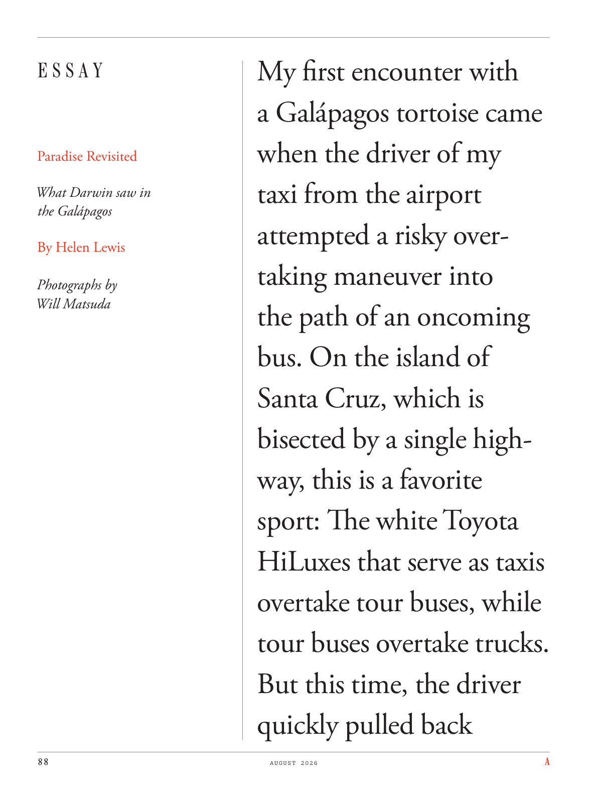

# The Atlantic — August 2026

## Page 90

---

### E S S A Y

**【标题翻译】** 散文

#### Paradise Revisited

**【副标题翻译】** 重访天堂

#### What Darwin saw in

**【副标题翻译】** 达尔文看到了什么

#### the Galápagos

**【副标题翻译】** 加拉帕戈斯群岛

#### By Helen Lewis

**【副标题翻译】** 通过海伦刘易斯

#### Photographs by

**【副标题翻译】** 照片由

#### Will Matsuda

**【副标题翻译】** 威尔·松田

### My first encounter with

**【标题翻译】** 我第一次遇到

### a Galápagos tortoise came

**【标题翻译】** 一只加拉帕戈斯象龟来了

### when the driver of my

**【标题翻译】** 当我的司机

### taxi from the airport

**【标题翻译】** 从机场乘坐出租车

### attempted a risky over-

**【标题翻译】** 尝试了一次冒险的过度

### taking maneuver into

**【标题翻译】** 采取机动行动

### the path of an on coming

**【标题翻译】** 即将到来的道路

### bus. On the island of

**【标题翻译】** 公共汽车。在岛上

### Santa Cruz, which is

**【标题翻译】** 圣克鲁斯，即

### bisected by a single high-

**【标题翻译】** 由单个高平分

### way, this is a favorite

**【标题翻译】** 方式，这是最喜欢的

### sport: The white Toyota

**【标题翻译】** 运动：白色丰田

### HiLuxes that serve as taxis

**【标题翻译】** 充当出租车的 HiLuxes

### overtake tour buses, while

**【标题翻译】** 超越旅游巴士，同时

### tour buses overtake trucks.

**【标题翻译】** 旅游巴士超过卡车。

### But this time, the driver

**【标题翻译】** 但这一次，司机

### quickly pulled back

**【标题翻译】** 迅速撤回
