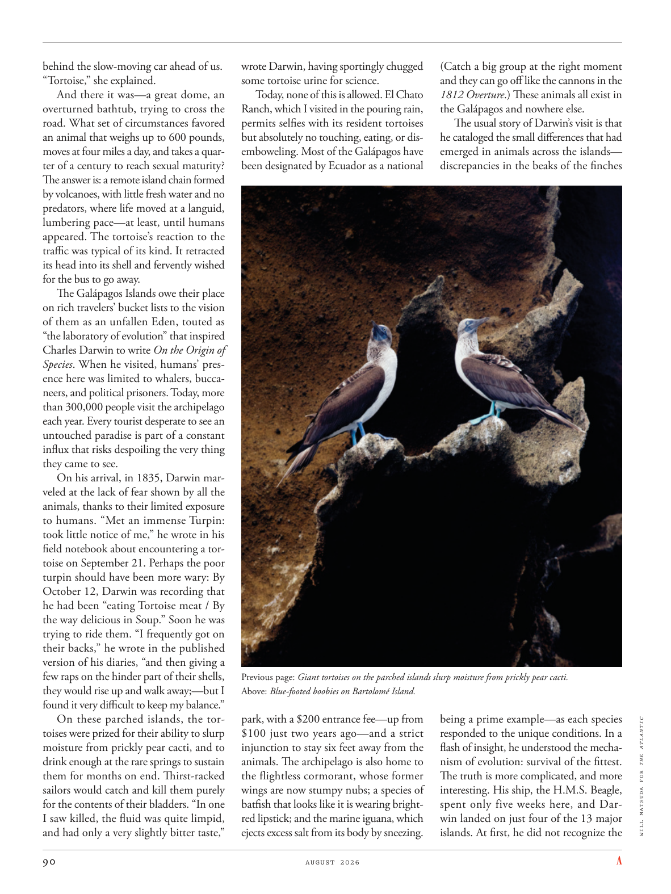

# The Atlantic — August 2026

## Page 92

---

behind the slow-moving car ahead of us. “Tortoise,” she explained. And there it was—a great dome, an overturned bathtub, trying to cross the road. What set of circumstances favored an animal that weighs up to 600 pounds, moves at four miles a day, and takes a quarter of a century to reach sexual maturity?

**【中文翻译】** 跟在我们前面那辆缓慢行驶的汽车后面。 “乌龟，”她解释道。就在那里——一个巨大的圆顶，一个翻倒的浴缸，正试图穿过马路。什么样的环境有利于这种重达 600 磅、每天移动四英里、需要四分之一个世纪才能达到性成熟的动物？

The answer is: a remote island chain formed by volcanoes, with little fresh water and no predators, where life moved at a languid, lumbering pace— at least, until humans appeared. The tortoise’s reaction to the traffic was typical of its kind. It retracted its head into its shell and fervently wished for the bus to go away.

**【中文翻译】** 答案是：一条由火山形成的偏远岛链，几乎没有淡水，也没有掠食者，生命在那里缓慢而缓慢地移动——至少在人类出现之前是这样。乌龟对交通的反应是同类中的典型反应。它把头缩进壳里，热切地希望公交车开走。

The Galápagos Islands owe their place on rich travelers’ bucket lists to the vision of them as an unfallen Eden, touted as “the laboratory of evolution” that inspired Charles Darwin to write On the Origin of Species . When he visited, humans’ presence here was limited to whalers, buccaneers, and political prisoners. Today, more than 300,000 people visit the archipelago each year. Every tourist desperate to see an untouched paradise is part of a constant influx that risks despoiling the very thing they came to see.

**【中文翻译】** 加拉帕戈斯群岛之所以能在富有的旅行者的愿望清单上占有一席之地，是因为它们被视为一个不朽的伊甸园，被誉为“进化的实验室”，启发了查尔斯·达尔文写下《物种起源》。当他访问时，这里的人类仅限于捕鲸者、海盗和政治犯。如今，每年有超过 300,000 人游览该群岛。每一位渴望一睹未受破坏的天堂的游客都是不断涌入的游客的一部分，而这些涌入的游客可能会破坏他们所看到的一切。

On his arrival, in 1835, Darwin marveled at the lack of fear shown by all the animals, thanks to their limited exposure to humans. “Met an immense Turpin: took little notice of me,” he wrote in his field notebook about encountering a tortoise on September 21. Perhaps the poor turpin should have been more wary: By October 12, Darwin was recording that he had been “eating Tortoise meat / By the way delicious in Soup.” Soon he was trying to ride them. “I frequently got on their backs,” he wrote in the published version of his diaries, “and then giving a few raps on the hinder part of their shells, they would rise up and walk away;—but I found it very difficult to keep my balance.”

**【中文翻译】** 1835 年，达尔文抵达达尔文后，他惊讶地发现，由于与人类的接触有限，所有动物都没有表现出恐惧。 9 月 21 日，他在野外笔记本中遇到了一只乌龟，他写道：“遇到了一只巨大的海龟：很少注意到我。”也许可怜的海龟应该更加警惕：到 10 月 12 日，达尔文记录说他一直在“吃乌龟肉/顺便说一下汤里的美味。”很快他就尝试骑它们了。 “我经常骑在它们的背上，”他在日记的出版版本中写道，“然后敲击它们壳的后部，它们就会站起来走开；——但我发现很难保持平衡。”

On these parched islands, the tortoises were prized for their ability to slurp moisture from prickly pear cacti, and to drink enough at the rare springs to sustain them for months on end. Thirst-racked sailors would catch and kill them purely for the contents of their bladders. “In one I saw killed, the fluid was quite limpid, and had only a very slightly bitter taste,” wrote Darwin, having sportingly chugged some tortoise urine for science.

**【中文翻译】** 在这些炎热的岛屿上，陆龟因其能够从仙人掌中吸取水分，并在稀有的泉水中喝到足够的水来维持数月的生命而受到重视。饥肠辘辘的水手们会抓住并杀死它们，纯粹是为了获取它们膀胱里的东西。 “我看到一只被杀死的乌龟，液体非常清澈，只有一点点苦味，”达尔文写道，他为了科学目的而运动着喝了一些乌龟尿液。

Today, none of this is allowed. El Chato Ranch, which I visited in the pouring rain, permits selfies with its resident tortoises but absolutely no touching, eating, or disemboweling. Most of the Galápagos have been designated by Ecuador as a national Previous page: Giant tortoises on the parched islands slurp moisture from prickly pear cacti.

**【中文翻译】** 今天，这一切都是不允许的。我在倾盆大雨中参观了埃尔查托牧场 (El Chato Ranch)，这里允许与当地的陆龟自拍，但绝对禁止触摸、进食或开膛破肚。加拉帕戈斯群岛的大部分地区已被厄瓜多尔指定为国家保护区 上一页：干燥岛屿上的巨龟从仙人掌中吸食水分。

Above: Blue-footed boobies on Bartolomé Island. park, with a $200 entrance fee— up from $100 just two years ago— and a strict injunction to stay six feet away from the animals. The archipelago is also home to the flightless cormorant, whose former wings are now stumpy nubs; a species of batfish that looks like it is wearing brightred lipstick; and the marine iguana, which ejects excess salt from its body by sneezing.

**【中文翻译】** 上图：巴托洛梅岛的蓝脚鲣鸟。公园的入场费为 200 美元（两年前为 100 美元），并且严格禁止与动物保持 6 英尺的距离。该群岛也是不会飞的鸬鹚的家园，它们以前的翅膀现在变成了短小的小节。一种蝙蝠鱼，看起来就像涂着鲜红色的口红；还有海鬣蜥，它通过打喷嚏排出体内多余的盐分。

(Catch a big group at the right moment and they can go off like the cannons in the 1812 Overture .) These animals all exist in the Galápagos and nowhere else.

**【中文翻译】** （在正确的时刻抓住一大群，它们就会像 1812 年序曲中的大炮一样爆炸。） 这些动物都存在于加拉帕戈斯群岛，而不是其他地方。

The usual story of Darwin’s visit is that he cataloged the small differences that had emerged in animals across the islands— discrepancies in the beaks of the finches being a prime example— as each species WILL MATSUDA FOR THE ATLANTIC responded to the unique conditions. In a flash of insight, he understood the mechanism of evolution: survival of the fittest.

**【中文翻译】** 达尔文访问的常见故事是，他记录了各岛屿动物中出现的微小差异（雀类喙部的差异就是一个典型的例子），因为每个物种都会对独特的条件做出反应。灵光一现，他明白了进化的机制：适者生存。

The truth is more complicated, and more interesting. His ship, the H.M.S. Beagle, spent only five weeks here, and Darwin landed on just four of the 13 major islands. At first, he did not recognize the

**【中文翻译】** 事实更复杂，也更有趣。他的船，H.M.S. 比格尔号在这里只呆了五个星期，而达尔文号则只登陆了 13 个主要岛屿中的 4 个。起初他并没有认出
