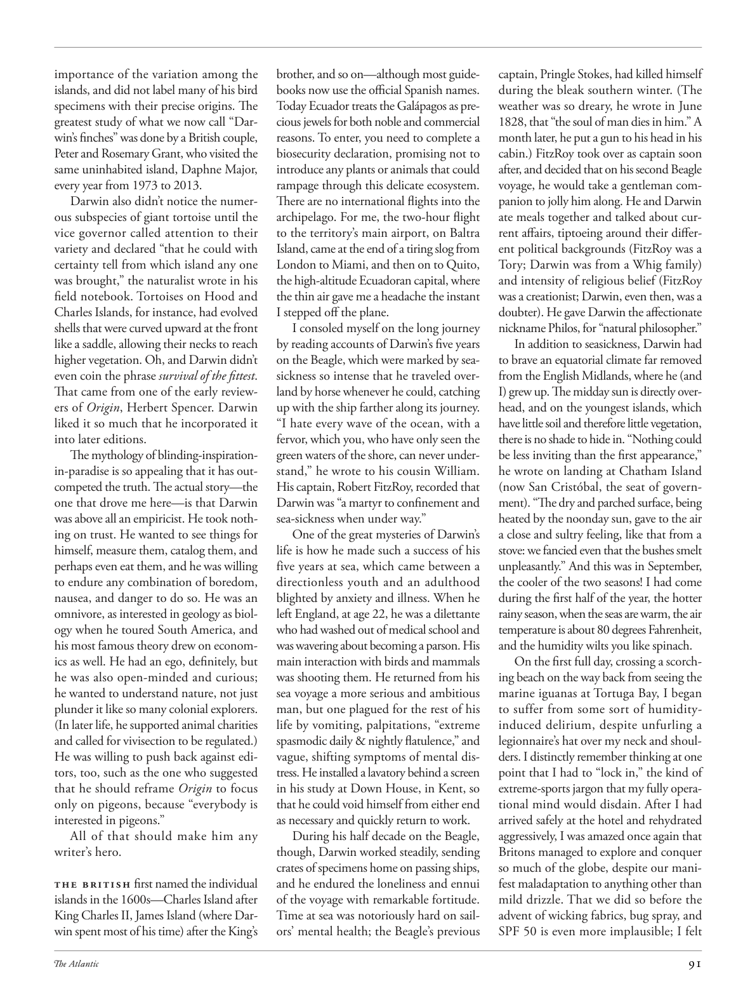

# The Atlantic — August 2026

## Page 93

---

importance of the variation among the islands, and did not label many of his bird specimens with their precise origins. The greatest study of what we now call “Darwin’s finches” was done by a British couple, Peter and Rosemary Grant, who visited the same uninhabited island, Daphne Major, every year from 1973 to 2013.

**【中文翻译】** 岛屿之间差异的重要性，并且没有为他的许多鸟类标本贴上确切的起源标签。对我们现在所说的“达尔文雀”最伟大的研究是由一对英国夫妇彼得·格兰特和罗斯玛丽·格兰特完成的，他们从 1973 年到 2013 年每年都会访问同一个无人居住的岛屿达芙妮·梅杰。

Darwin also didn’t notice the numerous subspecies of giant tortoise until the vice governor called attention to their variety and declared “that he could with certainty tell from which island any one was brought,” the naturalist wrote in his field notebook. Tortoises on Hood and Charles Islands, for instance, had evolved shells that were curved upward at the front like a saddle, allowing their necks to reach higher vegetation. Oh, and Darwin didn’t even coin the phrase survival of the fittest .

**【中文翻译】** 达尔文也没有注意到巨龟的众多亚种，直到副州长提请人们注意它们的多样性，并宣称“他可以肯定地分辨出任何一只巨龟是从哪个岛上带来的”，这位博物学家在他的野外笔记本中写道。例如，胡德岛和查尔斯岛上的陆龟进化出了外壳，外壳的前端像马鞍一样向上弯曲，使它们的脖子能够够到更高的植被。哦，达尔文甚至没有创造“适者生存”这个词。

That came from one of the early reviewers of Origin , Herbert Spencer. Darwin liked it so much that he incorporated it into later editions.

**【中文翻译】** 这是来自 Origin 早期评论家之一的赫伯特·斯宾塞 (Herbert Spencer)。达尔文非常喜欢它，因此将其纳入后来的版本中。

The mythology of blindinginspiration- in-paradise is so appealing that it has outcompeted the truth. The actual story— the one that drove me here— is that Darwin was above all an empiricist. He took nothing on trust. He wanted to see things for himself, measure them, catalog them, and perhaps even eat them, and he was willing to endure any combination of boredom, nausea, and danger to do so. He was an omnivore, as interested in geology as biology when he toured South America, and his most famous theory drew on economics as well. He had an ego, definitely, but he was also open-minded and curious; he wanted to understand nature, not just plunder it like so many colonial explorers.

**【中文翻译】** 天堂里令人眼花缭乱的灵感神话是如此吸引人，以至于它超越了事实。真正的故事——驱使我来到这里的故事——是达尔文首先是一位经验主义者。他没有接受任何信任。他想亲眼看看事物，测量它们，对它们进行分类，甚至可能吃掉它们，并且为此他愿意忍受任何无聊、恶心和危险的组合。他是一个杂食动物，当他游览南美洲时，他对地质学和生物学同样感兴趣，他最著名的理论也借鉴了经济学。毫无疑问，他很自负，但他也心胸开阔、好奇心强。他想了解自然，而不仅仅是像许多殖民探险家那样掠夺自然。

(In later life, he supported animal charities and called for vivisection to be regulated.) He was willing to push back against editors, too, such as the one who suggested that he should reframe Origin to focus only on pigeons, because “everybody is interested in pigeons.”

**【中文翻译】** （晚年，他支持动物慈善机构，并呼吁对活体解剖进行监管。）他也愿意反对编辑，比如有人建议他应该重新调整 Origin 的框架，只关注鸽子，因为“每个人都对鸽子感兴趣。”

All of that should make him any writer’s hero. The British first named the individual islands in the 1600s—Charles Island after King Charles II, James Island (where Darwin spent most of his time) after the King’s brother, and so on— although most guidebooks now use the official Spanish names.

**【中文翻译】** 所有这些都应该使他成为任何作家的英雄。英国人在 1600 年代首次为各个岛屿命名——查尔斯岛以国王查尔斯二世的名字命名，詹姆斯岛（达尔文在那里度过了大部分时间）以国王的兄弟命名，等等——尽管现在大多数旅游指南都使用官方的西班牙名称。

Today Ecuador treats the Galápagos as precious jewels for both noble and commercial reasons. To enter, you need to complete a bio security declaration, promising not to introduce any plants or animals that could rampage through this delicate ecosystem.

**【中文翻译】** 如今，出于高贵和商业原因，厄瓜多尔将加拉帕戈斯群岛视为珍贵的珠宝。要进入，您需要填写一份生物安全声明，承诺不会引入任何可能在这个脆弱的生态系统中肆虐的植物或动物。

There are no international flights into the archipelago. For me, the two-hour flight to the territory’s main airport, on Baltra Island, came at the end of a tiring slog from London to Miami, and then on to Quito, the high-altitude Ecuadoran capital, where the thin air gave me a headache the instant I stepped off the plane.

**【中文翻译】** 没有飞往该群岛的国际航班。对我来说，从伦敦到迈阿密，然后到高海拔的厄瓜多尔首都基多，经过两个小时的飞行，到达该领土巴尔特拉岛的主要机场，从伦敦到迈阿密，然后到达基多，那里稀薄的空气让我一下飞机就感到头疼。

I consoled myself on the long journey by reading accounts of Darwin’s five years on the Beagle, which were marked by seasickness so intense that he traveled overland by horse whenever he could, catching up with the ship farther along its journey.

**【中文翻译】** 在漫长的旅途中，我读了达尔文在小猎犬号上五年的经历来安慰自己，这五年里，他晕船非常严重，只要一有机会，他就骑马从陆路旅行，追赶这艘船在航行中更远的地方。

“I hate every wave of the ocean, with a fervor, which you, who have only seen the green waters of the shore, can never understand,” he wrote to his cousin William.

**【中文翻译】** 他在给表弟威廉的信中写道：“我憎恨大海的每一个波浪，你的热情是只见过海岸绿色海水的人永远无法理解的。”

His captain, Robert FitzRoy, recorded that Darwin was “a martyr to confinement and sea-sickness when under way.” One of the great mysteries of Darwin’s life is how he made such a success of his five years at sea, which came between a direction less youth and an adulthood blighted by anxiety and illness. When he left England, at age 22, he was a dilettante who had washed out of medical school and was wavering about becoming a parson. His main interaction with birds and mammals was shooting them. He returned from his sea voyage a more serious and ambitious man, but one plagued for the rest of his life by vomiting, palpitations, “extreme spasmodic daily & nightly flatulence,” and vague, shifting symptoms of mental distress. He installed a lavatory behind a screen in his study at Down House, in Kent, so that he could void himself from either end as necessary and quickly return to work.

**【中文翻译】** 他的船长罗伯特·菲茨罗伊 (Robert FitzRoy) 记录道，达尔文是“航行中因禁闭和晕船而殉道的人”。达尔文一生最大的谜团之一是他如何在海上的五年中取得如此成功，这五年是在缺乏方向的青年时期和饱受焦虑和疾病折磨的成年时期之间发生的。当他 22 岁时离开英国时，他还是一名从医学院退学的业余爱好者，并在是否成为一名牧师方面犹豫不决。他与鸟类和哺乳动物的主要互动是射击它们。海上航行归来后，他变得更加严肃、更加雄心勃勃，但他的余生都受到呕吐、心悸、“每天和夜间极度痉挛性肠胃气胀”以及模糊的、不断变化的精神痛苦症状的困扰。他在肯特郡唐豪斯的书房的屏风后面安装了一个厕所，这样他就可以在必要时从两端脱身并快速返回工作岗位。

During his half decade on the Beagle, though, Darwin worked steadily, sending crates of specimens home on passing ships, and he endured the loneliness and ennui of the voyage with remarkable fortitude.

**【中文翻译】** 然而，在小猎犬号上的五年里，达尔文工作稳定，通过过往的船只将一箱箱标本送回家，他以非凡的毅力忍受了航行中的孤独和无聊。

Time at sea was notoriously hard on sailors’ mental health; the Beagle’s previous captain, Pringle Stokes, had killed himself during the bleak southern winter. (The weather was so dreary, he wrote in June 1828, that “the soul of man dies in him.” A month later, he put a gun to his head in his cabin.) FitzRoy took over as captain soon after, and decided that on his second Beagle voyage, he would take a gentleman companion to jolly him along. He and Darwin ate meals together and talked about current affairs, tiptoeing around their different political backgrounds (FitzRoy was a Tory; Darwin was from a Whig family) and intensity of religious belief (FitzRoy was a creationist; Darwin, even then, was a doubter). He gave Darwin the affectionate nickname Philos, for “natural philosopher.”

**【中文翻译】** 众所周知，海上航行对水手的心理健康影响很大。小猎犬号的前任船长普林格尔·斯托克斯在南方寒冷的冬季自杀了。 （他在 1828 年 6 月写道，天气如此阴沉，“人的灵魂在他身上死去。”一个月后，他在自己的船舱里用枪指着自己的头。）菲茨罗伊不久之后就接任船长，并决定在他的第二次小猎犬号航行中，他将带上一位绅士同伴来陪伴他。他和达尔文一起吃饭，谈论时事，小心翼翼地谈论他们不同的政治背景（菲茨罗伊是保守党人；达尔文来自辉格党家庭）和强烈的宗教信仰（菲茨罗伊是神创论者；即使在当时，达尔文也是一个怀疑论者）。他给达尔文起了一个亲切的昵称“菲洛斯”，意思是“自然哲学家”。

In addition to seasickness, Darwin had to brave an equatorial climate far removed from the English Midlands, where he (and I) grew up. The midday sun is directly overhead, and on the youngest islands, which have little soil and therefore little vegetation, there is no shade to hide in. “Nothing could be less inviting than the first appearance,” he wrote on landing at Chatham Island (now San Cristóbal, the seat of government). “The dry and parched surface, being heated by the noonday sun, gave to the air a close and sultry feeling, like that from a stove: we fancied even that the bushes smelt unpleasantly.” And this was in September, the cooler of the two seasons! I had come during the first half of the year, the hotter rainy season, when the seas are warm, the air temperature is about 80 degrees Fahren heit, and the humidity wilts you like spinach.

**【中文翻译】** 除了晕船之外，达尔文还必须忍受远离他（和我）长大的英国中部地区的赤道气候。正午的阳光直射头顶，在最年轻的岛屿上，土壤很少，因此植被也很少，没有任何树荫可以躲藏。“没有什么比第一次出现更吸引人的了，”他在查塔姆岛（现在的圣克里斯托瓦尔岛，政府所在地）登陆时写道。 “干燥干燥的地表被正午的阳光加热，给空气带来一种亲密而闷热的感觉，就像炉子里的味道：我们甚至觉得灌木丛闻起来很难闻。”这是九月，两个季节中最凉爽的一个！我是在今年上半年来的，正值炎热的雨季，海水温暖，气温约为 80 华氏度，潮湿的天气让你像菠菜一样枯萎。

On the first full day, crossing a scorching beach on the way back from seeing the marine iguanas at Tortuga Bay, I began to suffer from some sort of humidityinduced delirium, despite unfurling a legionnaire’s hat over my neck and shoulders. I distinctly remember thinking at one point that I had to “lock in,” the kind of extreme-sports jargon that my fully operational mind would disdain. After I had arrived safely at the hotel and rehydrated aggressively, I was amazed once again that Britons managed to explore and conquer so much of the globe, despite our manifest maladaptation to anything other than mild drizzle. That we did so before the advent of wicking fabrics, bug spray, and SPF 50 is even more implausible; I felt

**【中文翻译】** 第一天，在托尔图加湾观看海鬣蜥回来的路上，穿过灼热的海滩，尽管我把一顶退伍军人的帽子戴在脖子和肩膀上，但我开始遭受某种潮湿引起的精神错乱。我清楚地记得有一次我想我必须“锁定”，这是我完全运作的大脑会鄙视的一种极限运动术语。当我安全抵达酒店并积极补充水分后，我再次惊讶于英国人能够探索和征服地球上如此多的地方，尽管我们明显不适应除了小雨之外的任何事物。在吸湿排汗织物、杀虫剂和 SPF 50 出现之前我们就这样做了，这更令人难以置信；我感觉
