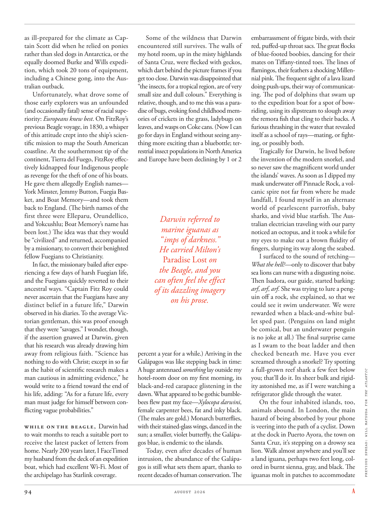

# The Atlantic — August 2026

## Page 96

---

as illprepared for the climate as Captain Scott did when he relied on ponies rather than sled dogs in Antarctica, or the equally doomed Burke and Wills expedition, which took 20 tons of equipment, including a Chinese gong, into the Australian outback.

**【中文翻译】** 就像斯科特船长在南极洲依靠小马而不是雪橇犬时所做的那样，或者同样注定失败的伯克和威尔斯探险队，他们携带了包括中国锣在内的 20 吨设备进入澳大利亚内陆。

Unfortunately, what drove some of those early explorers was an unfounded (and occasionally fatal) sense of racial superiority: Europeans knew best . On FitzRoy’s previous Beagle voyage, in 1830, a whisper of this attitude crept into the ship’s scientific mission to map the South American coastline. At the southernmost tip of the continent, Tierra del Fuego, FitzRoy effectively kidnapped four Indigenous people as revenge for the theft of one of his boats.

**【中文翻译】** 不幸的是，驱使一些早期探险家的是一种毫无根据的（有时是致命的）种族优越感：欧洲人最了解。在菲茨罗伊号 1830 年的上一次小猎犬号航行中，这种态度悄然渗透到了该船绘制南美海岸线地图的科学使命中。在非洲大陆最南端的火地岛，菲茨罗伊实际上绑架了四名原住民，作为对他的一艘船被盗的报复。

He gave them allegedly English names— York Minster, Jemmy Button, Fuegia Basket, and Boat Memory—and took them back to England. (The birth names of the first three were Elleparu, Orundellico, and Yokcushlu; Boat Memory’s name has been lost.) The idea was that they would be “civilized” and returned, accompanied by a missionary, to convert their benighted fellow Fuegians to Christianity.

**【中文翻译】** 他给它们取了据称是英文的名字——约克大教堂、杰米·巴顿、富吉亚·篮子和船记忆——然后把它们带回了英国。 （前三个人的出生名字是 Elleparu、Orundellico 和 Yokcushlu；Boat Memory 的名字已丢失。）他们的想法是，他们将“文明化”并在传教士的陪同下返回，让他们愚昧的火地岛同胞皈依基督教。

In fact, the missionary bailed after experiencing a few days of harsh Fuegian life, and the Fuegians quickly reverted to their ancestral ways. “Captain Fitz Roy could never ascertain that the Fuegians have any distinct belief in a future life,” Darwin observed in his diaries. To the average Victorian gentleman, this was proof enough that they were “savages.” I wonder, though, if the assertion gnawed at Darwin, given that his research was already drawing him away from religious faith. “Science has nothing to do with Christ; except in so far as the habit of scientific research makes a man cautious in admitting evidence,” he would write to a friend toward the end of his life, adding: “As for a future life, every man must judge for himself between conflicting vague probabilities.”

**【中文翻译】** 事实上，这位传教士在经历了几天严酷的火地岛生活后离开了，火地岛人很快又恢复了他们祖先的生活方式。达尔文在日记中写道：“菲茨罗伊船长永远无法确定火地岛人对未来的生活有任何明确的信仰。”对于普通的维多利亚绅士来说，这足以证明他们是“野蛮人”。不过，我想知道这种说法是否对达尔文产生了影响，因为他的研究已经使他远离了宗教信仰。 “科学与基督无关；除非科学研究的习惯使人在接受证据时保持谨慎，”他在生命的尽头写给一位朋友，并补充道：“至于未来的生活，每个人都必须在相互冲突的模糊概率之间做出自己的判断。”

While on the Beagle, Darwin had to wait months to reach a suitable port to receive the latest packet of letters from home. Nearly 200 years later, I FaceTimed my husband from the deck of an expedition boat, which had excellent Wi-Fi. Most of the archipelago has Starlink coverage.

**【中文翻译】** 在小猎犬号上，达尔文不得不等待数月才能到达合适的港口才能收到最新一包来自家乡的信件。近 200 年后，我在一艘拥有良好 Wi-Fi 的探险船的甲板上通过 FaceTime 与我的丈夫进行了视频通话。大部分群岛都有星链覆盖。

Some of the wildness that Darwin encountered still survives. The walls of my hotel room, up in the misty highlands of Santa Cruz, were flecked with geckos, which dart behind the picture frames if you get too close. Darwin was disappointed that “the insects, for a tropical region, are of very small size and dull colours.” Everything is relative, though, and to me this was a paradise of bugs, evoking fond childhood memories of crickets in the grass, lady bugs on leaves, and wasps on Coke cans. (Now I can go for days in England without seeing anything more exciting than a bluebottle; terrestrial insect populations in North America and Europe have been declining by 1 or 2 Darwin referred to marine iguanas as “imps of darkness.”

**【中文翻译】** 达尔文遇到的一些荒野仍然存在。我的酒店房间位于圣克鲁斯雾蒙蒙的高地，墙壁上布满了壁虎，如果你靠得太近，它们就会飞到相框后面。达尔文感到失望的是，“对于热带地区来说，这些昆虫的体型非常小，而且颜色暗淡。”不过，一切都是相对的，对我来说，这里是虫子的天堂，唤起了我对草丛中的蟋蟀、树叶上的瓢虫和可乐罐上的黄蜂的美好童年回忆。 （现在我可以在英国呆上好几天，都看不到比蓝蝇更令人兴奋的东西；北美和欧洲的陆生昆虫数量已经减少了一到两个，达尔文将海鬣蜥称为“黑暗的小鬼”。

He carried Milton’s Paradise Lost on the Beagle, and you can often feel the effect of its dazzling imagery on his prose. percent a year for a while.) Arriving in the Galápagos was like stepping back in time: A huge antennaed something lay outside my hotel-room door on my first morning, its black-and-red carapace glistening in the dawn. What appeared to be gothic bumblebees flew past my face— Xylocopa darwini , female carpenter bees, fat and inky black.

**【中文翻译】** 他在小猎犬号上携带了弥尔顿的《失乐园》，你经常可以感受到其令人眼花缭乱的意象对他的散文的影响。 ）到达加拉帕戈斯群岛就像时光倒流：第一天早上，一个巨大的有触角的东西躺在我的酒店房间门外，它的黑红色甲壳在黎明中闪闪发光。看起来像哥特式大黄蜂的东西飞过我的脸——Xylocopa darwini，雌性木蜂，肥胖，漆黑。

(The males are gold.) Monarch butterflies, with their stained-glass wings, danced in the sun; a smaller, violet butterfly, the Galápagos blue, is endemic to the islands.

**【中文翻译】** （雄性是金色的。）帝王蝶带着彩色玻璃翅膀在阳光下翩翩起舞。一种较小的紫色蝴蝶，即加拉帕戈斯蓝蝴蝶，是该群岛特有的。

Today, even after decades of human intrusion, the abundance of the Galápagos is still what sets them apart, thanks to recent decades of human conservation. The embarrassment of frigate birds, with their red, puffed-up throat sacs. The great flocks of blue-footed boobies, dancing for their mates on Tiffany-tinted toes. The lines of flamingos, their feathers a shocking Millennial pink. The frequent sight of a lava lizard doing push-ups, their way of communicating. The pod of dolphins that swam up to the expedition boat for a spot of bowriding, using its slipstream to slough away the remora fish that cling to their backs. A furious thrashing in the water that revealed itself as a school of rays—mating, or fighting, or possibly both.

**【中文翻译】** 如今，即使经过几十年的人类入侵，由于近几十年来人类的保护，加拉帕戈斯群岛的丰富资源仍然使其与众不同。军舰鸟的尴尬，它们的喉囊又红又肿。成群结队的蓝脚鲣鸟，用蒂芙尼色的脚趾为它们的伴侣跳舞。火烈鸟的线条，它们的羽毛是令人震惊的千禧粉红色。经常看到熔岩蜥蜴做俯卧撑，这是它们的交流方式。一群海豚游向探险船，准备骑弓，利用尾流甩掉附着在它们背上的鳉鱼。水中猛烈的扑腾，显示出自己是一群鳐鱼——交配，或者战斗，或者可能两者兼而有之。

Tragically for Darwin, he lived before the invention of the modern snorkel, and so never saw the magnificent world under the islands’ waves. As soon as I dipped my mask underwater off Pinnacle Rock, a volcanic spire not far from where he made landfall, I found myself in an alternate world of pearlescent parrotfish, baby sharks, and vivid blue starfish. The Australian electrician traveling with our party noticed an octopus, and it took a while for my eyes to make out a brown fluidity of fingers, slurping its way along the seabed.

**【中文翻译】** 对于达尔文来说，悲剧的是，他生活在现代通气管发明之前，因此从未见过岛屿海浪下的壮丽世界。当我把面罩浸入离他登陆地点不远的尖峰岩（Pinnacle Rock）水下时，我发现自己身处另一个世界，里面有珍珠般的鹦嘴鱼、小鲨鱼和鲜艳的蓝色海星。与我们同行的澳大利亚电工注意到了一只章鱼，过了一会儿我的眼睛才辨认出一条棕色流动的手指，它沿着海底吞食着。

I surfaced to the sound of retching— What the hell? — only to discover that baby sea lions can nurse with a disgusting noise. Then Isadora, our guide, started barking: arf , arf , arf . She was trying to lure a penguin off a rock, she explained, so that we could see it swim underwater. We were rewarded when a black-and-white bullet sped past. (Penguins on land might be comical, but an underwater penguin is no joke at all.) The final surprise came as I swam to the boat ladder and then checked beneath me. Have you ever screamed through a snorkel? Try spotting a full-grown reef shark a few feet below PREVIOUS SPREAD: WILL MATSUDA FOR THE ATLANTIC you; that’ll do it. Its sheer bulk and rigidity astonished me, as if I were watching a refrigerator glide through the water.

**【中文翻译】** 我浮出水面，听到干呕的声音——到底是什么？ ——却发现小海狮吃奶时会发出令人作呕的声音。然后我们的导游伊莎多拉开始吠叫：arf，arf，arf。她解释说，她试图将一只企鹅从岩石上引诱出来，这样我们就可以看到它在水下游泳。当一颗黑白子弹飞驰而过时，我们得到了回报。 （陆地上的企鹅可能很滑稽，但水下的企鹅可不是开玩笑。） 当我游到船梯上，然后检查身下时，最后的惊喜出现了。你曾经通过通气管尖叫过吗？尝试在下几英尺处发现一条成年礁鲨。就可以了。它的庞大体积和刚性让我感到惊讶，就好像我正在看着一台冰箱在水中滑行一样。

On the four inhabited islands, too, animals abound. In London, the main hazard of being absorbed by your phone is veering into the path of a cyclist. Down at the dock in Puerto Ayora, the town on Santa Cruz, it’s stepping on a drowsy sea lion. Walk almost anywhere and you’ll see a land iguana, perhaps two feet long, colored in burnt sienna, gray, and black. The iguanas molt in patches to accommodate

**【中文翻译】** 在这四个有人居住的岛屿上，动物也大量存在。在伦敦，沉迷于手机的主要危险是转向骑自行车的人的道路。在圣克鲁斯小镇阿约拉港的码头上，它踩着一只昏昏欲睡的海狮。走到几乎任何地方，你都会看到一只陆鬣蜥，大约有两英尺长，颜色为焦赭色、灰色和黑色。鬣蜥成片地蜕皮以适应
