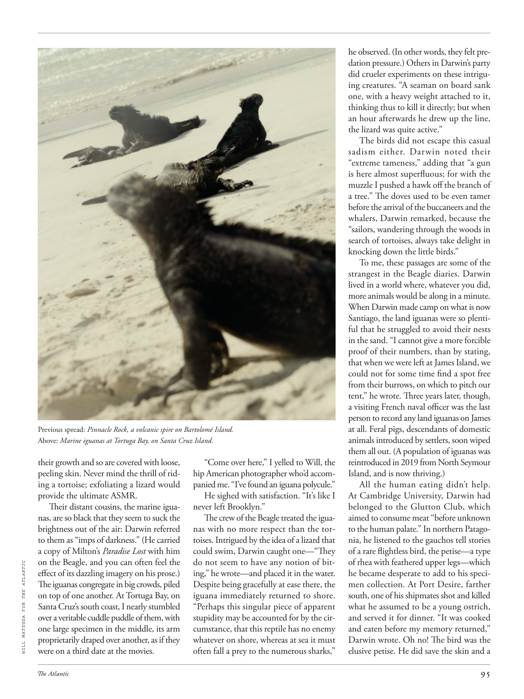

# The Atlantic — August 2026

## Page 97

---

Previous spread: Pinnacle Rock, a volcanic spire on Bartolomé Island. Above: Marine iguanas at Tortuga Bay, on Santa Cruz Island. their growth and so are covered with loose, peeling skin. Never mind the thrill of riding a tortoise; exfoliating a lizard would provide the ultimate ASMR.

**【中文翻译】** 上一张：尖峰岩 (Pinnacle Rock)，巴托洛梅岛上的一座火山尖顶。上图：圣克鲁斯岛托尔图加湾的海鬣蜥。它们的生长等都覆盖着松弛、剥落的皮肤。别介意骑乌龟的刺激；给蜥蜴去角质可以提供终极的 ASMR。

Their distant cousins, the marine iguanas, are so black that they seem to suck the brightness out of the air: Darwin referred to them as “imps of darkness.” (He carried a copy of Milton’s Paradise Lost with him on the Beagle, and you can often feel the WILL MATSUDA FOR THE ATLANTIC effect of its dazzling imagery on his prose.) The iguanas congregate in big crowds, piled on top of one another. At Tortuga Bay, on Santa Cruz’s south coast, I nearly stumbled over a veritable cuddle puddle of them, with one large specimen in the middle, its arm proprietarily draped over another, as if they were on a third date at the movies.

**【中文翻译】** 它们的远亲海鬣蜥全身黑色，似乎吸收了空气中的亮度：达尔文称它们为“黑暗的小鬼”。 （他在小猎犬号上随身携带了一本弥尔顿的《失乐园》，你经常可以感受到松田威尔在他的散文中令人眼花缭乱的意象所带来的大西洋效应。） 鬣蜥聚集在一起，彼此叠在一起。在圣克鲁斯南海岸的托尔图加湾，我差点被它们拥抱在一起的一个真正的水坑绊倒，中间有一个大标本，它的手臂特意地搭在另一个标本上，就像它们正在看电影第三次约会一样。

“Come over here,” I yelled to Will, the hip American photographer who’d accompanied me. “I’ve found an iguana poly cule.” He sighed with satisfaction. “It’s like I never left Brooklyn.”

**【中文翻译】** “过来，”我对陪同我的美国时尚摄影师威尔喊道。 “我发现了一只鬣蜥 Poly cule。”他满意地叹了口气。 “就像我从未离开过布鲁克林一样。”

The crew of the Beagle treated the iguanas with no more respect than the tortoises. Intrigued by the idea of a lizard that could swim, Darwin caught one—“They do not seem to have any notion of biting,” he wrote— and placed it in the water.

**【中文翻译】** 小猎犬号的船员对待鬣蜥并不比对待乌龟更尊重。达尔文对蜥蜴会游泳的想法很感兴趣，他抓住了一只蜥蜴——“它们似乎没有任何咬人的概念，”他写道——并将它放入水中。

Despite being gracefully at ease there, the iguana immediately returned to shore. “Perhaps this singular piece of apparent stupidity may be accounted for by the circumstance, that this reptile has no enemy whatever on shore, whereas at sea it must often fall a prey to the numerous sharks,” he observed. (In other words, they felt predation pressure.) Others in Darwin’s party did crueler experiments on these intriguing creatures. “A seaman on board sank one, with a heavy weight attached to it, thinking thus to kill it directly; but when an hour afterwards he drew up the line, the lizard was quite active.”

**【中文翻译】** 尽管鬣蜥在那里表现得很轻松，但它还是立即返回了岸边。 “也许这种看似愚蠢的奇特现象可能是由于这种爬行动物在岸上没有任何敌人，而在海上它必须经常成为众多鲨鱼的猎物，”他观察到。 （换句话说，他们感受到了捕食的压力。）达尔文队伍中的其他人对这些有趣的生物做了更残酷的实验。 “船上的一名水手击沉了一只蜥蜴，上面挂着很重的重物，想直接杀死它；但一小时后，当他拉起绳子时，蜥蜴非常活跃。”

The birds did not escape this casual sadism either. Darwin noted their “extreme tameness,” adding that “a gun is here almost superfluous; for with the muzzle I pushed a hawk off the branch of a tree.” The doves used to be even tamer before the arrival of the buccaneers and the whalers, Darwin remarked, because the “sailors, wandering through the woods in search of tortoises, always take delight in knocking down the little birds.”

**【中文翻译】** 鸟类也未能逃脱这种随意的虐待行为。达尔文注意到它们“极其温顺”，并补充说“枪在这里几乎是多余的；因为我用枪口把一只鹰从树枝上推了下来。”达尔文说，在海盗和捕鲸者到来之前，鸽子甚至更加驯服，因为“水手们在树林中漫步寻找乌龟，总是以击倒小鸟为乐。”

To me, these passages are some of the strangest in the Beagle diaries. Darwin lived in a world where, whatever you did, more animals would be along in a minute.

**【中文翻译】** 对我来说，这些段落是小猎犬日记中最奇怪的一些段落。达尔文生活在一个无论你做什么都会立刻出现更多动物的世界。

When Darwin made camp on what is now Santiago, the land iguanas were so plentiful that he struggled to avoid their nests in the sand. “I cannot give a more forcible proof of their numbers, than by stating, that when we were left at James Island, we could not for some time find a spot free from their burrows, on which to pitch our tent,” he wrote. Three years later, though, a visiting French naval officer was the last person to record any land iguanas on James at all. Feral pigs, descendants of domestic animals introduced by settlers, soon wiped them all out. (A population of iguanas was reintroduced in 2019 from North Seymour Island, and is now thriving.) All the human eating didn’t help.

**【中文翻译】** 当达尔文在现在的圣地亚哥扎营时，陆地鬣蜥数量如此之多，以至于他很难避开它们在沙子里的巢穴。他写道：“对于它们的数量，我无法提供更有力的证据，那就是，当我们被留在詹姆斯岛时，我们有一段时间找不到一个没有它们洞穴的地方来搭帐篷。”然而三年后，一位来访的法国海军军官成为最后一个在詹姆斯身上记录到陆地鬣蜥的人。野猪是定居者引入的家畜的后代，很快就把它们全部消灭了。 （2019 年，一群鬣蜥从北西摩岛重新引入，目前正在蓬勃发展。）所有人类进食都没有帮助。

At Cambridge University, Darwin had belonged to the Glutton Club, which aimed to consume meat “before unknown to the human palate.” In northern Patagonia, he listened to the gauchos tell stories of a rare flightless bird, the petise— a type of rhea with feathered upper legs— which he became desperate to add to his specimen collection. At Port Desire, farther south, one of his shipmates shot and killed what he assumed to be a young ostrich, and served it for dinner. “It was cooked and eaten before my memory returned,” Darwin wrote. Oh no! The bird was the elusive petise. He did save the skin and a

**【中文翻译】** 在剑桥大学，达尔文曾是暴食者俱乐部的成员，该俱乐部的目标是“在人类味觉未知之前”食用肉类。在巴塔哥尼亚北部，他听高乔人讲述一种罕见的不会飞的鸟的故事，这种鸟是美洲鸵（一种上肢有羽毛的美洲鸵），他迫切希望将其添加到他的标本收藏中。在更南边的欲望港，他的一位船友射杀了他认为是一只小鸵鸟，并将其作为晚餐。 “在我的记忆恢复之前，它就被煮熟了吃掉了，”达尔文写道。哦不！这只鸟就是难以捉摸的小鸟。他确实拯救了皮肤和
