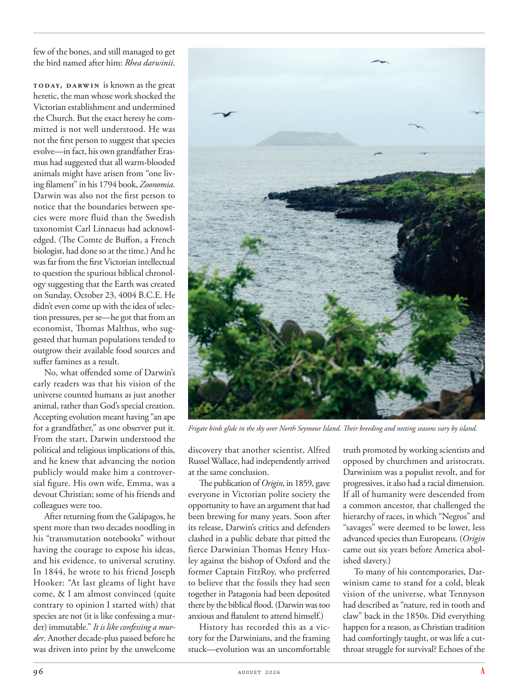

# The Atlantic — August 2026

## Page 98

---

few of the bones, and still managed to get the bird named after him: Rhea darwinii . Today, Darwin is known as the great heretic, the man whose work shocked the Victorian establishment and undermined the Church. But the exact heresy he committed is not well understood. He was not the first person to suggest that species evolve— in fact, his own grandfather Erasmus had suggested that all warm-blooded animals might have arisen from “one living filament” in his 1794 book, Zoonomia .

**【中文翻译】** 骨头很少，但仍然设法以他的名字命名这只鸟：Rhea darwinii。今天，达尔文被称为伟大的异端分子，他的著作震惊了维多利亚时代的当权者并破坏了教会。但他犯下的确切异端邪说尚不清楚。他并不是第一个提出物种进化的人——事实上，他的祖父伊拉斯谟在他 1794 年出版的著作《Zoonomia》中提出，所有温血动物可能都是由“一根活的细丝”产生的。

Darwin was also not the first person to notice that the boundaries between species were more fluid than the Swedish taxonomist Carl Linnaeus had acknowledged. (The Comte de Buffon, a French biologist, had done so at the time.) And he was far from the first Victorian intellectual to question the spurious biblical chronology suggesting that the Earth was created on Sunday, October 23, 4004 B.C.E. He didn’t even come up with the idea of selection pressures, per se— he got that from an economist, Thomas Malthus, who suggested that human populations tended to outgrow their available food sources and suffer famines as a result.

**【中文翻译】** 达尔文也不是第一个注意到物种之间的界限比瑞典分类学家卡尔·林奈所承认的更不稳定的人。 （法国生物学家布丰伯爵当时就这样做了。）他并不是第一个对圣经年代学提出质疑的维多利亚时代知识分子，该年代学认为地球是在公元前 4004 年 10 月 23 日星期日创造的。他甚至没有提出选择压力的概念本身——他是从经济学家托马斯·马尔萨斯那里得到这个概念的，马尔萨斯认为，人口增长往往会超出其可用的食物来源，并因此遭受饥荒。

No, what offended some of Darwin’s early readers was that his vision of the universe counted humans as just another animal, rather than God’s special creation.

**【中文翻译】** 不，冒犯达尔文的一些早期读者的是，他的宇宙观将人类视为另一种动物，而不是上帝的特殊创造。

Accepting evolution meant having “an ape for a grandfather,” as one observer put it. From the start, Darwin understood the political and religious implications of this, and he knew that advancing the notion publicly would make him a controversial figure. His own wife, Emma, was a devout Christian; some of his friends and colleagues were too.

**【中文翻译】** 正如一位观察家所说，接受进化论意味着“以猿为祖父”。从一开始，达尔文就明白这一点的政治和宗教含义，他知道公开推进这一概念将使他成为一个有争议的人物。他的妻子艾玛是一位虔诚的基督徒。他的一些朋友和同事也是如此。

After returning from the Galápagos, he spent more than two decades noodling in his “transmutation notebooks” without having the courage to expose his ideas, and his evidence, to universal scrutiny.

**【中文翻译】** 从加拉帕戈斯群岛回来后，他花了二十多年的时间在他的“嬗变笔记本”上苦苦思索，却没有勇气将他的想法和证据暴露给普遍的审查。

In 1844, he wrote to his friend Joseph Hooker: “At last gleams of light have come, & I am almost convinced (quite contrary to opinion I started with) that species are not (it is like confessing a murder) immutable.” It is like confessing a murder . Another decade-plus passed before he was driven into print by the unwelcome Frigate birds glide in the sky over North Seymour Island. Their breeding and nesting seasons vary by island.

**【中文翻译】** 1844 年，他写信给他的朋友约瑟夫·胡克（Joseph Hooker）：“曙光终于来临，我几乎确信（与我一开始的观点完全相反）物种并不是一成不变的（这就像承认谋杀一样）。”这就像承认谋杀一样。又过了十多年，他才被北西摩岛上空滑翔的不受欢迎的军舰鸟逼入印刷品。它们的繁殖和筑巢季节因岛屿而异。

discovery that another scientist, Alfred Russel Wallace, had independently arrived at the same conclusion. The publication of Origin , in 1859, gave everyone in Victorian polite society the opportunity to have an argument that had been brewing for many years. Soon after its release, Darwin’s critics and defenders clashed in a public debate that pitted the fierce Darwinian Thomas Henry Huxley against the bishop of Oxford and the former Captain FitzRoy, who preferred to believe that the fossils they had seen together in Patagonia had been deposited there by the biblical flood. (Darwin was too anxious and flatulent to attend himself.) History has recorded this as a victory for the Darwinians, and the framing stuck— evolution was an uncomfortable truth promoted by working scientists and opposed by churchmen and aristocrats.

**【中文翻译】** 发现另一位科学家阿尔弗雷德·拉塞尔·华莱士也独立得出了同样的结论。 1859年《起源》的出版，让维多利亚时代上流社会的每个人都有机会进行一场酝酿多年的争论。该书发布后不久，达尔文的批评者和捍卫者在一场公开辩论中发生冲突，激烈的达尔文主义者托马斯·亨利·赫胥黎与牛津主教和前船长菲茨罗伊对立，后者更愿意相信他们在巴塔哥尼亚一起看到的化石是由圣经中的洪水沉积在那里的。 （达尔文太焦虑、气喘吁吁，无法亲自参加。）历史已将此视为达尔文主义者的胜利，而框架却被卡住了——进化论是一个令人不安的真理，由工作科学家提倡，但遭到牧师和贵族的反对。

Darwinism was a populist revolt, and for progressives, it also had a racial dimension. If all of humanity were descended from a common ancestor, that challenged the hierarchy of races, in which “Negros” and “savages” were deemed to be lower, less advanced species than Europeans. ( Origin came out six years before America abolished slavery.) To many of his contemporaries, Darwinism came to stand for a cold, bleak vision of the universe, what Tennyson had described as “nature, red in tooth and claw” back in the 1850s. Did everything happen for a reason, as Christian tradition had comfortingly taught, or was life a cutthroat struggle for survival? Echoes of the

**【中文翻译】** 达尔文主义是民粹主义的反叛，对于进步派来说，它也有种族层面。如果全人类都是同一个祖先的后裔，这就对种族等级制度提出了挑战，在这种等级制度中，“黑人”和“野蛮人”被认为是比欧洲人低等、不太先进的物种。 （《起源》出版于美国废除奴隶制的六年前。）对于许多同时代的人来说，达尔文主义代表着一种冷酷、暗淡的宇宙景象，丁尼生在 1850 年代将其描述为“牙齿和爪子呈红色的自然”。一切的发生都是有原因的，正如基督教传统所教导的那样，还是生活是一场为了生存而进行的残酷斗争？的回声
