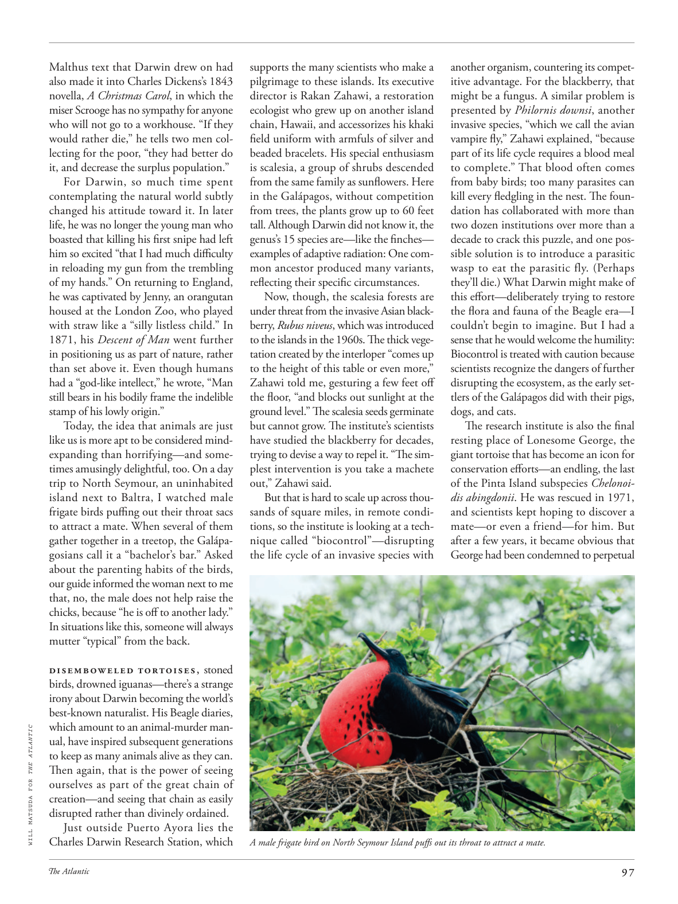

# The Atlantic — August 2026

## Page 99

---

Malthus text that Darwin drew on had also made it into Charles Dickens’s 1843 novella, A Christmas Carol , in which the miser Scrooge has no sympathy for anyone who will not go to a workhouse. “If they would rather die,” he tells two men collecting for the poor, “they had better do it, and decrease the surplus population.”

**【中文翻译】** 达尔文借鉴的马尔萨斯文本也被写入查尔斯·狄更斯 1843 年的中篇小说《圣诞颂歌》中，其中守财奴斯克鲁奇对那些不愿去济贫院的人没有同情心。 “如果他们宁愿死，”他对两个为穷人募捐的人说，“他们最好这样做，减少剩余人口。”

For Darwin, so much time spent contemplating the natural world subtly changed his attitude toward it. In later life, he was no longer the young man who boasted that killing his first snipe had left him so excited “that I had much difficulty in reloading my gun from the trembling of my hands.” On returning to England, he was captivated by Jenny, an orangutan housed at the London Zoo, who played with straw like a “silly listless child.” In 1871, his Descent of Man went further in positioning us as part of nature, rather than set above it. Even though humans had a “god-like intellect,” he wrote, “Man still bears in his bodily frame the indelible stamp of his lowly origin.”

**【中文翻译】** 对于达尔文来说，花费大量时间思考自然世界巧妙地改变了他对自然的态度。在后来的生活中，他不再是那个吹嘘杀死第一只鹬让他如此兴奋的年轻人，“我的手颤抖着，很难给枪重新装弹”。回到英国后，他被伦敦动物园饲养的一只猩猩珍妮迷住了，珍妮像一个“愚蠢无精打采的孩子”一样玩着稻草。 1871 年，他的《人类的由来》进一步将我们定位为自然的一部分，而不是凌驾于自然之上。他写道，尽管人类拥有“上帝般的智力”，“人类的身体结构中仍然带有其卑微出身的不可磨灭的印记。”

Today, the idea that animals are just like us is more apt to be considered mindexpanding than horrifying— and sometimes amusingly delightful, too. On a day trip to North Seymour, an un inhabited island next to Baltra, I watched male frigate birds puffing out their throat sacs to attract a mate. When several of them gather together in a treetop, the Galápagosians call it a “bachelor’s bar.” Asked about the parenting habits of the birds, our guide informed the woman next to me that, no, the male does not help raise the chicks, because “he is off to another lady.”

**【中文翻译】** 如今，“动物和我们一样”的想法更容易被认为是思维拓展而不是可怕——有时也被认为是有趣的、令人愉快的。在去北西摩岛（巴尔特拉旁边的一个无人居住的岛屿）的一日游中，我看到雄性军舰鸟吐出喉囊来吸引配偶。当他们中的几个人聚集在树顶时，加拉帕戈斯人将其称为“单身汉酒吧”。当被问及鸟类的养育习惯时，我们的导游告诉我旁边的女士，不，雄性不会帮助抚养雏鸟，因为“他已经去找另一位雌性了”。

In situations like this, someone will always mutter “typical” from the back. Disemboweled tortoises, stoned birds, drowned iguanas—there’s a strange irony about Darwin becoming the world’s best-known naturalist. His Beagle diaries, which amount to an animal-murder manWILL MATSUDA FOR THE ATLANTIC ual, have inspired subsequent generations to keep as many animals alive as they can.

**【中文翻译】** 在这种情况下，总会有人在背后嘀咕“典型”。被开膛破肚的乌龟、被石头砸死的鸟、被淹死的鬣蜥——达尔文成为世界上最著名的博物学家，这真是一种奇怪的讽刺。他的《小猎犬日记》相当于《大西洋的动物谋杀者松田威尔》，激励了后代尽可能让更多的动物活下去。

Then again, that is the power of seeing ourselves as part of the great chain of creation— and seeing that chain as easily disrupted rather than divinely ordained.

**【中文翻译】** 话又说回来，这就是将我们自己视为伟大的创造链条的一部分的力量，并且看到这条链条很容易被破坏，而不是神圣的命定。

Just outside Puerto Ayora lies the Charles Darwin Research Station, which supports the many scientists who make a pilgrimage to these islands. Its executive director is Rakan Zahawi, a restoration ecologist who grew up on another island chain, Hawaii, and accessorizes his khaki field uniform with armfuls of silver and beaded bracelets. His special enthusiasm is scalesia, a group of shrubs descended from the same family as sunflowers. Here in the Galápagos, without competition from trees, the plants grow up to 60 feet tall. Although Darwin did not know it, the genus’s 15 species are— like the finches— examples of adaptive radiation: One common ancestor produced many variants, reflecting their specific circumstances.

**【中文翻译】** 阿约拉港郊外坐落着查尔斯·达尔文研究站，为许多前往这些岛屿朝圣的科学家提供支持。该组织的执行董事是拉坎·扎哈维 (Rakan Zahawi)，他是一位生态恢复学家，在另一个岛链夏威夷长大，他的卡其色野战服上挂满了银饰和串珠手镯。他特别热衷于鳞翅目植物，这是一种与向日葵同科的灌木。在加拉帕戈斯群岛，没有树木的竞争，植物可以长到 60 英尺高。尽管达尔文并不知道，该属的 15 个物种（如雀类）都是适应性辐射的例子：一个共同的祖先产生了许多变种，反映了它们的具体情况。

Now, though, the scalesia forests are under threat from the invasive Asian blackberry, Rubus niveus , which was introduced to the islands in the 1960s. The thick vegetation created by the interloper “comes up to the height of this table or even more,” Zahawi told me, gesturing a few feet off the floor, “and blocks out sunlight at the ground level.” The scalesia seeds germinate but cannot grow. The institute’s scientists have studied the blackberry for decades, trying to devise a way to repel it. “The simplest intervention is you take a machete out,” Zahawi said.

**【中文翻译】** 然而现在，鳞翅目森林正受到入侵性亚洲黑莓（Rubus niveus）的威胁，这种黑莓于 20 世纪 60 年代被引入岛屿。闯入者创造的茂密植被“达到了这张桌子的高度，甚至更高，”扎哈维指着离地板几英尺的地方告诉我，“挡住了地面的阳光。”鳞翅目种子发芽但不能生长。该研究所的科学家们对黑莓进行了数十年的研究，试图找到一种方法来排斥它。 “最简单的干预措施就是拿出一把砍刀，”扎哈维说。

But that is hard to scale up across thousands of square miles, in remote conditions, so the institute is looking at a technique called “bio control”— disrupting the life cycle of an invasive species with A male frigate bird on North Seymour Island puffs out its throat to attract a mate. another organism, countering its competitive advantage. For the blackberry, that might be a fungus. A similar problem is presented by Philornis downsi , another invasive species, “which we call the avian vampire fly,” Zahawi explained, “because part of its life cycle requires a blood meal to complete.” That blood often comes from baby birds; too many parasites can kill every fledgling in the nest. The foundation has collaborated with more than two dozen institutions over more than a decade to crack this puzzle, and one possible solution is to introduce a parasitic wasp to eat the parasitic fly. (Perhaps they’ll die.) What Darwin might make of this effort— deliberately trying to restore the flora and fauna of the Beagle era— I couldn’t begin to imagine. But I had a sense that he would welcome the humility: Biocontrol is treated with caution because scientists recognize the dangers of further disrupting the ecosystem, as the early settlers of the Galápagos did with their pigs, dogs, and cats.

**【中文翻译】** 但在偏远条件下，这种方法很难在数千平方英里的范围内推广，因此该研究所正在研究一种称为“生物控制”的技术——通过北西摩岛上的一只雄性军舰鸟伸出喉咙来吸引配偶，从而扰乱入侵物种的生命周期。另一个有机体，对抗其竞争优势。对于黑莓来说，那可能是一种真菌。另一种入侵物种 Philornis downsi 也存在类似的问题，“我们称之为鸟类吸血蝇，”扎哈维解释说，“因为它生命周期的一部分需要吸血才能完成。”这种血液通常来自幼鸟。太多的寄生虫会杀死巢中的每只雏鸟。十多年来，该基金会与二十多个机构合作破解了这个难题，一个可能的解决方案是引入寄生黄蜂来吃掉寄生苍蝇。 （也许他们会死。）达尔文可能会用这种努力做什么——故意试图恢复小猎犬时代的动植物群——我无法想象。但我有一种感觉，他会欢迎这种谦逊：生物防治受到谨慎对待，因为科学家认识到进一步破坏生态系统的危险，就像加拉帕戈斯群岛的早期定居者对待他们的猪、狗和猫一样。

The research institute is also the final resting place of Lonesome George, the giant tortoise that has become an icon for conservation efforts— an endling, the last of the Pinta Island subspecies Chelonoidis abingdonii . He was rescued in 1971, and scientists kept hoping to discover a mate— or even a friend— for him. But after a few years, it became obvious that George had been condemned to perpetual

**【中文翻译】** 该研究所也是孤独乔治的最后安息地，这种巨龟已成为保护工作的标志，是平塔岛亚种 Chelonoidis abingdonii 的最后一个。他于 1971 年获救，科学家们一直希望为他找到一个伴侣，甚至是一个朋友。但几年后，很明显，乔治注定要永远受苦受难。
