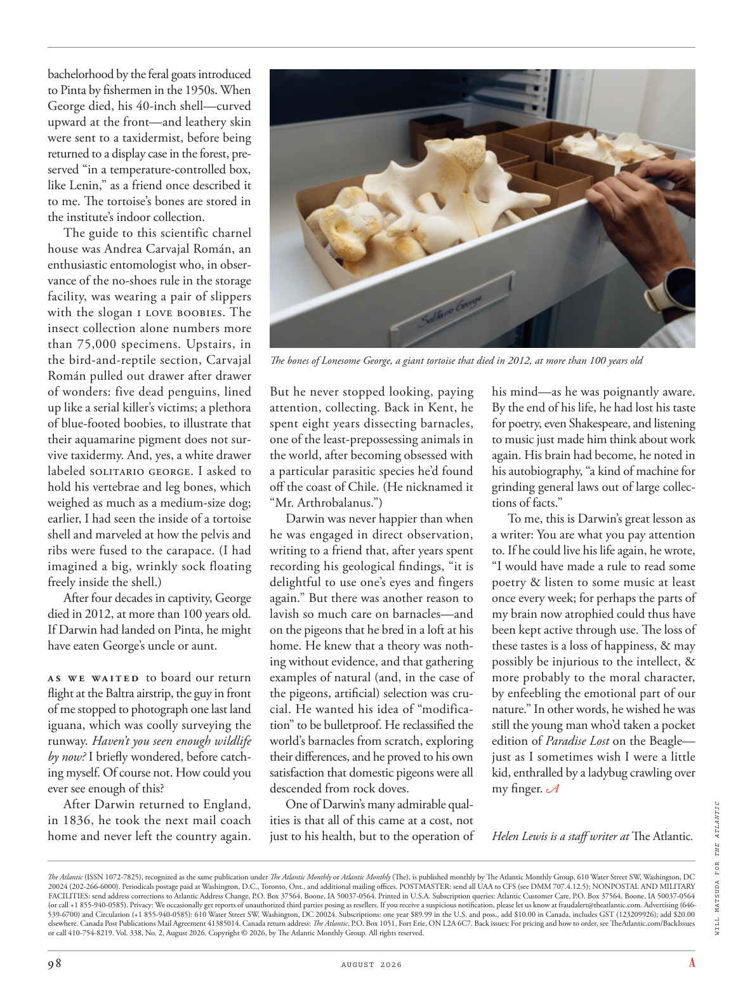

# The Atlantic — August 2026

## Page 100

---

bachelorhood by the feral goats introduced to Pinta by fishermen in the 1950s. When George died, his 40-inch shell— curved upward at the front— and leathery skin were sent to a taxidermist, before being returned to a display case in the forest, preserved “in a temperature-controlled box, like Lenin,” as a friend once described it to me. The tortoise’s bones are stored in the institute’s indoor collection.

**【中文翻译】** 20 世纪 50 年代，渔民将野山羊引入平塔。乔治去世后，他的 40 英寸外壳（前端向上弯曲）和皮革般的皮肤被送往标本剥制师，然后被送回森林中的一个展示柜，“像列宁一样保存在一个温控盒子里”，正如一位朋友曾经向我描述的那样。乌龟的骨头存放在该研究所的室内收藏中。

The guide to this scientific charnel house was Andrea Carvajal Román, an enthusiastic entomologist who, in observance of the no-shoes rule in the storage facility, was wearing a pair of slippers with the slogan I LOVE BOOBIES. The insect collection alone numbers more than 75,000 specimens. Upstairs, in the bird-andreptile section, Carvajal Román pulled out drawer after drawer of wonders: five dead penguins, lined up like a serial killer’s victims; a plethora of blue-footed boobies, to illustrate that their aqua marine pigment does not survive taxidermy. And, yes, a white drawer labeled SOLITARIO GEORGE. I asked to hold his vertebrae and leg bones, which weighed as much as a medium-size dog; earlier, I had seen the inside of a tortoise shell and marveled at how the pelvis and ribs were fused to the carapace. (I had imagined a big, wrinkly sock floating freely inside the shell.) After four decades in captivity, George died in 2012, at more than 100 years old.

**【中文翻译】** 这座科学停尸房的导游是安德里亚·卡瓦哈尔·罗曼 (Andrea Carvajal Román)，他是一位热心的昆虫学家，为了遵守停尸房内禁止穿鞋的规定，他穿着一双印有“我爱胸部”标语的拖鞋。仅昆虫收藏就有超过 75,000 个标本。在楼上的鸟类和爬行动物区，卡瓦哈尔·罗曼拉出了一个又一个抽屉，里面装满了奇迹：五只死企鹅，像连环杀手的受害者一样排成一排；大量的蓝脚鲣鸟，以说明它们的水蓝色海洋色素无法在动物标本剥制术中幸存下来。是的，还有一个标有“SOLITARIO GEORGE”字样的白色抽屉。我要求握住他的椎骨和腿骨，它们的重量相当于一只中型狗；早些时候，我看到了乌龟壳的内部，并对骨盆和肋骨如何与甲壳融合在一起感到惊讶。 （我曾想象过一只又大又皱的袜子在贝壳内自由漂浮。） 被囚禁了 40 年之后，乔治于 2012 年去世，享年 100 多岁。

If Darwin had landed on Pinta, he might have eaten George’s uncle or aunt. As we waited to board our return flight at the Baltra airstrip, the guy in front of me stopped to photograph one last land iguana, which was coolly surveying the runway. Haven’t you seen enough wildlife by now? I briefly wondered, before catching myself. Of course not. How could you ever see enough of this?

**【中文翻译】** 如果达尔文登陆平塔，他可能会吃掉乔治的叔叔或婶婶。当我们在巴尔特拉机场等待登机时，我前面的那个人停下来拍摄最后一只陆地鬣蜥，它正在冷静地审视着跑道。你还没见过足够多的野生动物吗？我短暂地想了想，然后才意识到自己的想法。当然不是。你怎么能看够呢？

After Darwin returned to England, in 1836, he took the next mail coach home and never left the country again. The Atlantic (ISSN 1072-7825), recognized as the same publication under The Atlantic Monthly or Atlantic Monthly (The), is published monthly by The Atlantic Monthly Group, 610 Water Street SW, Washington, DC 20024 (202-266-6000). Periodicals postage paid at Washington, D.C., Toronto, Ont., and additional mailing offices. POSTMASTER: send all UAA to CFS (see DMM 707.4.12.5); NONPOSTAL AND MILITARY FACILITIES: send address corrections to Atlantic Address Change, P.O. Box 37564, Boone, IA 50037-0564. Printed in U.S.A. Subscription queries: Atlantic Customer Care, P.O. Box 37564, Boone, IA 50037-0564 (or call +1 855-940-0585). Privacy: We occasionally get reports of unauthorized third parties posing as resellers. If you receive a suspicious notification, please let us know at fraudalert@theatlantic.com. Advertising (646539-6700) and Circulation (+1 855-940-0585): 610 Water Street SW, Washington, DC 20024. Subscriptions: one year $89.99 in the U.S. and poss., add $10.00 in Canada, includes GST (123209926); add $20.00 elsewhere. Canada Post Publications Mail Agreement 41385014. Canada return address: The Atlantic , P.O. Box 1051, Fort Erie, ON L2A 6C7. Back issues: For pricing and how to order, see TheAtlantic.com/BackIssues or call 410-754-8219. Vol. 338, No. 2, August 2026. Copyright © 2026, by The Atlantic Monthly Group. All rights reserved.

**【中文翻译】** 1836年，达尔文回到英国后，他乘坐下一趟邮车回家，再也没有离开过这个国家。 《大西洋月刊》(ISSN 1072-7825) 被视为《大西洋月刊》或《大西洋月刊》(The) 下的同一出版物，由大西洋月刊集团每月出版，地址：610 Water Street SW, Washington, DC 20024 (202-266-6000)。期刊邮资在华盛顿特区、安大略省多伦多和其他邮局支付。 POSTMASTER：将所有UAA发送至CFS（参见DMM 707.4.12.5）；非邮政和军事设施：将地址更正发送至 Atlantic Address Change, P.O.信箱 37564，布恩，IA 50037-0564。美国印刷 订阅查询：Atlantic Customer Care，P.O. Box 37564, Boone, IA 50037-0564（或致电 +1 855-940-0585）。隐私：我们偶尔会收到未经授权的第三方冒充经销商的报告。如果您收到可疑通知，请通过fraudalert@theatlantic.com告知我们。广告 (646539-6700) 和流通 (+1 855-940-0585)：610 Water Street SW, Washington, DC 20024。订阅：美国一年 89.99 美元，加拿大另加 10.00 美元，包括商品及服务税 (123209926)；其他地方加 20.00 美元。加拿大邮政出版物邮寄协议 41385014。加拿大回邮地址：The Atlantic , P.O.信箱 1051，伊利堡，ON L2A 6C7。过刊：有关定价和订购方式，请访问 TheAtlantic.com/BackIssues 或致电 410-754-8219。卷。 338，第 2 期，2026 年 8 月。版权所有 © 2026，大西洋月刊集团。版权所有。

The bones of Lonesome George, a giant tortoise that died in 2012, at more than 100 years old But he never stopped looking, paying attention, collecting. Back in Kent, he spent eight years dissecting barnacles, one of the least-prepossessing animals in the world, after becoming obsessed with a particular parasitic species he’d found off the coast of Chile. (He nicknamed it “Mr. Arthrobalanus.”) Darwin was never happier than when he was engaged in direct observation, writing to a friend that, after years spent recording his geological findings, “it is delightful to use one’s eyes and fingers again.” But there was another reason to lavish so much care on barnacles— and on the pigeons that he bred in a loft at his home. He knew that a theory was nothing without evidence, and that gathering examples of natural (and, in the case of the pigeons, artificial) selection was crucial. He wanted his idea of “modification” to be bulletproof. He reclassified the world’s barnacles from scratch, exploring their differences, and he proved to his own satisfaction that domestic pigeons were all descended from rock doves.

**【中文翻译】** 2012年去世的巨龟“孤独乔治”的骨头，已经有100多岁了，但他从未停止寻找、关注、收集。回到肯特郡后，他对在智利海岸发现的一种特殊寄生物种着迷，花了八年时间解剖藤壶，这是世界上最不讨人喜欢的动物之一。 （他给它起了个绰号“节巴拉努斯先生”。）达尔文在从事直接观察时感到无比快乐，他在给一位朋友的信中写道，在花了多年时间记录他的地质发现后，“再次使用自己的眼睛和手指真是令人高兴。”但对藤壶和他在自家鸽舍饲养的鸽子如此投入还有另一个原因。他知道，没有证据，理论就毫无意义，收集自然选择（对于鸽子来说，人工选择）的例子至关重要。他希望他的“修改”想法能够万无一失。他从头开始对世界上的藤壶进行了重新分类，探索了它们的差异，并满意地证明了家鸽都是原鸽的后代。

One of Darwin’s many admirable qualities is that all of this came at a cost, not just to his health, but to the operation of his mind— as he was poignantly aware.

**【中文翻译】** 达尔文众多令人钦佩的品质之一是，所有这一切都是有代价的，不仅损害了他的健康，而且损害了他的思维运作——正如他深刻地意识到的那样。

By the end of his life, he had lost his taste for poetry, even Shakespeare, and listening to music just made him think about work again. His brain had become, he noted in his autobiography, “a kind of machine for grinding general laws out of large collections of facts.”

**【中文翻译】** 在他生命的最后阶段，他已经失去了对诗歌甚至莎士比亚的兴趣，而听音乐只是让他再次思考工作。他在自传中指出，他的大脑已经成为“一种从大量事实中磨练出一般规律的机器”。

To me, this is Darwin’s great lesson as a writer: You are what you pay attention to. If he could live his life again, he wrote, “I would have made a rule to read some poetry & listen to some music at least once every week; for perhaps the parts of my brain now atrophied could thus have been kept active through use. The loss of these tastes is a loss of happiness, & may possibly be injurious to the intellect, & more probably to the moral character, by enfeebling the emotional part of our nature.” In other words, he wished he was still the young man who’d taken a pocket edition of Paradise Lost on the Beagle— just as I sometimes wish I were a little kid, enthralled by a ladybug crawling over my finger. WILL MATSUDA FOR THE ATLANTIC Helen Lewis is a staff writer at The Atlantic .

**【中文翻译】** 对我来说，这是达尔文作为作家的伟大教训：你所关注的就是你。如果他能重新过上自己的生活，他写道：“我会制定一个规则，每周至少读一些诗歌，听一些音乐；因为也许我现在萎缩的大脑部分可以通过使用而保持活跃。失去这些品味就是失去幸福，可能会损害智力，更可能损害道德品质，因为削弱了我们天性中的情感部分。”换句话说，他希望自己仍然是那个在小猎犬号上拿了一本袖珍版《失乐园》的年轻人——就像我有时希望自己是个小孩子，被一只爬过我手指的瓢虫迷住了一样。 《大西洋月刊》的威尔·松田 海伦·刘易斯是《大西洋月刊》的特约撰稿人。
