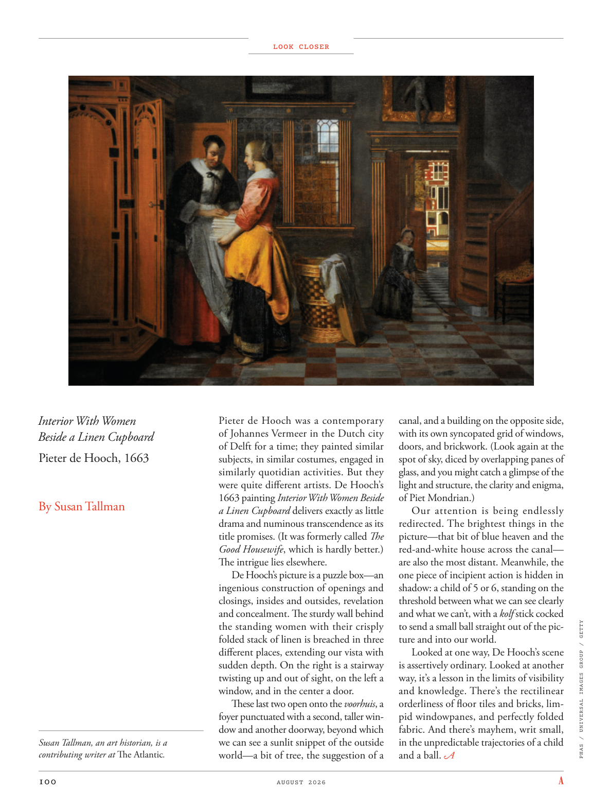

# The Atlantic — August 2026

## Page 102

---

Interior With Women Beside a Linen Cupboard Pieter de Hooch, 1663 By Susan Tallman Susan Tallman, an art historian, is a contributing writer at The Atlantic .

**【中文翻译】** 亚麻橱柜旁的女人的室内装饰 Pieter de Hooch，1663 作者：苏珊·托曼 苏珊·托曼是一位艺术史学家，也是《大西洋月刊》的特约撰稿人。

LOOK CLOSER Pieter de Hooch was a contemporary of Johannes Vermeer in the Dutch city of Delft for a time; they painted similar subjects, in similar costumes, engaged in similarly quotidian activities. But they were quite different artists. De Hooch’s 1663 painting Interior With Women Beside a Linen Cupboard delivers exactly as little drama and numinous transcendence as its title promises. (It was formerly called The Good Housewife , which is hardly better.) The intrigue lies elsewhere.

**【中文翻译】** 仔细观察 彼得·德·霍奇（Pieter de Hooch）曾一度与荷兰代尔夫特市的约翰内斯·维米尔（Johannes Vermeer）同时代。他们画相似的主题，穿着相似的服装，从事相似的日常活动。但他们是完全不同的艺术家。德胡赫于 1663 年创作的画作《室内，亚麻橱柜旁的女人》正如其标题所承诺的那样，没有多少戏剧性，却充满了神秘的超越感。 （它以前的名字叫《好主妇》，也好不到哪里去。） 阴谋在别处。

De Hooch’s picture is a puzzle box— an ingenious construction of openings and closings, insides and outsides, revelation and concealment. The sturdy wall behind the standing women with their crisply folded stack of linen is breached in three different places, extending our vista with sudden depth. On the right is a stairway twisting up and out of sight, on the left a window, and in the center a door.

**【中文翻译】** 德胡奇的画是一个拼图盒——一个开口和闭合、内部和外部、揭示和隐藏的巧妙结构。站着的妇女背后的坚固墙壁，以及折叠整齐的亚麻布，在三个不同的地方被破坏，突然加深了我们的视野。右边是一条蜿蜒向上、看不见的楼梯，左边是一扇窗户，中间是一扇门。

These last two open onto the voorhuis , a foyer punctuated with a second, taller window and another doorway, beyond which we can see a sunlit snippet of the outside world— a bit of tree, the suggestion of a canal, and a building on the opposite side, with its own syncopated grid of windows, doors, and brickwork. (Look again at the spot of sky, diced by overlapping panes of glass, and you might catch a glimpse of the light and structure, the clarity and enigma, of Piet Mondrian.) Our attention is being endlessly re directed. The brightest things in the picture— that bit of blue heaven and the red-and-white house across the canal— are also the most distant. Meanwhile, the one piece of incipient action is hidden in shadow: a child of 5 or 6, standing on the threshold between what we can see clearly and what we can’t, with a kolf stick cocked

**【中文翻译】** 最后两扇通向大厅，门厅中点缀着第二扇更高的窗户和另一个门口，透过门厅，我们可以看到外面世界的阳光照射的片段——一棵树，暗示着一条运河，对面有一座建筑物，有自己的切分网格的窗户、门和砖墙。 （再看看被重叠的玻璃分割成的天空，你可能会瞥见皮特·蒙德里安的光线和结构、清晰度和神秘感。） 我们的注意力正在不断地被重新引导。图片中最亮的东西——那片蓝色的天空和运河对面的红白房子——也是最遥远的。与此同时，一个刚刚开始的动作隐藏在阴影中：一个五六岁的孩子，站在我们能清楚看到和看不到的东西之间的门槛上，手里拿着一根高尔夫球杆

*PHAS / UNIVERSAL IMAGES GROUP / GETTY*

*【图注与署名】PHAS / 环球影像集团 / GETTY*

to send a small ball straight out of the picture and into our world. Looked at one way, De Hooch’s scene is assertively ordinary. Looked at another way, it’s a lesson in the limits of visibility and knowledge. There’s the rectilinear orderliness of floor tiles and bricks, limpid windowpanes, and perfectly folded fabric. And there’s mayhem, writ small, in the un predictable trajectories of a child and a ball.

**【中文翻译】** 将一个小球直接从画面中发送到我们的世界中。从某种角度来看，德胡赫的场景无疑是普通的。从另一个角度来看，这是关于可见性和知识的局限性的一课。这里有直线有序的地砖和砖块、清澈的窗玻璃和完美折叠的织物。孩子和球的不可预测的轨迹中存在着小规模的混乱。
