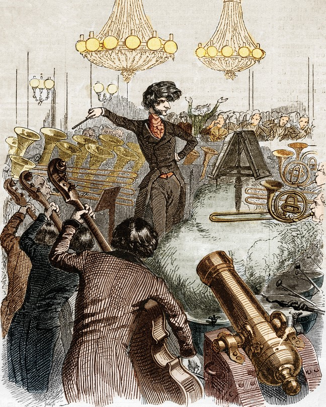

# The Mysterious Art of Conducting

> **作者**: Matthew Aucoin | **发布日期**: 2026-08-09 | **来源**: [TheAtlantic](https://www.theatlantic.com/magazine/2026/09/orchestra-conductor-profession/687962/)

*An 1846 caricature of the Romantic composer Hector Berlioz, known for his love of big, loud orchestras (Stefano Bianchetti / corbis / Getty)*

---

The conductor is a con artist. Or: The conductor is God. Musicians frequently encounter both of these extreme views of music’s most mysterious profession. It’s not surprising that conductors elicit suspicion as well as adulation. The very act of conducting—waving a wand to summon ravishing or ethereal or earsplitting sounds—can look like either inexplicable magic or embarrassing nonsense, a kind of tuxedoed air guitar.

With most kinds of musical performance, the listener can sense, in their heart and their gut, how demanding the musician’s task is. To possess the infinitesimally sensitive fine motor skills required to make a violin sing, or the poise and breath control needed to coax beauty out of a trombone, is to be not only an artist but an Olympic athlete in command of invisible muscles. There’s a reason that a primal scene of countless anxiety dreams is the musical performance for which you are unprepared, the audience coughing impatiently and the grand piano awaiting you in a pool of light, like some kind of gleaming, jet-black armored tank.

Conducting is different. I would bet that practically everyone who’s seen a conductor leading an orchestra has had the fleeting thought Come on, anyone could do that. They’re just waving their arms! Aren’t they? And if not, then what exactly are they doing? Plenty of people—plenty of musicians, even—mistrust the abracadabra mysticism that so frequently surrounds practitioners of this elusive and slightly dubious art.

At the other end of the spectrum is the equally inaccurate notion that the conductor is an infallible being with almost supernatural powers. People who hold this view tend to assume that the orchestra would be utterly helpless without the sage guidance of the baton-wielder; they forget that any good ensemble is made up of dozens of experienced, intelligent musicians, each of whom is capable of autonomous musical thought. Listeners inclined in this direction will sometimes marvel that the conductor seems, somehow, to know every note of everyone’s part. If they attend a rehearsal, they might swoon over even a simple request from the maestro—for example, to play a passage more lyrically—as if it were a commandment from on high.

I’m mainly a composer; I’m at my happiest confronted with a blank sheet of staff paper. But I am also a conductor, of both my own music and other music. And the mystery of conducting has fascinated me since long before I picked up a baton. Orchestral musicians don’t need a conductor in order to execute the core tasks of music-making. And yet, with an exceptional conductor on the podium, an electricity can flow through the ensemble, an extra energy that helps dozens of musicians breathe and speak as one complex, multifarious organism. Conducting is, above all, a profound exercise in trust: the orchestra trusting the conductor to keep a hand on the throttle, the conductor trusting the orchestra to soar.

Conductors aren’t always necessary, of course. For someone to stand up and wave their arms at a trio or quartet would be superfluous, not to mention insulting. Communicating is easy in a small group, where the musicians can face one another, like friends in a booth at a restaurant, and have a musical conversation. Everyone can hear every other part clearly; the players can meet one another’s eyes, breathe together.

This kind of interaction can turn cumbersome, however, once a gathering reaches a certain numerical threshold. A group of four or five friends can decide, on the fly, where to go for dinner. But a group of 70 or 80 people? Any given member of the group probably doesn’t know every single other person, and holding one conversation without some kind of agreed-upon structure would be all but impossible. In such situations, even the most independent-minded adult can yearn for a competent event planner. One of the conductor’s core functions is to be that helpful, sheepdog-like presence.

Conducting, as a distinct profession, only emerged in the mid-19th century, an inevitable result of converging musical and technological developments. The Industrial Revolution left its imprint on music as on so much else, enabling the invention of newfangled instruments: the tuba, the saxophone, the celesta. Instruments that had been around for centuries got upgrades; the addition of piston valves to trumpets and French horns, for example, made them louder and more precise. In turn, these technical improvements made possible the roaring, oceanic modern orchestra, an ensemble capable of producing the rich, polished sound that we might call “cinematic” today.

Many composers made gleeful use of the new coloristic possibilities available to them. Now they had brass sections whose burnished, gleaming tone could rattle the listener’s ribs, and string sections so large and lush that they could lull their audience into a narcotic stupor. Orchestras got bigger and bigger, ultimately evolving into the musical counterpart of the mighty steamboats and freight trains of the Industrial Age. And like those boats and trains, these ensembles were unwieldy enough that they needed conductors to steer them.

The aristocratically sponsored court orchestras of earlier centuries tended to be small enough that they didn’t require a conductor. Those ensembles often performed in intimate halls, for exclusive audiences, and they were typically led by the first violinist or a keyboardist, who would mark time with their bow arm or their head while playing. But throughout the 19th century, in both Europe and the United States, musical organizations sprang up that, rather than being housed at royal courts, were founded by private citizens. These new orchestras were civic institutions, and they were intended to be available to as many people as possible. To accommodate this bigger audience, many cities built formidable new concert halls, and the size of the ensembles onstage grew too.

The solitary, magus-like figure of the conductor was also an ideal emblem of the Romantic age, a period that valorized the lone artist endowed with mystical gifts. Composers had once tended to think of themselves as craftsmen, not so different from woodworkers or shipbuilders or shoemakers. Regardless of whether a church composer was feeling especially inspired in a given week, his job was to write new music for every Sunday service.

The Romantic composers had a very different conception of the artist’s relationship to the world. The creative artist was a singular, almost divinely inspired fountain of imagination, a spirit blessed (or cursed) with the capacity to gaze into the heavens and the abyss. Composers such as Hector Berlioz and Richard Wagner dreamed up wild, intricately phantasmagorical works so challenging for musicians of the time that both composers had to take up the baton themselves to make their musical cosmos a reality. The conductor, and especially the composer-conductor, was the Romantic figure par excellence, the visionary who faced a sea of musicians, like some figure out of a Caspar David Friedrich painting, and summoned storms.

Once orchestras reached this grand scale, the conductor became a practical necessity. Logistical and spatial issues intrude when you have 90 or 100 people onstage. With an ensemble of this size, someone at one end of the stage is going to find hearing exactly what’s going on at the other end extremely difficult. If you’re a trombone player, sitting way in the back, are you really going to notice if the first violins speed up a hair, way down in front? If the formidably loud colleagues who surround you—trumpets, tubas, timpani—happen to be playing their heart out too, they’re probably the only people you’ll hear. How, then, are you supposed to coordinate what you’re doing with people playing much quieter instruments at the other side of the stage? How can you tell whether your sound is balancing and blending with people you can’t even hear properly?

And how would you synchronize your playing with theirs, especially given the fluid sense of rhythm that’s integral to the performance of so much orchestral music? If you mainly listen to contemporary pop music, you’re probably accustomed to hearing a steady beat; a lot of pop music today is even recorded to a “click track,” or a preset electronic pulse that provides a string of beats spaced with absolute, inflexible evenness. In such music, the performer’s first task is to lock into that easily audible pulse. If a steady beat is present, getting through a piece without a conductor is no problem for a group of musicians, no matter its size. Even an orchestra of 100 players would do fine on its own if it were simply playing along with a very loud drummer.

The trouble is that in most orchestral music, no such beat exists; absolute metronomic steadiness usually isn’t the goal. Time can flow with the changeability of a river current. It might be swift and free at one moment, and then a second later turn halting and trickling, as if navigating around boulders. Even within a single phrase, a performer might feel an impulse to slow down and caress an especially tender change of harmony, and then to surge forward again once the moment passes. One of the thrills of orchestral performance is that the pacing is flexible and volatile; the same piece might move somewhat differently from one evening to the next. In a given performance, if the violins bring an extra dose of voluptuous beauty to a certain section, the whole ensemble might want to slow down more than usual, to wring every drop of expressive power from the music.

This is the conductor’s essential task: to embody, guide, and react to the current of the music. A responsible conductor understands that they must both lead and serve as listener in chief. They should have a clear plan for how a performance will be shaped, but they must also be prepared to respond to their colleagues’ music-making as it happens. If a particular player or section is doing something magical, the conductor should know how to absorb that energy and reflect it back to the ensemble. Last year, when I conducted performances of my piece Music for New Bodies at Lincoln Center, I remember being so stunned by the oboist Joseph Jordan’s beautiful sound that his solo sections expanded and stretched in ways I hadn’t anticipated, even though I wrote the music. The transference of musical ideas between conductor and orchestra is a two-way street.

And although conductor and orchestra alike are guided by a score, a single piece of music can be performed countless ways. There can be as many interpretations of a phrase in a Mozart symphony as there are members of the orchestra. Should a given moment sound joyous, wistful, irreverent, sarcastic? What is its emotional temperature? What should the quality of sound be—dark or gleaming, soft-textured or biting? The risk, when an ensemble performs without a conductor, is that everyone’s different musical ideas can get averaged out, that everyone can gravitate toward the median interpretation rather than the most daring.

But the fact that small or medium orchestras could play without a conductor means that the bar for what conductors offer ought to be set very high. Both orchestras and audiences have a right to ask: Is this performance stronger and more expressive thanks to the person waving the baton? Orchestral musicians have a bone-deep instinct for this; they can usually tell within the first minute of the first rehearsal whether a given conductor is likely to make their life easier or harder. If the orchestra is playing a familiar piece—say, a Brahms symphony—and the conductor’s cue results in a first chord that sounds hesitant or scattered, the conductor may already have lost the orchestra’s trust, within five seconds. And if the conductor talks too much at the start of the rehearsal, attempting to tell the musicians how things should sound rather than physically showing them, that’s another immediate yellow flag.

Any orchestra that plays together week after week shares a collective unconscious, and in that unconscious is a finely calibrated autopilot system. This autopilot engages if the conductor isn’t sufficiently clear or interesting. If a conductor is unhelpfully flailing around, the musicians don’t even need to say a word: The autopilot turns on, and the players instinctively react primarily to one another rather than to the person on the podium. The bodily intelligence of an orchestra is formidable; the musicians always know when it would be safer to ignore the lunatic in the cockpit. Some conductors are painfully aware of when they’re being ignored. The more clueless ones think they can take all the credit, even when it’s the orchestra that is calmly guiding the plane back to Earth.

There is an abiding tension between the profession of conductor, with its persistent whiff of old-world autocracy, and the workplace culture of most contemporary American cities. We are a long way from the days when Arturo Toscanini could arrive at the Metropolitan Opera House and shriek that “the orchestra play like pig!,” or when Herbert von Karajan could pause a rehearsal, ask a violinist near the back of the section to stand up and play a passage by himself, and then—unsatisfied with the result—show that violinist the door and announce that he never wanted to see him again. If a conductor attempted such a move today, the musician’s union would have them drawn and quartered. Conductors are now more likely to speak of their orchestra as a family, and to emphasize how collaborative and friendly their working relationship is.

Paris Match/ Getty

Yet I’m not always convinced by these sometimes-cloying assertions of free and easy collaboration. Even if most conductors have softened their affect, the fundamental power dynamic has not shifted. “I think we’re still dictators but we smile more,” the conductor Stéphane Denève said, with refreshing candor, in a 2011 interview.

For the most part, Denève is right. In rehearsals, except for occasional moments when orchestra members might request clarification on a particular point, the conductor is typically the only person who speaks, deciding what to rehearse, how many times to repeat a section, whether to stop and tune a complex chord in the winds and brass, and so on. For a clarinetist to suddenly start holding forth about something would be an unthinkable breach of protocol. In economic terms, too, conductors occupy a singular position within the orchestral hierarchy, by which I mean they’re radically overpaid. A conductor can make 10 times as much as the highly trained virtuoso musicians they claim to treat as equals.

It’s true that if a conductor serves as music director of an orchestra, they have institutional responsibilities beyond conducting concerts, especially in the United States, where public funding is scarce and fundraising is a perpetual necessity. An orchestra’s music director hears auditions, plans the repertoire for future seasons, and generally serves as an ensemble’s recognizable face, its ambassador to the public. But it’s also true that the music director might be present for only a few months a season, whereas the instrumentalists are required to perform with the orchestra all year round. I’ve always been impressed by the unusual example of the Dutch conductor Frans Brüggen, a co-founder of the Orchestra of the Eighteenth Century, who insisted on economic parity with the instrumentalists in his ensemble. “I earn the same as the second clarinet,” he said simply, in a 2008 interview. Some conductors might bridle at Brüggen’s approach, but I doubt they’d enjoy having to articulate why their work is so much more valuable than that of the musicians whose task it is to bring sound into the air.

At its best, the musical connection between an orchestra and a conductor is a profound and mysterious thing. In those rare situations when an orchestra and a conductor understand each other completely, the relationship is neither democratic nor autocratic but symbiotic; it becomes impossible to tell who is doing what, who is leading whom.

Consider the question of how orchestras respond to a conductor’s beat. A conductor gives the downbeat—but when, relative to the visible gesture, does the orchestra’s sound speak? It can’t be literally instantaneous. The conductor provides a physical impulse, which the players react to. And there is always a slight delay between the visual signal and the audible response.

Here’s the odd thing: This delay is subtly different from orchestra to orchestra, occasion to occasion. No two orchestras react the same way to a conductor’s gesture; the same orchestra might respond differently to different conductors, and even with the same conductor, the nature of the reaction will be different depending on what music is being played.

Times Union/ Getty

Who among the participants could explain exactly how this works? No one. Not the musicians of the orchestra, and not the conductor. If you were to ask any of the players, “How long, exactly, is the space between the visible gesture and the sound?,” I doubt you’d find one who would say, “Oh, our policy is that it’s about an eighth of a second.” Even the most basic action (how do we all know to start together?) is deceptively hard to account for.

Picture yourself sitting with your instrument in the middle of the orchestra, poised to make the evening’s first sound, to break the ice of that fraught pre-performance silence. Breaking a silence can be scary, and an orchestra’s ability to do so with confidence depends on a deep shared instinct for when it’s safe to jump. I have a colleague who played for a long time with the Berlin Philharmonic, a mighty ensemble whose addictively rich sound speaks with a special kind of roar that seems to well up from within the Earth. Each musician visibly digs deep, drawing on some shared inner reserve; the string section rocks and bobs as if steering through a high wind.

This tremendous effort tends, understandably, to cause a slight delay in the orchestra’s reaction time. At my colleague’s first rehearsal, when the conductor gave the downbeat, he played immediately; that was what he’d been trained to do in other orchestras. Embarrassingly, he was blatantly ahead of everyone else. A kindhearted fellow musician turned to him and said, in effect: Don’t look for where the beat is. Feel it with us. Just trust it; you’ll figure it out before long. And within a few rehearsals, my colleague found himself—in a way he couldn’t explain—reacting in tandem with the rest of the orchestra.

The conductor Carlos Kleiber, a wizard of the craft, exploited this ineffable psychological dynamic in a 1970 rehearsal, filmed with an orchestra in Stuttgart, Germany, of the overture to Carl Maria von Weber’s opera Der Freischütz. This piece begins with an ominous unison C-natural in the strings and winds, a note that swells from nothingness into velvety saturation before leaping up an octave. Kleiber summons that initial note with the gentlest of gestures: First, with benedictory grace, he spreads his arms, leading the musicians to perhaps expect a generous downbeat. But at the crucial moment, after bringing his hands close together, he pauses for an instant, then tilts his hands barely—just barely—downward. There is no downbeat to speak of, just this microscopic tilt, like a diver leaning slightly forward on a diving board without jumping. The musicians start to play, and Kleiber stops them almost immediately. The texture isn’t quite right; the sound has poked its head too abruptly out of the silence. In this situation, most conductors would offer a straightforward remedy—“Start softer,” for instance, or “Take more time with the crescendo.” But Kleiber says something gnomic: “Let the others start. Always let your colleagues start.”

This is a paradoxical instruction. Kleiber asks every member of the orchestra to not play until the other musicians play. If everyone took this directive literally, no one would make any sound at all. But in reality, what he’s asking the musicians to do is to listen with absolute focus to their shared unconscious instinct. To say “Don’t play until your colleagues play” is to say Don’t play until we all feel, as a collective, that it is impossible not to play, that we’re all playing at the behest of a will not our own. He himself can’t be sure exactly how the sound will speak, but his job is to create conditions under which that subterranean intelligence, wiser than any one individual, can take hold. He restarts the piece, once again making only the subtlest of physical gestures, and this time the sound surges forth with the liquid force of a geyser.

At its best, this is what conducting can be. A great conductor can help unleash a communal musical power that no individual could achieve in isolation. It’s this kind of subtlety that refutes the all-too-easy comparison between conductors and demagogues. No doubt conductors, like despots, are required to possess a degree of charisma; in both cases, the leader’s success depends on rousing the collective energy of the people they oversee. But in music, unlike in politics—certainly unlike in American politics—that potent communal force can be channeled only if everyone involved knows how to listen with every cell of their being. When an orchestra and a conductor work together in this way, the power they summon might be described as the opposite of violence.

This article appears in the  September 2026 print edition with the headline “Music’s Most Mysterious Profession.”
