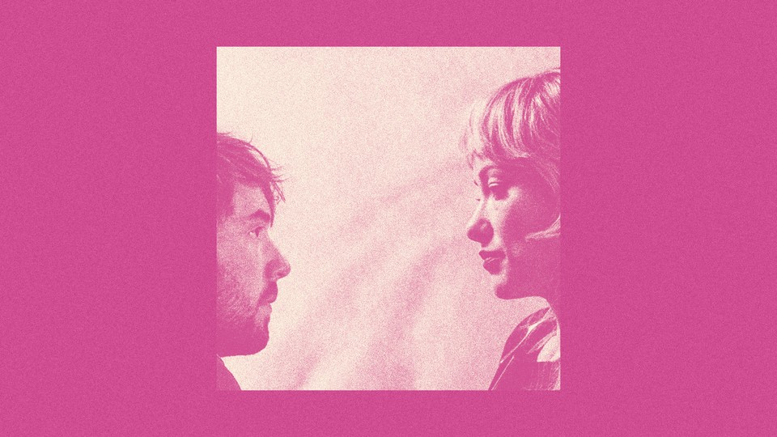

# A Culture War in the Bedroom

> **作者**: Faith Hill | **发布日期**: 2026-08-10 | **来源**: [TheAtlantic](https://www.theatlantic.com/culture/2026/08/i-want-your-sex-movie-gen-z-millennials/688209/)

*llustration by The Atlantic. Source: Magnolia Pictures.*

---

A new film pokes fun at Gen Z’s inhibitions—erotic and otherwise.

In the new film I Want Your Sex, characters are action figures in a staging of generational war.

On one side is Gen Z, its members portrayed as anxious little prudes. Twenty-three-year-old Elliot is bumbling and directionless. His high-achieving girlfriend is far more interested in studying than she is in him. (When he tries to initiate intimacy, she accuses him of “constantly draining my qi energy.”) His best friend, Apple, is angsty about her lack of interesting life experience—yet she almost always seems to be home, donning pimple cream and loungewear. None of them is having much sex.

Their Millennial foil is Erika Tracy: self-serving, insensitive, and ostentatiously sex-positive. She’s a visual artist who has hired a league of underpaid Zoomer assistants—including Elliot—mostly to chew gum and then affix it to a giant drawing of a vagina. She has said publicly that a one-night stand “knows you better than your mother or your best friend ever will.” And she has no problem crossing lines. Amused by Elliot’s innocent skittishness, she promptly suggests that they make their relationship sexual. Soon she’s handcuffing him and making him crawl on the ground. In the bedroom as in the office, she’s dominant and he’s submissive.

The film, directed by Gregg Araki, is hitting theaters at a time when many commentators (okay, myself included) are writing nervously about the “sex recession” and the “romance slump,” wringing their hands about why the youths aren’t getting laid. Some paint young people as coddled and fragile, too timid to put themselves out there. Meanwhile, many Zoomers point out that they’re not growing up in the same world that older cohorts did: They have plenty of valid reasons to feel inhibited (a pandemic, a housing crisis, a culture of constant digital surveillance) and plenty of other priorities (saving, studying, worrying).

Araki sketches each generation with a cartoonishly broad brush. But the caricatures help illuminate what each perspective might get a little bit right. In an era of shifting etiquette and vigilance against inappropriate behavior, the film seems to ask, can sex be liberating, transgressive, and respectful all at once?

I Want Your Sex knows that a person’s most intimate experiences can be shaped by their historical context. At first, the choice to make Erika a 30-something struck me as odd; Millennials, who’ve partnered later and less than prior generations, were the ones who kicked off the sex recession. But although they may have been having less sex in their 20s on average, they were also known as the “hookup generation.” Compared with older cohorts, Millennials were more tolerant of gay and premarital sex, and more likely to report having casual sex. And they enjoyed a culture of relative erotic frankness and optimism.

Araki, who is 66, grew into adulthood during the AIDS epidemic. In his 20s, he said in a 2023 interview, he felt as if “this black cloud of doom is hanging over you every fucking day.” By the time Millennials were coming of age, some of that darkness had lifted. The HIV pre-exposure drug Truvada was approved for use in 2012, when the median Millennial was about 24. The internet opened up access to information about sexual health and kink. Last year, Match Group’s Singles in America poll crowned Millennials “the horniest generation”: Of all the cohorts surveyed, they reported the highest levels of sexual desire and the most boredom with “vanilla sex.”

Erika is, in her way, a perfect encapsulation of the Millennial sex paradox: She has made the erotic a major part of her identity. But it’s not clear that she’s happier for it, or that she’s scratching whatever itch she has—one that might be more existential than physiological. “Sex is everything; it forges us as human beings,” she lectures Elliot. Later, when he reminds her of this, she amends that point: “Sex is everything. It’s also nothing.”

If more Zoomers are openly questioning the value of intimacy, perhaps it’s because they’ve picked up on some of that quiet ambivalence. And in the time since Millennials entered adulthood, the rules and expectations about sex have gotten even more complicated. The MeToo movement heightened people’s suspicion of uneven and potentially exploitative power dynamics—perhaps especially in the workplace, one of the primary places where romantic partners used to meet. After decades of relaxing societal norms regarding what’s appropriate to talk about and with whom, backlash arrived in the form of “boundaries”: a suddenly ubiquitous pop-psychology concept. And then COVID hit. By the time Americans emerged from isolation, many were socially rusty and fond of a good night in. The gaps between people aren’t generally getting easier to bridge.

Yet the idea of Zoomer sexlessness seems to have galvanized even just slightly older people to champion eroticism. In one slightly on-the-nose scene in the film, Erika confronts Elliot about what she sees as his age group’s failure of joie de vivre, in sex and in general. “Gen Z is all about FOMO, and yet you’re willing to miss out on the sexual prime of your life?” she asks. He replies earnestly about spending formative years amid a pandemic: “My peers have not been well served growing up in a time where nothing feels safe.” That’s what Erika thinks is the problem with his generation’s risk aversion, though. Why is feeling safe their overarching goal? “Being outside your comfort zone,” she tells him, “is the whole fucking point.”

I Want Your Sex isn’t an anti-MeToo movie; it takes manipulations and abuses seriously enough to show that Erika is, at some points, truly acting egregiously. But you also get the sense that she’s right about a few things. Elliot wants to let go of some control. He enjoys a lot of what happens between them. And what he doesn’t enjoy, the movie insinuates, he’ll learn from. Araki seems to be grieving a bygone era: one that felt a little looser, a little spicier, and perhaps more resilient. At one point, when Erika is encouraging Elliot to lighten up, she gives him a copy of Harold Robbins’s Never Love a Stranger, a raunchy novel that became the subject of an obscenity trial in 1949. Certain progressive impulses, the film suggests, somehow led the nation in a big loop—right back to a puritanical streak in which pleasure is seen as threatening enough to suppress.

In a perfect sensual landscape, everyone would feel safe and free all at once. I Want Your Sex doesn’t identify the secret to making that happen, of course—and the film arguably avoids the trickiest parts of its own debate by making Erika’s character a woman. Araki has said that the original script featured a young female intern and her male boss, but “after MeToo, I was like, I kind of don’t want to have a male dragging a female around by the hair.”

Still, by focusing on BDSM, he offers an alternative framework for navigating desire. The practice inherently involves power differences—but also a code of ethics. When I talked with Yehuda Duenyas, the film’s intimacy coordinator, he drew an analogy between kink etiquette and his own work: Having a clear permission structure and good communication from the start means that people might actually feel more able to lean into passion; they’re not worrying in the moment about what’s acceptable or desired, because they’ve already established it. His job isn’t to make people feel comfortable. It’s to foster clarity and openness.

Erika and Elliot don’t exactly model a healthy dynamic. But the film makes a point of emphasizing his agency, even at his most vulnerable. When an incident brings Elliot to an interrogation room to be questioned about his relationship with Erika—don’t ask why—he tells police that he was “way over my head” and “under her control.” And how does he feel about that? Thankful.
