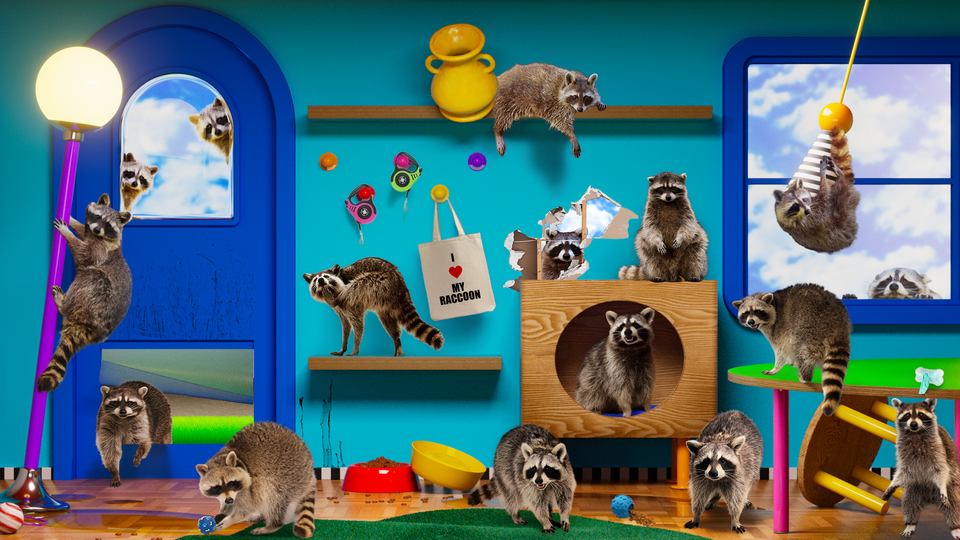

# Are Raccoons Evolving Into Pets?

> **作者**: Annie Lowrey | **发布日期**: 2026-08-10 | **来源**: [TheAtlantic](https://www.theatlantic.com/ideas/2026/08/are-raccoons-evolving-pets/688231/)

*Illustration by Pedro Nekoi*

---

The myth and science of the country’s favorite floofy, fluffy cuddle-badgers

At 10 p.m. in early July, Long Island was sweltering under a heat dome. As bedroom lights dimmed and heavy clouds rolled in, a raccoon ambled onto the porch of a split-level home, found a crack in a sliding door, and slipped inside. He tongue-polished a lasagna tray on the floor near the kitchen counter before waddling back into the damp fug of the summer night.

Soon after, a raccoon with a facial scar and a thin tail entered, ate a snack, and flopped down for a nap. Next, a pair of juvenile raccoons scrounged for kibble and used the dining chairs as a wrestling ring, hanging upside down from the rungs and tackling one another like luchadores. By dawn, a procession of animals had cycled through—one piebald kitty, a bunch of raccoons—like the stoned overnight patrons of a roadside Waffle House.

Marilyn Smith knows that things have escalated. Maybe, she concedes, they have even gotten out of hand. (I am giving her a pseudonym, because she worries her neighbors will call the police.) Years ago, she encountered a colony of feral cats on a nearby trail. She got involved in trapping and neutering the animals, and started feeding them. “I don’t know whether the word was out, but a gazillion cats came to my house,” Smith told me. She set up hard-shell crates for them in her backyard. She left her garage and porch doors open a bit so they could shelter during storms. In time, the feral cats became her cats, some with names, Tootsie and Little Baby and Foxy. “They trust me,” she said, describing how one curls up around her neck and sleeps on her pillow. Still, they often prefer to be outdoors.

Smith would not keep out the cats. Thus, she could not keep out the raccoons, who quickly lost whatever fear of her they might have had. They started appearing in her bedroom in the middle of the night, searching her pocketbook for kibble. They began breaking into her cabinets. They began dominating the tin cans she left out, making the cats caterwaul. Smith considered quelling the resource conflicts by feeding the species separately: cat food inside during the day, raccoon food outside at night. (Cats are crepuscular carnivores; raccoons are nocturnal omnivores.) It wouldn’t work, she concluded. She ended up slinging orders for half a dozen cats and who knows how many raccoons 24/7, the customer always right. “The other day, the raccoons rejected a kind of cookie; maybe it was oatmeal,” she said. “They took it and spit it out. So that’s off the list.” They don’t like stuffing or brussels sprouts either.

As much as Smith loves animals, the situation is not exactly working for her. Her kitchen smells like stale ammonia; the stairs to an abandoned seating area are dotted with scat. She can’t travel. She can’t sleep. She can’t host (people, I mean). She has had to get two rounds of rabies shots—scratched by accident, not on purpose, she swears. She could simply shut her doors at night, I suggest, or go on a vacation, encouraging the animals to fend for themselves. “I’m very neurotic,” she responds. “When I wake up in the morning, the first thing I think is: They’re hungry.”

Smith is living out the “If you give a mouse a cookie” parable. She is also unwittingly taking part in an extraordinary, unfolding ecological shift. Unlike many native species—ocelots, Shenandoah salamanders, Xerces blue butterflies, Key Largo wood rats—raccoons flourish in human settlements. Over time, their population has increased and their attitude toward the people in those settlements has changed. Urban raccoons have become more curious and less reactive. They have also started to develop distinctive traits common among tame species and uncommon among wild ones. The differences are so pronounced that some academics believe that raccoons are actively domesticating, much like the curious wolves that eventually transformed into pugs.

Last year, Frontiers in Zoology published a study on the phenomenon; mainstream media outlets picked up on it; social-media posts heralded the arrival of the “new American pet.” The research confirmed what many Americans suspected about the creatures rummaging through their recycling bins. More than that, it confirmed what many Americans wanted to believe about these floofy, fluffy cuddle-badgers, with their picklock fingers and Zorro masks. Raccoons aren’t just raccoons, after all. They’re up there with capybaras and deep-sea anglerfish as objects of unhinged human adoration. They’re trash pandas. They’re Rocket and Bandit. They’re Jimothy, a spry, deformed raccoon who has become so popular in Seattle that its city council officially decreed it “Jimothy Summer.”

Standing in Smith’s kitchen, surrounded by lasagna pans and scat, I half-felt that I was watching Darwinian evolution occurring in real time, and even wondered whether the raccoons of Long Island somehow wanted to domesticate. Then again, that might be nothing more than what a lot of Americans want to believe.

The raccoon’s thriving represents not merely a remarkable triumph but a remarkable turnaround. When Christopher Columbus arrived on Long Island (the one in the Bahamas, not New York) in 1492, he noticed a local fisherman keeping some strange kind of dogs as pets. He was far from the last colonist to be confused by the species, described nearly 300 years later by the explorer Jonathan Carver as possessing a badger’s body, fox’s head, dog’s muzzle, cat’s tail, and sharp claws that let it climb like a monkey. (Raccoons are not a close relative of any of those animals; they are procyonids, related to coatis and kinkajous.) Following Columbus’s second voyage, Europeans ate so many of the animals that they went extinct on the island of Hispaniola.

Over the following centuries, colonizers exploited raccoons not so much for food as for fur. Jaunty association with the king of the wild frontier notwithstanding, raccoon pelts were considered inferior to beaver pelts, “common or even undignified for men of means and ambition,” Daniel Health Justice, a professor of Indigenous studies at the University of British Columbia, writes. Nevertheless, in the early 1800s, settlers trapped and skinned hundreds of thousands of raccoons a year.

The population busted, thanks to humans. Then it boomed, thanks to humans. Hunters and ranchers eradicated raccoons’ natural predators, among them coyotes, wolves, and bobcats. Developers and farmers destroyed their natural habitats, woodlands and marshlands, but built unnatural environments that suited raccoons just as well. Raccoons survive on farms and in fields. They thrive in suburbs and cities, thanks to gardens and trash cans and dumps. From the 1930s to the late ’80s—as dozens of native species went extinct, and even as the raccoon-pelt trade picked up again—the raccoon population soared 20-fold.

Humans don’t deserve all the credit for raccoons’ success, I should note. The animals are one of nature’s star utility players. They are opportunistic feeders, eating just about anything available. They are opportunistic den-makers, exploiting whatever natural cavities or fabricated structures they find. They are intelligent, having long memories and a knack for problem-solving. “If you give them a puzzle and change the rules, they go with it,” Lauren Stanton, a cognitive ecologist at UC Berkeley, told me. “They have this creativity.” On top of that, they are dexterous enough to shuck oysters, unscrew jars, unlatch gates, and pick knots.

Raccoons have not only taken advantage of their anthropogenic environment but also adapted to it, much like pigeons, ants, rats, and crows. Urban raccoons have smaller ranges and live at higher densities than their wildland counterparts, for instance. Suzanne MacDonald, an animal psychologist at York University, told me: “They’re much more social in the city.” (Same.) Urban raccoons have also become less afraid of the unfamiliar, more eager to solve puzzles, more flexible in their routines, and less flighty. “We’ve ended up with animals that don’t run away from us, and instead come sit on our patio furniture,” as MacDonald put it.

This nascent friendliness could be due to habituation—raccoons learning to play nice, more or less. It could also be due to what MacDonald describes as “runaway selection.” Affable raccoons probably eat more than aggressive raccoons do. They probably have more kits. Those kits are probably more likely to survive, more likely to be affable themselves, and more likely to give birth. In this way, generation by generation, the raccoon population would become less lion and more kitty cat.

Docility is domestication’s lynchpin trait, because it allows for an animal’s safe handling and captive breeding. (You wouldn’t let an animal hang around the homestead if it kept trying to fight you.) Yet the strongest evidence that raccoons are evolving straight through the crack in the porch door has nothing to do with their attitudes. It has to do with their snouts.

In On the Origin of Species, Charles Darwin observed that domesticated animals share a set of peculiar phenotypic traits, among them floppy ears, bright colors, and curly fur. Humans were not purposefully breeding those features into existence; rather, they seemed to be the byproducts of a deep and cryptic biological process. (“When man goes on selecting, and thus augmenting, any peculiarity, he will almost certainly unconsciously modify other parts of the structure,” Darwin wrote.) “Domestication syndrome” remained a mystery for 140 years after the voyage of The Beagle. Why those specific features? How did they show up in animals as varied as angora rabbits and zebrafish? In 2014, scientists published a tidy and compelling theory: Docile animals have a heritable “deficiency” of a specific kind of stem cell that appears in vertebrate embryos, migrates through the body, affects tissue development, and disappears. Through these neural crest cells, rubbable tummies lead to furry tummies.

As well as short snouts—3.6 percent shorter in urban raccoons than in rural raccoons, according to the study in Frontiers in Zoology. “That doesn’t sound like a lot. And in a sense, it is not a lot. But if you think about these animals potentially only being at the very early beginning stages of domestication, that is still a fairly clear signal,” Raffaela Lesch, the lead author on the study, told CNN. (Lesch declined to speak with me.)

I found this evidence tantalizing yet bewildering. The United States’ cities and suburbs exploded in size after World War II—less than 100 years and 100 raccoon generations ago. Didn’t evolution take eons? Could raccoons really develop domesticated traits so fast?

Yes, Melinda Zeder, a zooarcheologist and emeritus curator at the Smithsonian Institution, told me. Domestication can take thousands of years or tens of years, as a Soviet experiment on silver foxes demonstrated. In the late 1950s, the geneticists Dmitri Belyaev and Lyudmila Trut decided to see how friendly they could make foxes, and how fast they could do so. Within a dozen generations, the animals exhibited “major changes in behavior, as well as in coat color” and other ancillary traits, Zeder said. Within decades, the foxes looked more like fluffy kittens and acted more like silly puppies.

In a sense, raccoons are arriving on our doorsteps half-domesticated. They naturally tolerate close proximity to humans, unlike wolverines. They pose no mortal threat to humans, unlike hippos. They love human food, unlike pandas. They are highly intelligent, unlike ostriches. (Ostriches, it turns out, are real morons.) They’re so compatible with us that our earliest written records describe them as pets, the Taino fisherman’s unusual dogs. In the centuries before the United States urbanized, writers frequently emphasized the raccoon’s tameability. Foxes “are never to be made familiar,” the naturalist John Lawson wrote in 1709. “The Raccoon is.” (Little did he know about the Soviets.) President Calvin Coolidge even kept a raccoon, Rebecca, in the White House, walking her around on a leash. I wondered: If raccoons naturally possess many of the features common in companion animals, why aren’t they common companion animals? Why haven’t raccoons already domesticated?

“They’re not really a very good model” for domestication, Bonnie Beaver, a veterinarian and an acclaimed animal behaviorist at Texas A&M University, told me. Domesticated animals reproduce easily, early, and often, for instance; female raccoons are fertile as few as three days a year. Raccoons might be curious about and comfortable near humans but are innately solitary too. They don’t like roommates and won’t put up with taskmasters. Plus, Beaver said, raccoons “do not have limited agility.”

I did not quite understand what she meant until I spoke with Dave, who had impulsively bought a raccoon kit from an exotic-pet dealer a few years ago and now cohabitates with “a total asshole.” (Dave asked me to give him a pseudonym. Keeping a raccoon is legal in a dozen states, though not the one where he lives.) Things started out promisingly. “Blondie learned a bunch of tricks,” Dave told me, describing how the raccoon would climb onto his shoulders to get a Cheez-It or a shred of turkey jerky, careen through the tunnel mazes that Dave would build for him, snooze in a big dog crate, and use a litter box.

Then Blondie “went psycho.” (Raccoons become much more aggressive when they hit puberty, at around 1 year of age.) He ate through the cords to Dave’s television, gaming system, and computer. He shredded books. He expanded a crack in the living-room drywall into a hole big enough for Dave to climb into. He escaped from his crate and trashed the kitchen in the middle of the night. When placed in a stronger enclosure, the raccoon injured himself trying to get out. Today, Dave is the only person that Blondie tolerates as a handler, and tolerate is a generous description. The raccoon is “mad” all the time. I asked Dave whether he wished he had never gotten his pet. He would not say that, but he expressed frustration at the exotic-animal dealer, himself, and his miserable raccoon.

Experts were not exactly surprised. Breeders play up raccoons’ supposed good nature and definite good looks. Social-media accounts showcase the animals freezing when a light turns on or freaking out when they dunk cotton candy in water and it disappears. (In many languages, raccoons are called “the ones who wash,” “wash-bears,” or “washing-rats.” They submerge objects in water to heighten the sensory capacity of their finger pads, not unlike gourmands who bring Brie to room temperature before they take a whiff.) Cute, sure. But raccoons are “incredibly destructive,” Nessie O’Neil, a raccoon biologist, told me. “They’re so smart compared to cats and dogs—wildly, wildly intelligent—and because of that, they are very, very hard to keep entertained.” Captive raccoons require specially designed, large enclosures and “puzzle after puzzle” to work on, she said. “They like textures, they like to pick at things, they like to tear things apart, and it’s fun for them.”

Other experts were more emphatic. “These are mesocarnivores. Would you accept having a coyote in your house?” MacDonald, of York University, said. “Why the hell would you take a crazy little wild animal that is exceedingly bitey—why would you want this destructive force in your house?” She added: “In the U.S., I have to say, you folks are insane. In Canada, raccoons are a protected species” and thus generally illegal to keep as pets.

Raccoons pose a serious bite risk to humans and are carriers of rabies, leptospirosis, and the raccoon roundworm. In humans, the parasite can cause nausea, fatigue, ataxia, liver disease, blindness, and comatosis. The condition is rare, thank Bandit, and sometimes treatable. But many people do not realize they are infected until they fall over while walking down the stairs or notice a squiggle in their vision, meaning a roundworm is floating in their eyeball. Oh, and the roundworm’s eggs can survive for years, even after being doused with soap, detergent, and bleach.

Raccoons make humans sick; humans make raccoons sick too. One of the simpler ways to keep a captive raccoon pliable is to feed it all the time, MacDonald pointed out. As a result, many raccoon pets are obese and diabetic, as are many of their wild cousins. They are also prone to kidney disease. On a human diet, they die, O’Neil said. “I see it all the time. It’s horrible.”

If raccoons were domesticated animals, they would be far different. Their brains would have shrunken; their neuroendocrine system would have transformed. These changes would have made them calmer, more trainable, less intelligent, and less aggressive. Maybe they would have developed sheepdog shags, Dalmatian spots, poodle curls, and Boston terrier bug eyes too.

Perhaps this genetic drift started 100 raccoon generations ago, and if we wait a few hundred raccoon generations more, the process would be complete. Yet scientists cautioned me against thinking about domestication as a sequential, deterministic, and unidirectional process—get on at wolf; get off at Yorkie. Some species start domesticating and then stop, such as gazelles. Some domesticate and later rewild, such as dingoes. Some seem domesticated but are not, like quokkas. Some are considered domesticated and perhaps should not be, such as cats—really. Sure, kitties have velvety meow-meows and tortoiseshell coats, and they like to figure-eight through people’s legs. Yet we haven’t been selectively breeding the animals for long, Beaver pointed out, meaning that we “haven’t really messed cats up.” Neither have we made them need us, or even listen to us. Indeed, they do perfectly well on their own.

Domesticated is a tidy term for systems as chaotic and complicated and changeable as nature itself, and a term that “robs you of really understanding what’s going on,” as Zeder put it. When we talked about raccoons, she used two other words to describe them: The creatures might have developed a “commensal” relationship with humans, meaning that they benefit and we do not. (Remora have a commensal thing going on with sharks; demodex face mites have a commensal thing going on with us.) Or they might be “synanthropes,” relying on humans without us ever throwing open the porch door to them. (Lice, cockroaches, bedbugs, and pigeons are synanthropes.)

Marilyn and Dave aside, humans aren’t throwing the porch door open to raccoons. Everyone in possession of a brain knows that they are a rabies vector and a bite risk. Anyone in possession of a trash can, feed bin, vegetable garden, root cellar, chicken coop, barn, attic, garage, woodshed, crawl space, dumpster, corn field, or DoorDash order on their front steps knows that they are a nuisance, if a stuffy-sized nuisance with a habit of standing on their hind legs and making uppy-arms. Thus, these marauding chubbos are missing the most fundamental domesticating force: human desire. We don’t have a lot of use for raccoons, Beaver pointed out: “We don’t need them for food. We don’t need them for clothing. We don’t need them as companions.” We aren’t going to start mass-raccoon-breeding operations or begin putting them under the tree at Christmas. Like a lot of species, they might remain half-domesticated forever.

What about last year’s attention-getting study, then? The paper is just one, researchers told me. Plus, the analysis is based on photographs submitted by members of the public, meaning the sample might not be big enough and sound enough to draw conclusions. The greater risk lies in its interpretation. “People hear what they think is a scientific justification for having this animal as a pet,” O’Neil said. “People are not going to do enough digging to realize, Oh my God, this is a really bad idea.”

As for Smith, she recognizes that what she is doing is probably not a good idea, but she can’t stop. She described putting lasagna trays filled with kibble, peanut-butter sandwiches, crackers, and leftovers out one recent night. The raccoons were still hungry, she guessed. They ventured upstairs and ransacked her daughter’s old bedroom.

“No one would believe this,” she said, but “I’m really a dog lover.”
