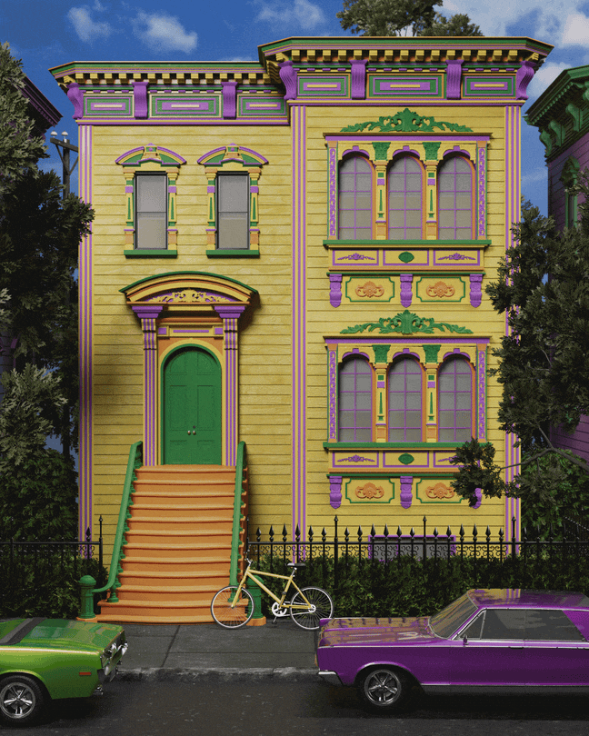

# The Color Recession May Be Permanent

> **作者**: Amogh Dimri | **发布日期**: 2026-08-10 | **来源**: [TheAtlantic](https://www.theatlantic.com/ideas/2026/08/colorless-gray-products-houses/688174/)

*Illustration by Matteo Giuseppe Pani / The Atlantic*

---

Consumers are so afraid of getting colors wrong, they don’t use them at all.

When Bob Buckter, a 79-year-old housepainter who also goes by “Dr. Color,” began his career, in the 1970s, the job was a lot more fun. Acid-tripping hippies in his hometown of San Francisco wanted “wild-ass color combinations” for their facades, he told me. Armed with mustard-yellow, lime-green, and vermilion paint, Buckter happily transformed drab Victorian and Edwardian homes into vivid eye candy.

Today, almost no one seems to be looking to the hues of jelly beans for inspiration for their home—or car or couch or fridge or practically anything else. Since the late 2000s, Buckter has watched with dismay as essentially colorless colors—think white, beige, gray—have taken over. “It’s not even three shades, or four shades, of gray. It’s just one dark gray,” he said. “It’s an ignorant way to paint your house.” A study of homes in Washington, D.C., last year found a similarly sharp rise in the number of gray homes, especially in the most rapidly gentrifying wards.

Color trends used to come and go. But the color recession that began early this century has dragged on far longer than the heyday of avocado green in the 1960s or hot pink in the 1980s. “Our top color from 2000 to 2010 was ‘Pelham Beige.’ We thought that would never change,” Sue Wadden, the director of color marketing at the paint company Sherwin-Williams, told me. The next decade, she said, “gray was dominant. Like gray, gray, more gray.” Sherwin-Williams’s current list of its most popular colors for home interiors features “Ice Cube” and “Crushed Ice” (both white), and “Agreeable Gray” and “Passive” (both gray). Colors are now getting warmer again, Wadden noted hopefully, but they’re “warmer whites.” The company’s color of 2026 is “Universal Khaki”—otherwise known, unfortunately, as “greige.”

The color drought doesn’t affect just paint companies. According to Pantone, a color-technology company influential among designers and manufacturers across industries, 2026’s “Color of the Year” is “Cloud Dancer” (yes, white).

The share of new cars in grayscale colors rose from 60 percent in 2004 to 80 percent in 2023. Production of purple cars dropped 93 percent over that period, gold by 97 percent. “I don’t know how many different variants of silver and gray there could possibly be, but I think BMW and Mercedes have discovered it,” Karl Brauer, the analyst behind the report, told me.

Some color trends may look like a matter of whim. In the 2006 film The Devil Wears Prada, the imperious fashion editor Miranda Priestly (played by Meryl Streep) delivered the now-famous monologue in which she berates her assistant Andy Sachs (Anne Hathaway) for being “blithely unaware” of how her own cerulean-blue sweater was in fact a product of a high-fashion embrace of the hue “by the people in this room.” Twenty years on, in this year’s The Devil Wears Prada 2, Sachs is gently discouraged from wearing anything colorful. “This is quiet luxury,” Stanley Tucci’s Nigel Kipling explains while assembling a wardrobe of grays and taupes. “That,” he adds, gesturing at the pink garment in her hands, “is like a screaming guitar solo.”

What’s plain, in the Prada sequel and nearly everywhere else, is that color fads are no longer dictated from on high by style gurus. Remarkably, shoppers’ personal taste may not be much of a factor, either. Although some studies show that people tend to feel more cheerful in the company of oranges and yellows, more calm among blues and greens, and sometimes more depressed around too much gray, their spending habits say otherwise. Two decades into the color recession, the observable preferences of landlords, homeowners, car buyers, and consumers have grown detached from what people claim to like. And little evidence indicates that walls or cars or appliances in hues other than greige are coming back anytime soon.

For thousands of years, color was an aristocratic luxury. From the 14th century B.C.E. to the 15th century C.E., only Mediterranean royalty, priests, and nobles wore anything dyed Tyrian purple, because acquiring the color could involve slicing out the mucous glands of special sea snails, fermenting them in salt for days, boiling them for days more, and then pouring urine on newly dyed garments to bind the color to the fabric. (A single gram of the dye required at least 10,000 snails.) The deep red of kermes crimson in ancient Rome involved grinding dried female kermes insect corpses. By the Middle Ages, some landlords accepted the dye as rent. The lurid verdigris that adorns the dining-room walls of George Washington’s Mount Vernon estate was a labor-intensive status symbol, achieved by oxidizing copper plates with vinegar vapors and then mixing the resulting patina with oil.

In 1856, after an 18-year-old English chemistry student named William Henry Perkin accidentally invented synthetic dye while trying to cure malaria, a range of colors—including his own, snail-free Tyrian purple—became widely available for textiles. Suddenly, anyone could don the color the Roman emperor Caligula allegedly killed the King of Mauretania for wearing.

Perkin’s discovery spurred other lab-made dyes, which lowered costs and applied color to a widening variety of goods. Indiscriminate demand duly followed. By the early 20th century, Sherwin-Williams’s ads were encouraging homeowners to repaint every season: warm colors for winter and cool shades in the summer. Henry Ford may have once said that buyers could get a Ford Model T in any color, “so long as it was black,” but even he succumbed. In 1927, nearly two decades after the first Model T rolled off the assembly line, Ford hoped to revive interest in his car by painting it red.

“The effects of our chromatic revolution are everywhere apparent,” a 1928 Saturday Evening Post article called “The New Age of Color” observed. “Cars are borrowing their hues from the waters of the Nile, from the sands of Arabia, the plumage of birds and the fire of gems.” The ’20s were roaring; stocks were climbing, Hitler had yet to rise to power, and the cars plying American highways bore the Day-Glo colors of tropical birds. What could be more delightful?

By mid-century, a put-together, color-coordinated lifestyle “was what it meant to be middle class,” Regina Blaszczyk, a color historian, told me. Buyers matched their shoes to their suit and hat, and their car to the exterior of their home.

Mad Men–era color oracles in high-rise offices offered industry executives predictions that promised to boost sales and solve problems. In his 1945 book, Selling With Color, the color consultant Faber Birren wrote about the value of using warm and light colors for hospital-patient rooms but a more clinical blue-green hue for operating rooms (to reduce eye fatigue by posing a contrast to the red hue of innards). Alexander Schauss, a biologist, found in 1979 that a shade of pink—known as Baker-Miller Pink or Drunk-Tank Pink—could calm inmates and reduce fights in prisons.

The postwar decades, in short, were gloriously colorful in the United States. The decline would be precipitous.

Institutional constraints on color were already starting to emerge during this period. Postwar developers, for example, worked to meet the immense demand for housing by building entire neighborhoods with a handful of floorplans and a limited palette. In the name of protecting property values, homeowner associations attached to these developments decided that “uniformity is actually a positive,” Evan McKenzie, a University of Illinois Chicago professor who studies HOAs, told me. Many mandated earth-tone palettes for home facades, and even restricted the colors of street-visible features such as mailboxes, roofs, and curtains. Instead of resenting these limits, buyers came to see greige paint as securing their investment. “You’d want a neighborhood where you can restrict your neighbor, because your neighbor might do something crazy,” McKenzie said.

Meanwhile, in the auto industry, the passage of the Clean Air Act of 1970 and the Toxic Substances Control Act of 1976 narrowed the range of financially feasible colors for cars. Roy Kerney, the head of product strategy at the car-painting company Axalta, told me that the more eco-friendly coating that replaced lacquer paints was more expensive, which raised the cost of delivering variety. Stocking neutrals, which sold reliably, was far easier and more cost-effective than testing the appeal of various hues.

Time has reinforced those constraints. Given that ever more auto sales are for used vehicles, shoppers sensibly prefer to buy cars in inoffensive colors in case they need to resell. “When it comes to car colors, it’s not just about personal preference or what makes you happiest,” Kelley Blue Book warns. “If you’re looking to retain your car’s value, it’s best to play it safe and choose neutral colors.”

Never mind that resale-market data defy this conventional wisdom. A 2024 study of 1.2 million three-year-old used cars found that yellow, orange, and green cars depreciated less than silver, gray, and white ones.

Big purchases breed risk aversion. A 2025 survey of real-estate agents by Better Homes and Gardens found that 84 percent recommend repainting house interiors in white, gray, or beige before selling—particularly if the walls are red. Yet this market-appeasing logic doesn’t always satisfy the market. One Zillow study last year found that olive-green and navy-blue walls actually boosted home prices compared with white.

Even so, Alana Cowan, a graphic designer, still found herself puzzling over the difference between “Chantilly Lace” and “Alabaster” recently while figuring out what to paint the walls of her new house, in Arkansas. “Apparently, there’s 30 shades of white,” she told me. She was too plagued by doubt to consider anything more adventurous: “What if I hate it? What if I get tired of it? What if the next buyer doesn’t like it and that’s the reason they don’t buy the house?”This logic repeats itself from one room to the next, a phenomenon some decry as “the HGTV-ification of America.” Among renovating homeowners, 72 percent choose inoffensive stainless-steel appliances, according to one recent report. White and off-white dominated kitchen-wall colors and backsplash tiles. Amy Woolf, an interior decorator and color forecaster, told me that she’s seen “cocooning”—or seeking safety in one’s purchases—solidify gray’s dominance in every product sphere. When people buy a sofa now, they “don’t want to hate it in two years, so they’re not going to go with orange,” she said.

Yet grayification isn’t as “neutral” as buyers believe. A review last year of more than 100 studies of the effect of color on emotion found that gray consistently triggered fatigue, boredom, or sadness. Stephen Westland, a professor who studies color science, attributes the rise of gray to the fact that people are “scared of using color,” he told me, even though “the use of color can make you feel happier, psychologically.”

I wish I could say that change is on the horizon—that after decades in retreat, color is making a comeback.

Here and there, some consumers are letting color back in. Amy Freed, a retired lawyer from Maryland, decided to repaint her home and hired Woolf to help pick out the best shades of gray. Freed was shocked when Woolf suggested orange for the entryway. The color seemed “too bold and aggressive, and so out of my comfort zone,” Freed told me. “I don’t like color.” Nevertheless, Woolf persuaded her to try it out, and the foyer quickly “became this incredibly fun, joyful thing for me,” Freed said.

But her experience is notable precisely because it’s unusual. Millennial Pink in the 2010s, Barbie Pink in 2023, and Brat Green in 2024 were welcome counterpoints to the color recession, but they were also short-lived. They never quite translated into real-world buying habits for most consumers.

Color experts across multiple sectors told me, with varying degrees of wistfulness, that bright shades are ill-equipped to return. The structural obstacles to color are not going away. Almost 70 percent of new single-family homes were built into HOAs in 2024, the second-highest year on record after 2020. In a data-driven car marketplace, the color recession has become self-reinforcing. The preponderance of grays ensures that there’s too little information to even gauge demand for other colors.

Color enthusiasts are now largely stuck sneaking bright hues into gray. “Color is coming back,” Nancy Lockhart, a co-director of the Inter-Society Color Council, a nonprofit professional group, assured me. “But it’s coming back so subtly that you almost don’t notice it.”

In a show of defiance, Axalta did pick “Solar Boost”—“a warm and inviting orange tone”—as its automotive color of the year. But Kerney, the company’s product-strategy head, told me that the company doesn’t actually expect many orange cars to roll off the assembly line anytime soon. The choice of Solar Boost was simply to nudge the market in a livelier direction. The hope, Kerney explained, was that “a gray car out there may be gray, but may have a slight twinge of red.”

A marginally brighter gray might not seem worth celebrating. Dr. Color, the San Francisco housepainter, certainly can’t understand why so many people are denying themselves the pleasure of vivid, kaleidoscopic hues. His house is painted in no fewer than 11: “yellows, golds, ochres, cinnamons, with touches of blues, reds, and gold leaf, and purple and green,” he said. His home, in all of its peacocking beauty, stands out on Google Maps.

His neighbors, however, are playing it safe. Their homes are painted in different shades of greige.
