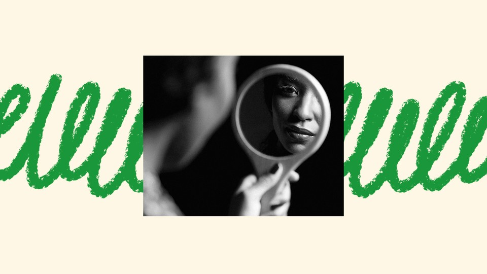

# The Internet Is More Image-Focused Than Ever

> **作者**: Julie Beck, Natalie Brennan | **发布日期**: 2026-08-10 | **来源**: [TheAtlantic](https://www.theatlantic.com/podcasts/2026/08/the-internet-is-more-image-focused-than-ever/688170/)

*Illustration by The Atlantic. Source: Gallo Images / Alamy.*

---

Just a few years ago, the body-positivity movement was going strong. What happened?

Subscribe here: Apple Podcasts | Spotify | YouTube| Pocket Casts

It wasn’t that long ago that “body positivity” was all over the internet. Oppressive beauty standards hadn’t gone away by any stretch, but many people on social media were pushing against limits on what an “ideal” body could look like. Now, things have swung in the opposite direction, with the rapid uptake of GLP-1s and the resurgence of a skinny ideal, combined with a new frankness about plastic surgery. The calls for “self-love” and “health at any size” can be harder to hear these days over the roar of looksmaxxers and influencers talking about weight loss and cosmetic procedures.

In this episode of How to Touch Grass, hosts Natalie Brennan and Julie Beck talk with Atlantic staff writer Sophie Gilbert, the author of Girl on Girl: How Pop Culture Turned a Generation of Women Against Themselves, about how the culture of the internet got even more image-focused and the role that social-media algorithms play in distorting what people consider “normal.”

The following is a transcript of the episode:

[Phone ringing]

Natalie Brennan: Hi, Mom. It’s Natalie.

Mom: Hey.

Brennan: Can you hear me?

Mom: Yeah, I can hear ya.

Brennan: We’re working on an episode, it’s about bodies, and we did an interview that was all about, like, what’s happening online at this exact moment in terms of body image, etc., and I just wanted to tell you a story about something I really remember from when I was little.

Mom: Okay, sure. Go ahead.

Brennan: There was this day that you and I were in Stop & Shop together, which was most days, I guess. (Laughs.)

Mom: That’s true. At least for me, yes. (Laughs.)

[Music]

Brennan: Julie, that’s my mom.

Julie Beck: Hi, Natalie’s mom.

Brennan: And we are going to get back to my mom, but first, I’m Natalie Brennan, a producer at The Atlantic.

Beck: And I’m Julie Beck, a staff writer at The Atlantic.

Brennan: This is How to Touch Grass.

Brennan: Julie, this is not an uncommon scenario. I call my mom, put her on the spot with some big story or question, and ask her what she makes of all of it.

[Music]

Brennan: You know how there was all of the magazines at the checkout aisle?

Mom: Yeah, yeah.

Brennan: This was, like, the early 2000s, so I’m sure they were just covered with images of women’s bodies or celebrities’ bodies. And I was probably really longingly looking at these women and, like, sighing and being frustrated.

Mom: Mm-hmm. Yes. Yeah.

Brennan: And you were so direct and totally saw what I was doing and were just like, “This is these people’s jobs. Their work is making sure that they look like this. They have full-time nutritionists. They have—

Mom: Cooks. Trainers. Yup. Mm-hmm.

Brennan: Like, this is their life, and their lives kind of exist in these magazines, and our lives kind of exist in this different world.

Mom: Right. Right.

Brennan: And I remember at that age being like, That’s a very helpful distinction for me.

Mom: Right.

Brennan: I just feel like that conversation must be so different between parents and children today.

Mom: Right.

Brennan: Because I don’t know that that delineation exists anymore.

Mom: Which is sad because, you know, like you on the checkout line, kids kinda look to what’s happening in society to kind of gain a little bit of a identity outside of their family, let’s say, right?

Brennan: Right. Right.

Mom: And it’s not just walking on the supermarket line and looking at magazines.

Brennan: No.

Mom: It’s on your phone. It’s on your computer. It’s everywhere. So I feel like maybe some of the good …

Brennan: Julie, my mom and I went back and forth a bit about this memory—about how things have really changed in my lifetime from, you know, magazines to social media to the place that we are at online now.

Beck: I mean, magazines to online I feel like was maybe chapter one of a transformation. Like, we’ve been online for a while now, right?

Brennan: Yeah.

Beck: And yet, I feel like the transformation is not over. Somehow lately we’re entering a new chapter where the pressure of the body-image stuff that we see online feels even more inescapable today than it did just a few years ago.

Brennan: Well, I’m really curious about this feeling that I’ve been having lately, which is this question of yeah, is there something specific about this exact moment on the internet that is making us feel worse about ourselves? Because yes, it does feel like we’re in a new chapter, but what is it? What changed?

[Music]

Beck: Natalie, when you and I were planning this season, we knew that we wanted to talk about the effect of the internet and social-media algorithms on our relationship with our bodies. And we both knew immediately that the person we had talk to about that was our colleague Sophie Gilbert. Sophie’s a staff writer at The Atlantic, and she’s the author of Girl on Girl: How Pop Culture Turned a Generation of Women Against Themselves.

Beck: Sophie, am I crazy or was there actually a time not that long ago when the internet seemed to offer maybe a bit of an antidote to the relentless pressure of beauty standards?

Sophie Gilbert: No, you’re not crazy at all. And I actually, I’ve been thinking about this a lot, and I really think the moment that you are referring to peaked around 2016.

Beck: Okay.

Gilbert: Which, uncoincidentally, was at the end of the Obama era. So—

Beck: Well.

Gilbert: —I mean, 2016 was the year that the Barbie doll was relaunched with different body types, and it was very much this moment where people were sort of talking a lot more about body positivity or even just body neutrality, like this idea that the beauty ideal that we’d long been aspiring to—sort of white, impossibly thin—that it was not reflective of most people.

Beck: Yes.

Gilbert: But there really was this sort of feeling in 2016 that we were coming to accept ourselves with more kindness and more care, and stop sort of the parade of self-loathing that I think was certainly part of my adolescence and my 20s, and particularly the era of the 2000s.

Beck: And I feel like there was something, at least at first, that was relieving about social media just showing us normal people. And as you mentioned, the body-positivity movement that came along with that, that at least for a little while, was really fueled by social media.

Gilbert: I mean, there were some incredible influencers who sort of came of age on Instagram and, you know, just opening the conversation, broadening it, and encouraging people to approach themselves with neutrality if they couldn’t quite get all the way to positivity. People were being blunt about how damaging fatphobia is, how much it hurts people, how completely unproductive it is. There were so many sort of positive voices coming to the fore in that moment that social media really elevated. There have been studies done on body-positivity content and the effect that it had. I think there was one study showing what being exposed to body-positive content on Facebook did to teenage girls. And teenage girls after seeing images that were body positive, they reported feeling much happier about themselves. They reported better self-esteem. It was not just talk. I know people are sort of cynical about things like the Dove campaign for Real Beauty.

Beck: Yeah.

Gilbert: But just because it was coming from corporations doesn’t mean that it didn’t have a positive impact, which I think is important to remember.

Beck: And you can—you can still find some of that more affirming content, right? It’s not totally gone or anything.

Gilbert: No, you totally can. And one place where I think it has really stuck around, which is tremendously helpful, is in parenting. Like, we do not talk to children about their bodies in the way that I remember my mother talking about her body or, God forbid, about other people’s bodies. Like we are—

Beck: Yeah.

Gilbert: —much more, I think, sensitive and attuned to how to raise kids to think positively about their bodies and what they can do, and how they can be, you know, strong and happy, and not be so focused on what they look like. I think the problem is when we start trying to apply that to ourselves. That’s where things get a little stickier.

Beck: Yeah. So, I mean, those things still exist to some degree, but I do feel like the overall vibe of social media feels very different now. (Laughs.)

Gilbert: Yeah.

Beck: How have you seen things change?

Gilbert: Probably of over the last two to three years, maybe since COVID. And definitely sort of accompanying the rise of GLP-1s as a sort of cultural force, not as a, you know, as a health treatment so much, but as a cultural force. There has been a resurgence in this kind of skinny ideal on social media. There are skinny influencers, SkinnyTok, which is this influencers on TikTok who are advising people how to be skinny, how to calorie restrict, and sort of not only advising them, but also talking about why skinniness is the only thing that people should sort of aspire to. During the 2000s, there was so much criticism of women and their bodies. I’m sure you remember the magazine covers of— there was no way for women to win in that era. They were too thin; they were too fat; they were too, you know, they hadn’t bounced back from pregnancy fast enough. And I think we’re all a little wounded from that era, and so we’re very loath now to criticize anyone’s body or to talk really about anyone’s body, anyone who happens to be especially a young female celebrity in the public eye. But it’s also impossible not to notice that stars do seem to be getting a lot thinner. And it’s hard for me and I’m sure for everyone to not worry about what that is doing to us as a culture. It feels like we’re in this period again of living through the sort of heroin chic era of the ’90s as a teenager of, you know, there’s a new cultural ideal of extreme thinness, and that is not an easy thing to live through.

Beck: What kinds of things are you seeing get traction online with people’s social-media algorithms that maybe reinforce that cultural ideal?

Gilbert: Yeah, like I’m thinking of the influencer Liv Schmidt. I think she was banned from TikTok but is still on Instagram, and she has a diet community. She charges people to be in her sort of secret community, and she’ll give you tips. She really seems to be pushing this idea that skinniness will bring you blessings from the universe.

Beck: Mm.

Gilbert: But she doesn’t—she would never sort of come out and outright critique someone else’s body, I think. Everyone has adopted language that—it’s not quite that harsh. Whereas if you compare her to—there’s a diet book that came out in the 2000s called Skinny Bitch. And it was written by two women in the modeling industry, I think, and it is an extraordinary book because it just berates the reader. It’s like, You are a disgusting fat pig. You need to stop eating.

Beck: Oh my gosh.

Gilbert: It’s a horrendous text, but it was a best seller. The language of skinny influencers is not as harsh, but in some ways that just makes it more insidious, I think. I just think everything now in this age that we’re currently in is so much more relentless. Back in the ’90s I would read magazines with my teenage friends, and we would have to, like, pick up a paper magazine to see pictures of very skinny models. But now, if you’re a teenager and you go on your phone, like my God, it’s everywhere. It’s all you’re exposed to. You’re sort of bombarded with imagery.

Beck: Right, like Teen Vogue wasn’t coming again ’til next month—

Gilbert: (Laughs.)

Beck: —at least. Whereas, like, Instagram is all the time.

Gilbert: It is all the time, yeah.

Beck: I think it’s not only, you know, the extreme skinniness and the GLP-1s that we’re seeing, but there’s also sort of new honesty about altered bodies on social media, right? Like plastic surgery and fillers and Botox and other kinds of cosmetic procedures that people are getting done. There just seems to be a sort of new willingness to be honest about that—especially online—which, I guess is nice that they’re not just gaslighting you into thinking they just drink a lot of water and that’s why they look like that. But why do you think our culture’s gotten more open about that?

Gilbert: We are in a moment right now of very conspicuous consumption in terms of our faces and our bodies. It’s sort of—there’s a kind of peacocking going on right now in the culture that applies in all different sort of ways, especially in beauty, especially with regard to money and power. And it’s all connected, and it seems to be getting more and more and more extreme by the day. But at the same time, you’re also monetizing your own value. You’re bringing more attention to yourself, more sort of currency for yourself as a famous person. We really were in this moment where people were questioning whether or not our worth as human beings is directly associated with how we look. And it feels like we’ve just veered all the way away from that point now, where suddenly it’s like, Nope, nope, ’cause we’re in this sort of heavy image-centric, like pivot-to-video era where everything is images all the time. Suddenly everyone is just like, No, it’s how you look is everything. 

Beck: It’s interesting what you said about the sort of “pivot to video” of it all. Do you think that’s the main thing that feels different? Like, are we even more image-focused now than we were in the era of body positivity, which also involved images, right?

Gilbert: I think that’s a huge part of it. I do think certainly post-Instagram, post-TikTok, as our attention spans decline and we read less and we talk to our friends less and we spend less time in community, we are all on our phones for hours and hours and hours a day looking at images of ourselves, of each other. I don’t think anyone is supposed to see their own face as much as we do now.

Beck: Yeah.

Gilbert: I think about this a lot, like how our ancestors would have felt, like, catching a glance at themselves in a lake or … And instead, we’re just, like, front-facing camera, front-facing camera, front-facing camera, and it’s weird. It’s warping our brains.

Beck: As someone whose preferred mediums are text and audio, it kind of bums me out, man.

Gilbert: I know, man. I became a writer for a reason. I don’t wanna be camera ready.

Beck: I’m curious to hear your thoughts on the similar shift that I feel like has been happening for men as well.

Gilbert: Yes. No, they totally has, and this is what’s been so interesting about the last five years specifically for me, is that for the first time, you are seeing men exposed to the same sort of intensity of the beauty industry in the way that women have been for decades, and they’re not coping with it well. Obviously, you know the term looksmaxxing and this community of men who are intent on—

Beck: Regrettably, yes.

Gilbert: —maximizing their handsomeness by allegedly hitting themselves in the face with hammers or doing crystal meth to keep their weight down. I mean, all these absurd things that looksmaxxing influencers talk about. Men are sort of, again, being saturated in the same kind of negative sort of hate-yourself language that women have been exposed to for years. There are higher rates of eating disorders now among men. Men are apparently now a lot more worried about their penis size, to the point where people are getting fillers. It’s like all these new anxieties that men are suddenly being encouraged to feel about themselves in a way that is profoundly depressing but also fascinating to me because they’re understanding more of what we’ve lived through all this time.

[Music]

Beck: We’re going to take a quick break. But when we come back: Are body modification and beauty trends actually as common as they seem to be online?

[Break]

Beck: Natalie, the thing that’s really interesting to me about how overt beauty standards are right now is that it’s not something you do in the shadows so that in public you can seem effortlessly hot. We’re showing off the effort.

Brennan: Yes. The best way that I’ve been marking this shift is before 2015, it was such a big deal that Kylie Jenner would not admit that she had gotten her lips done.

Beck: Oh my God, I remember that.

Brennan: And now, recently, she commented on someone’s TikTok with the exact dimensions, material, and doctor who did her boob job.

Beck: Oh my gosh.

Brennan: And the comment ends, quote, “Hope this helps LOL.” Which I think just really shows there’s this proving now of how hard you worked to be this beautiful.

Beck: Right. I mean, if there are two things American culture loves, it is hard work and the pursuit of individual success. (Laughs.)

Brennan: That’s correct.

Beck: So I feel like beauty just ends up feeling like another way you should be self-optimizing, and you don’t have to be ashamed of your self-optimization. Like, you kind of show it off.

Brennan: I feel very stuck in my algorithm, stuck as what it thinks I want as a 30-year-old woman in a city, and it doesn’t matter at this point how quickly I hover or swipe away from content regarding body optimization and alteration. There is this version of my online identity that I have both built for myself and the algorithm has built for me. And at this point, I mean, it feels like I don’t know how to escape that content without just staying off social media.

Beck: Yeah, it does feel pretty inescapable. And, like, the way that cosmetic procedures get talked about, not just on social media where they’re trying to get you to buy something, but even in the news, it’s talked about, like, Everyone is doing it.They’re doing it more.They’re doing it younger. Like, okay, listen to these headlines. These are just a few that I found recently. “The Forever-35 Face.” “The Facelift Is Better Than Ever, and Everybody Wants One.”

Brennan: Mm.

Beck: “The Year All My Friends Got Botox.” “Leg-Lengthening Surgery Is Gaining Popularity Among Men Seeking to Be Taller.” “How Botox Went Middle Class.” “Where Have All the Hooded Eyes Gone?” “Suddenly Everyone Is Looking Extra Wide-Eyed and Awake. Is Upper Bleph Surgery the Reason Why? “Everyone’s On Ozempic, So Why Will No One Talk About It?”

[Music]

Beck: Sophie, you shared a stat with me recently that was so fascinating about the gap between what seems normal and common online and then what the reality actually is.

Gilbert: Yes. No, I like to do this because I think, especially talking about my own book over the past year, one of the things that often comes up is, like, the internet is not real life and yet it can feel very real. And so the more that we can remember that it is not real life, the healthier we can be. So the question that I asked you, I think, I asked you and some other people to guess what percentage of American women get Botox.

Beck: I think I guessed at the time, like, 17 percent.

Gilbert: I think someone else guessed like 15, ’cause there’s this sort of presumption when you feel like everyone you know is getting it or talking about it. It’s sort of—it’s a fair assumption, I think. And then I looked it up. It’s sort of hard exactly to quantify, but the figure seems to be somewhere between 1.5 and 2 percent.

Beck: Wow.

Beck: So for all we talk about Botox, for all the Are people getting baby Botox? and What age is best for Botox? it’s actually not that common. There are way, way, way, way, way, way more of us who don’t do it. That’s not to place a judgment value on whether someone decides to or doesn’t decide to. It’s just to say, I think there’s so much discussion online about beauty treatments, and specifically sometimes about really extreme beauty treatments, that they can feel very normalized, and it’s healthy for us to remember that it’s not that way.

Beck: So is that stat, is that all adult American women of any age?

Gilbert: Yes, yes.

Beck: I’m still really—I’m still really surprised by that. So is it that the trend is increasing, but overall it’s still just a really small percentage of people, or what’s the deal?

Gilbert: It is increasing. It’s not increasing by that much. From what I can figure out, I think Botox usage has gone up 50 percent over the last 10 years, which is not really that much considering how much it went up in the 2000s when it first was popularized in our culture. And I should say, too, that it’s expensive, so it’s very much a sort of—

Beck: Yeah.

Gilbert: —selective expense, and there are lots of people who can’t afford it and might want it but don’t have that in their budget. But it is, yeah, it’s a fascinating statistic.

Beck: Something I’m noticing in this specific moment is that this newfound emphasis on body modification feels hard to talk about. Because it’s like we have held on to one value from the body-positivity era, which is you can talk about your own body, but don’t comment on other people’s bodies. So are we stuck in that place of having a conversation with old language, or what’s going on here?

Gilbert: Yeah, it’s really difficult, right? I think because we’re sort of traumatized from this moment where there was so much relentless critique and obsessive, like, nitpicky focus on women’s bodies in the public eye, I think we’ve rightfully have recognized as extremely damaging, and we do not want to go back to that place. But it does kind of maroon us now in a place where—there’s also something about the way that women are appearing in public at the moment. We’ve seen a lot more images recently of very, very, very slender celebrities. I would say past the point of slender, even.

Beck: Yeah.

Gilbert: That is making us uncomfortable, and we don’t really have ways to describe it without—’cause obviously, we’re not wanting to criticize anyone for their body, because we know how damaging that can be. But also, what is really troubling to me is the cultural impact. I think there are ways maybe to critique it as a cultural trend and not without picking on anyone individually, but it’s one of the things—this sort of backlash from the 2000s—is one of the things that makes this moment so hard to talk about.

Beck: Right, it’s a really hard conversation to have. Like, even right now as we’re talking about it, I’m worried people are going to think we’re saying, Actually we should be judging and commenting on other people’s bodies more, which is not what we’re saying. But when there’s a big cultural shift toward valuing a certain type of look, when enough people are making similar choices, that does affect how people feel about their own bodies. And then if you shut down that bigger conversation by saying, We shouldn’t talk about this at all, because it’s not appropriate to comment on other people’s bodies, and everyone should just do whatever they want, then we lose the opportunity to question this pretty damaging new collective beauty standard that is developing. For instance, the rise of GLP-1s: It’s led to this new era of “thin is in” again.

Gilbert: I think what you just said is really interesting with regard to GLP-1s, right? Because they’ve been really revolutionary medical treatments for lots of people.

Beck: Right.

Gilbert: I have family members on them who have just had the most profound experiences, whose health has been transformed at an individual level. They’re enormously beneficial and helpful and positive for so many people. And speaking of statistics, I think one in eight Americans now is on a GLP-1, so much, much higher uptake than Botox. But we live in a society, and more than one thing can be true at the same time, right? Something can be positive at an individual level and it can also have really damaging cultural ramifications. There has been such a tendency towards extreme thinness that has accompanied this kind of Ozempic era. And that has a potentially damaging impact on the kids, the girls and the boys who are growing up in this era, and holding that up as a standard to aspire to, because it’s an impossible standard, and it’s not healthy, and it’s something that I think we need to find ways to call out while also acknowledging that everyone does have an individual choice to do whatever they need to do for their health.

Beck: I think the issue for me feels like the separation of your individual choice from, like, the stew that you live in. ’Cause even if you’re not a celebrity or an influencer, your choices do still influence your friends and your family and people who see you and know you.

Gilbert: I think one way that is maybe productive, or one thing that is maybe productive for people to think about is that we don’t have to opt in to these beauty standards, to these regimes, to these sort of, like, money-making enterprises. And in some ways, I think we should celebrate opting out as a form of rebellion. Like, the most radical thing you can do right now is just accept yourself exactly as you are, to refuse to have the sort of self-obsession of constantly critiquing yourself and wondering how you could change yourself. I think Naomi Wolf wrote about this in The Beauty Myth, which, you know, she’s gone wayward since then, but I think about it all the time. It’s this idea that this is all a project of distraction, especially for women.

Beck: Mm.

Gilbert: Like, when we’re so focused on keeping ourselves small, it seems so conservative in some ways. If you keep women completely obsessed with themselves and the project of self-maintenance, they’re not thinking about what else they actually need or how to change the world or what they would do if they had power to organize or to demand changes at their workplace or in their homes. It’s a big, big project of distraction. And so the more that we can refuse to be swayed by it, the more that we can embrace sort of visibly aging, visibly being unkempt as a sort of, actually quite a profound choice and one that is meaningful and has meaning for lots of other women as well, not just for us, then maybe the more we can kick-start a sort of, a pushback against this movement.

Beck: Yeah. You used the word distraction, and that stood out to me because I feel like we have the greatest technologies of distraction of all time, in our pockets all the time. So maybe it makes sense that there would be an unholy alliance between the distraction of beauty standards and the distraction of the algorithm.

Gilbert: There is definitely a growing, actively misogynist movement on the right that, for example, does want women to opt out of the workplace and to be completely entrenched in the domestic sphere. And it’s no coincidence to me that so many of the visible avatars for that movement who are women are so groomed. And the idea of clean-girl beauty and stuff like that, it’s all part and parcel of the same thing, which is like, This is what you should be thinking about, ladies. Don’t worry about the other stuff. We’ll take care of that.

Beck: Well, and it’s also—it makes people money, right?

Gilbert: Yeah.

Beck: It makes the beauty companies money, and it makes the tech companies money if you keep, like, scroll, scroll, scrolling.

Gilbert: Anytime anyone gets that rich off of making other people feel bad about themselves, I think we should raise an eyebrow.

Beck: You know, for all of their faults, which have been enumerated many times, earlier versions of social media were at least, like, a little bit more collective, a little bit more about connection, right?

Gilbert: Mm-hmm.

Beck: For instance, Instagram used to show you your friends’ posts in chronological order.

Gilbert: Yeah.

Beck: And now it shows you individually targeted videos from accounts you never chose to follow, and your actual friends just get, like, buried in there.

Gilbert: Yeah.

Beck: So to me, it feels like less of a place to connect and more like a place to consume.

Gilbert: It’s more of a place to be sold things. Instagram is a mall now, I think. It’s whatever can compel us to click the “Buy” button. You know, 10 years ago, there was a lot more text-based social media.There were sites like Tumblr.

Beck: Mm-hmm.

Gilbert: People would write long, long Facebook posts that were just text and didn’t have images or video attached. I mean, it’s that the sites—the social-media sites—have just become so, so, so, so image-heavy. It is very, very gendered and it’s very, very focused on getting us to buy things.

There’s a great quote by John Berger in his 1977 book, Ways of Seeing, about why beauty ads are damaging, and he says something like: The beauty ad steals the woman’s love of herself as she is and sells it back to her for the price of the product. Which is so much of what’s going on. It’s this idea that we cannot be allowed to love ourselves as we are, because if we do, we simply will not buy enough.

Beck: Do you have any kind of advice for how to deal with this?

Gilbert: I think logging off can be profoundly effective, like having a digital detox, removing ourselves from these sort of fake people who feel like they’re real but are not. And spending more time face-to-face with real people, talking to them, and having sort of broader concerns and broader interests. It’s very strange to be saturated in visual perfection all the time. And when you go out in the real world and you see what people actually look like, it’s different. Sounds so trite and so basic, but it can be really powerful.

Beck: What do you think that an individualistic social-media environment does to our ability to see collective problems or come up with collective solutions?

Gilbert: We’ve been living in an individualistic culture for sort of 30 years now. Basically, the moment that third-wave feminism, which was so much about, like, improving on second-wave feminism to make it more inclusive and more successful for other women, and thinking collectively and not just think—as soon as that was replaced by post-feminism and this idea that, like, Any woman can do anything she wants, ’cause that’s her choice, and she can make money and wear whatever she wants and have sex with anyone she wants.The minute that that shift happened, we lost, I think, all the force of—I’m speaking about feminism, but it speaks broadly to other kinds of activism and progress as well. You simply cannot change the world if you are only thinking about yourself.

Again, it comes back to this project of distraction and the idea that we should all be so focused on ourselves and the project of ourselves, and how to have our revenue streams and, our side hustles and our five-to-nines. And because if we do that, we’re not actually thinking about other people. We’re not going to community board meetings or school meetings or PTA meetings. We’re losing that sense of looking beyond ourselves. I think we need so much more of that, and I hope, I hope that it comes soon.

Beck: Is the solution to just get offline and touch grass, or to change the culture of the internet, or a little bit of both?

Gilbert: A little bit of both, but I would say, actively remembering the force that body positivity had in the 2010s and what it was able to do and the real impact that it had in the culture, and to sort of remember that that’s possible, I think, and that it can be done again. To remember that online lives are not real, and online beauty standards are not real. The thing I keep coming back to is, again, just like divorcing this idea that our value as human beings is how we look. There’s so much that’s liberating when you learn to let that go, and it does get easier as you get older and older; I can tell you from 43. But anything that we can do to reclaim our love for ourselves and our acceptance of ourselves and our sense of value as humans is profoundly positive.

[Music]

Beck: Natalie, Sophie used a phrase that I’ve heard a lot, especially since starting to work on this podcast. The internet is not real. And I know what she means to say, but I kind of have a problem with that way of thinking about things.

Brennan: Oh, interesting.

Beck: Well, the internet is real. (Laughs.) It really exists. There are real tubes under the ocean that carry data. There are massive data centers that exist in physical space, and they use up real energy. You know, I have real conversations on the internet with real people who really exist.

Brennan: Yeah.

Beck: And the things people look at online do have real effects on their lives, on their mental health, and even potentially on their bodies, as we were just talking about.

Brennan: Yeah. I think the spirit of The internet isn’t real is trying to connote that there’s this alternative, right? That you can opt out and embrace that which is offline. I think it’s just trying to communicate attention that a lot of us are trying to find separation from. I saw this quote from Haley Nahman on Substack recently that said, “The mirror worlds of social media and Hollywood and women’s media may present our participation as inevitable, but this is effectively an advertisement for a future that doesn’t have to exist.”

And I think what people are feeling right now is that they wanna push back against that inevitability. They want to create an alternative future. You know, my mom said something to this extent. “Maybe it’s not about what is versus what isn’t inherently real, but about choosing what reality you want to exist in.”

Mom: Your reality has to be centered inside of you, not outside of you. That’s a screen, and that screen isn’t telling you the real story of who you are. Right? And listen, I mean, even as a 60-something mom, I still fall into the trap of seeing things on my Instagram feed that make me think, Oh, maybe I should be doing that, or maybe I should … You know? It is so easy to be influenced, but then you just always have to come back to, like, I have to be who I am. I have to live in my own world. But you know what? It’s all in how people are talking to one another and how you’re talking to your children. And so all of that still matters. Talking matters.

Brennan: Yeah. Talking def matters. Well, thanks for talking with me today.

Mom: Oh, you’re so welcome. I love you.

Brennan: Love you.

Mom: Bye.

Brennan: Bye.

Beck: That’s all for this episode of How to Touch Grass. This episode was hosted by me, Julie Beck, and co-hosted and produced by Natalie Brennan, with production help from Elena Schwartz. Our editors are Claudine Ebeid and Jocelyn Frank. Fact-check by Gisela Salim-Peyer. Our engineer is Rob Smierciak. Rob also composed some of the music for this show. The executive producer of audio is Claudine Ebeid, and the managing editor of audio is Andrea Valdez.

Beck: Next week: When it comes to how technology is changing learning, are we thinking about things all wrong?

Michelle Miller: We have to remind ourselves, technology, whether it is a knitting needle or it’s a social media or a chatbot, is something that, at least collectively, we human beings created because it did something that we very much wanted. So it is part of us.

Beck: That’s next time on How to Touch Grass.
