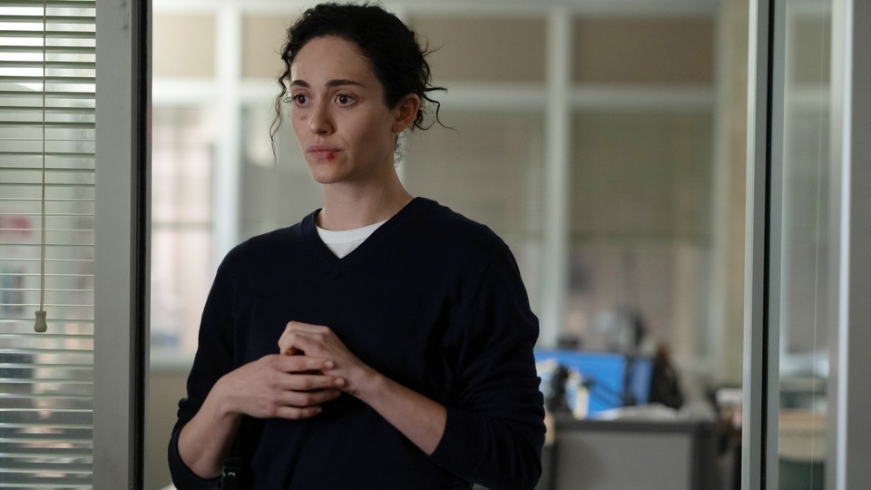

# A Time for Female Monsters

> **作者**: Sophie Gilbert | **发布日期**: 2026-08-20 | **来源**: [TheAtlantic](https://www.theatlantic.com/culture/2026/08/furious-hulu-tv-review-female-monsters/688313/)

*Sarah Shatz / Hulu / Disney / Everett Collection*

---

The crime drama of the year is all about anger that has metastasized into something darker.

Most dramas about murderous women save the revelations of deviance for the end, after parceling out uncertainty and complication. Furious does things exactly backwards. Here is a monster, the Hulu series announces with its very first scene, during which an unblinking blonde in a Halloween cat mask kills a man by forcibly injecting him with fentanyl, which she keeps in a bedazzled silver tin. “I don’t really like listening to you,” she whispers, as he gasps for breath. “I don’t like the sounds you’re making. But I love your smile.” After he dies, she reaches for a bowl of candy corn, which she eats slowly and with care, piece by piece.

The scene felt confrontational to me at first watch, as though it were daring me to switch it off in discomfort. But why? Crime shows begin with violated women all the time—the naked, bloodied female corpse is such a staple in the genre’s visual language that viewers hardly notice it. Why is a scene of a young woman luxuriating in her sadistic treatment of a man so unsettling? As Furious goes on, it offers up more murders, but also more context for why this woman, Catherine (played by Lola Petticrew), is doing what she’s doing—and although she remains monstrous, the show shades in her full, horrifying humanity.

Furious—created by the writer Liz Meriwether and executive-produced by the actor Emmy Rossum, who also stars in it—is preoccupied with elemental ideas about violence and transformation, which juxtapose nicely with the more conventional framework of a police procedural. Rossum plays Alice, a former detective turned FBI grunt who’s dragged into investigating Catherine’s latest victim by her former partner Danny (Scoot McNairy). Like Catherine, Alice has been warped by trauma; her previous boyfriend, also a police officer (Jake Lacy), beat her, and all of her colleagues except Danny froze her out when she finally reported him. She uses apps to find sexual partners who will agree to beat her, role-playing her own abuse. In one episode, she outright refuses to shower, a tendency that seems off-putting until her sister reveals to Danny that her ex used to drag her from the shower to hit her, sometimes leaving her passed out under the running water.

Early on, the show evokes Medusa—whose rape at the hands of Poseidon saw her turned into a hideous Gorgon with snakes for hair—in reference to Catherine, whose own history is at least as cruel; there are also multiple references to the Furies, winged goddesses of retribution. Nora Washington (Quincy Tyler Bernstine), who runs the FBI sex-crimes division that Alice is trying to get assigned to, describes the room that agents use to review child-sexual-abuse material as “the darkest pit of Hades down deep in the bottom of the Earth.” Washington’s perpetual rage, and her attempts to quash it with emotional detachment and tequila, suffuses every scene she’s in.

Watching the show, I remembered the moment, almost a decade ago, when women’s anger became the subject of countless books and news stories—when many people expressed hope that it might have a revolutionary power. Instead, during a period when women have lost fundamental rights and have been confronted with the apparent futility of their protests, cultural narratives about women’s rage no longer have the luxury of optimism. Instead, anger has metastasized into vengeance, inflamed and out for blood.

While watching Furious, I happened to read Honey, by Imani Thompson: a wry and erudite take on the dark-academia genre about a Ph.D. candidate at Cambridge named Yrsa (derived from an Old Norse word for “furious”) who—almost accidentally—becomes a serial killer. Yrsa’s journey toward murder begins casually one day, when she tips a bee into the lemonade of an older male colleague who has betrayed Yrsa’s friend and stolen credit for the research project they were working on together. When the bee stings the man, who’s allergic to them, Yrsa watches while he chokes to death, observing “the theatrics of the wheezing man. The red-hot raspberry of his face.” When he falls to the ground, she gets onto her knees and strokes his hair. Afterward, she eats ice cream. Murder in the book becomes associated with sweetness and satiation. In dull moments after the man’s death, Yrsa replays the scene in her mind, and it fills her up.

Thompson wanted to write about a female serial killer, she said in one interview, because “we always see the woman as a victim,” in ways that are often glamorized. But Yrsa is also working on a Ph.D. about “Afropessimism and Black women’s discourses on their liberation,” and the book is studded with references to academics and writers who consider the heritage of violence. Yrsa often uses critical theory to try to justify what she’s doing: She cites thinkers such as Audre Lorde, Stuart Hall, and Saidiya Hartman, and fixates particularly on Hartman’s essay Venus in Two Acts, about all of the nameless murdered Black girls obliterated by history. How, Hartman wonders, can she “revisit the scene of subjection without replicating the grammar of violence?” In Yrsa’s mind, this question becomes twisted into the idea that punishing abusive men might redress some of the imbalance.

Yrsa does so in part by tracking down men outed on a site where sex workers name their most vicious clients. She injects one with a fatal dose of heroin and enjoys doing it, much like Catherine, savoring the memory of “that moment when she realized he was vulnerable only to her. That moment when she could do anything.” Late in Furious, Catherine tells Alice about how her brutal actions feel to her: “It’s power, watching someone die.” She adds, “When I’m killing someone, it’s like I’m eating him, like I’m swallowing him, like everything he’s ever done is disappearing inside me.” She is, it turns out, pursuing and murdering the men who hurt her when she was an underage teenager being trafficked for sex, starting with the pimp who beat, raped, and starved her. Her pleasure in killing, unlike Yrsa’s, is derived not from the act itself but from neutralizing what these men did to her.

The show is a fascinating pivot for Meriwether, who previously created the beloved offbeat Fox comedy New Girl and who most recently co-created the FX series Dying for Sex, about a woman who receives a fatal cancer diagnosis and decides to pursue sexual pleasure in her final months. There are moments in Furious that come off as morbidly comic—an FBI agent played by Rob Yang shouts “Boom!” at inopportune moments, and a witness with muscular dystrophy (Steve Way) needles police officers with his wheelchair—but more often, the series is pitch-dark. The show was shot with anamorphic lenses to foster a moody, surveillant feeling, evoking David Fincher more than Law & Order: Special Victims Unit.The point seems to be to use the visual language of neo-noir while shifting the focus to characters who don’t usually draw the camera’s attention.

Furious has been referred to as a “crime drama for a post-Epstein world,” and one of the characters—a billionaire with similar proclivities who seems to operate with impunity—seems modeled after the serial sex offender. “The ones who are really to blame don’t get caught, never, never,” Nora tells Alice. “You think you’re ever gonna catch anyone who matters?” But Meriwether, in an interview with Vulture,noted that she was “much more interested in the experience of the women than I am with the experience of the perpetrator,” and the show is especially curious regarding women who become compelled to victimize others. What does living with that kind of trauma and injustice do to a person’s psyche? “My memory sucks,” Catherine says in one scene, trying to piece together fragments of her past life into a coherent shape. “It’s ’cause I got strangled so much.”

The actors in Furious are uniformly brilliant: Bernstine’s achingly blasé Nora; McNairy’s frowsy, compassionate Danny; Rossum’s magnetic and volatile Alice. Petticrew turns Catherine’s postured immaturity into something vividly repulsive—she’s constantly restaging the girlhood she never got to have, but in an unavoidably corrupted way. By the show’s end, we can better understand her, even if we’re lucky enough not to have her tolerance for cruelty. What happens to anger when it can’t be absorbed? We can only consider whether there’s truth in Nora’s assertion that only evil can really fight evil, and that in order to defend humanity, you occasionally have to sacrifice your own.

When you buy a book using a link on this page, we receive a commission. Thank you for supporting The Atlantic.
