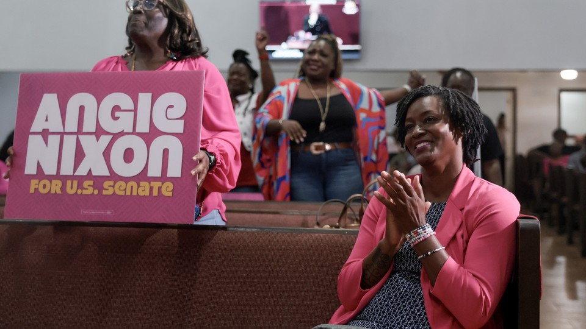

# The ‘Resistance’ Is Over

> **作者**: David Frum | **发布日期**: 2026-08-20 | **来源**: [TheAtlantic](https://www.theatlantic.com/ideas/2026/08/democratic-primaries-left-dsa-trump/688327/)

*Joe Raedle / Getty*

---

The insurgent left cares more about its own factional agenda than the president’s threats to democracy.

Is Donald Trump over? Can we all now relax and move on to the next thing?

That’s the message from a significant portion of Democratic primary voters. Just as Trump is bored with Iran and the economy and wants to play with monuments and gilding, so too are many Democratic primary voters in Florida and elsewhere bored with Trump and eager to play factional politics instead.

The political statistician Nate Silver summed up the mood on X today: “It’s kind of been a rough set of primaries for Heroes of the Resistance 1.0.” Silver then listed stalwart anti-Trumpers who have lost their contests in 2026 and concluded, “People want to move on.”

America is a fast-moving, dynamic country. It’s tough for Americans to stay focused on a single thing, even if that single thing is the threat to American democracy. As the celebrity spokesmodel Heidi Klum tells the audience on Project Runway: “In fashion, one day you’re in, and the next day, you’re out.” This law also apparently applies to Democratic candidates who took serious risks to challenge Trump. The resistance, it seems, is out.

The far left of the Democratic Party has never been as energized as the party’s center about Trump and democracy. A 2017 analysis in The Washington Post suggested that between 6 and 12 percent of people who voted for Bernie Sanders in the 2016 Democratic primaries voted for Trump in the general election. With many careful caveats, the analysis observed that these voters exceeded Trump’s margin of victory.

In 2024, likewise, some leaders of the activist left noisily defected from the Harris-Walz ticket. For many of them, opposing Israel’s war against Hamas in Gaza mattered more than stopping a Trump presidency at home. The effect of this mobilization on the left is hard to measure, but The Nation was quick to insist that the Biden administration’s Gaza policy likely cost the party Michigan, because many Arabs and Muslims swung toward Trump. The article did not seriously consider whether culture politics, such as Kamala Harris’s support for transgender rights, influenced socially conservative Arab and Muslim voters, even though the city of Dearborn has long been a locus of anti-gay grassroots politics in the state. The claim that Harris lost to Trump because of Gaza may well be activist self-medication, but this kind of story about the election is telling.

This year, the dulling of anti-Trump impetus on the left is even more visible and consequential. Again and again, primary voters have made choices that subordinate general-election concerns to factional power-seeking. Democratic leaders—the dreaded “Establishment”—have promoted highly plausible candidates for statewide office in North Carolina, Texas, and other suddenly competitive states. But the insurgent left has again and again upset leadership plans with high-risk choices to serve its own factional agenda, putting at risk once-probable Senate victories in Maine, Michigan, and some House seats too.

That agenda seems to argue as follows:

Donald Trump is not that important. His attacks on the rule of law, on free and peaceful elections, on U.S. alliances, on trade and markets—those are all mere symptoms of a disease, not the disease itself. Political energy should be focused on treating the deeper problems of which Trump is a mere passing expression, even at the risk of losing the Senate in 2026 and forfeiting the presidency in 2028. “Winning” with Chuck Schumer–approved candidates is no win at all. Better to risk losing than to “win” on Schumer’s terms.

The Democratic left is making a complicated—and quite ironic—internal gamble here. The faction’s efforts to hijack the larger party to their own unpopular causes will work only if they can convince Democratic voters that Trump is not the most important and urgent problem facing Americans. Yet the only reason Democratic centrists would coalesce around the party’s leftist candidates in November is if they believe in the absolute urgency of stopping Trump.

Many of the far-left candidates are aggressively obnoxious from a centrist’s point of view. Centrist Democrats are not socialists, not revolutionaries, and not disposed to blame Zionist conspiracies for every trouble in American life, including police brutality and urban gentrification. Why on earth would centrist Democrats in Michigan vote for a radical leftist who calls most Democrats hypocrites when the other choice on the ballot is a Republican campaigning on reducing housing costs by simplifying the government-approval process?

In Florida last night, Democrats rejected Alex Vindman, the former national-security official who at immense personal and career risk blew the whistle on Trump’s 2019 plot to blackmail Ukrainian President Volodymyr Zelensky into fabricating campaign dirt against Joe Biden. Voters chose instead Angie Nixon, who campaigned as an explicit “socialist” in a state that is home to hundreds of thousands of Cuban American and Venezuelan American refugees from socialism, and who ran alongside anti-Israel figures such as Oliver Larkin and Rashida Tlaib in a state with the nation’s third-biggest Jewish population.

From a Democratic-centrist point of view, if Trump’s attacks on the rule of law are not a supreme and imperative threat, then a Republican Senate majority led by John Thune is an endurable nuisance. Far-left candidates have a chance in the general election only if Democrats believe that Trump is the supreme and imperative threat.

The remains of the suddenly unfashionable Democratic resistance can only hope that Democrats in Texas, North Carolina, Michigan, and elsewhere will rise above the factional politics and remember in November what, and who, remains the most pressing danger to the nation’s law and democracy.
