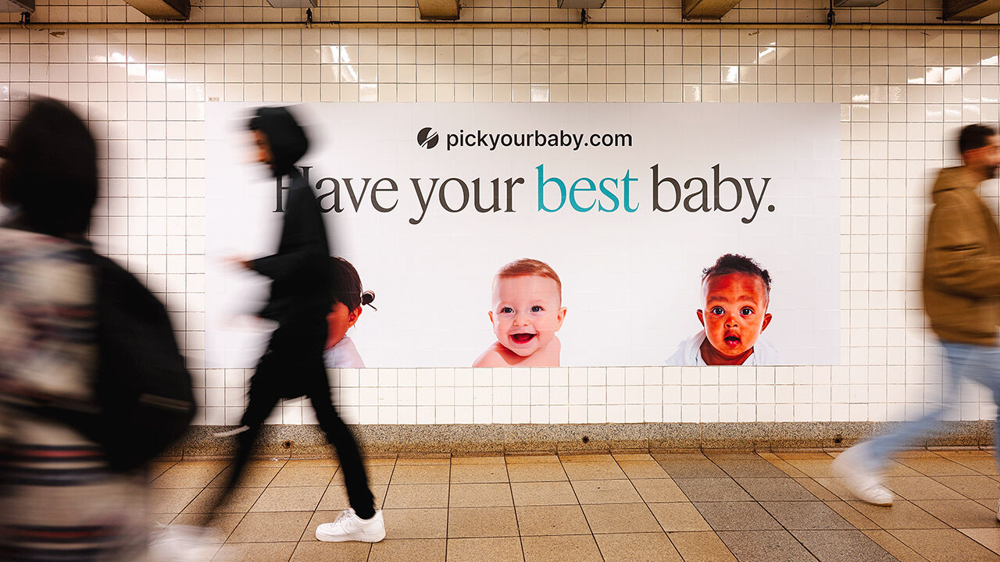

# In praise of designer-ish babies

> **作者**: Unknown | **发布日期**: 2026-08-20 | **来源**: [TheEconomist](https://www.economist.com/leaders/2026/08/13/in-praise-of-designer-ish-babies)

*photograph: 28ninetyfive*

---

H
aving transformed human life, Silicon Valley is now coming for birth. A spate of startups offer screening services that allow couples having children via in-vitro fertilisation (ivf) to assess embryos based on their genetic risk of diseases such as breast cancer and diabetes. Some venture further into science-fiction territory, providing scores for iq and height, or even eye and hair colour.

Both his supporters and detractors dehumanised the tragic fabulist

Walloping the global trading system is no way to help Ukraine

Five years after America’s exit, the Afghan regime is not going anywhere
