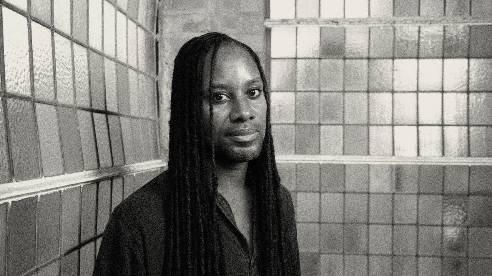

# Jason Arday was treated as a symbol, not a man

> **作者**: Unknown | **发布日期**: 2026-08-20 | **来源**: [TheEconomist](https://www.economist.com/leaders/2026/08/19/jason-arday-was-treated-as-a-symbol-not-a-man)

*photograph: christian sinibaldi/eyevine/the economist*

---

O
n august 14th Jason Arday was found dead, apparently of suicide, at his home in London. For those who loved this 41-year-old Cambridge professor, it is a tragedy. For the world it is a warning of the destruction bad ideas can wreak.

Couples should be allowed to select embryos on the basis of both disease resistance and IQ

Walloping the global trading system is no way to help Ukraine

Five years after America’s exit, the Afghan regime is not going anywhere
