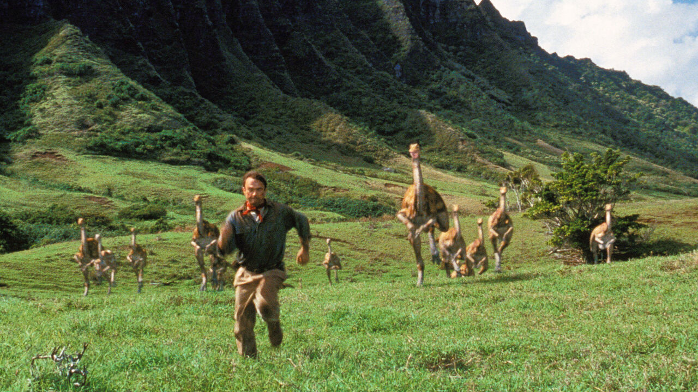

# Rock-solid evidence for the origins of birds

> **作者**: Unknown | **发布日期**: 2026-08-20 | **来源**: [TheEconomist](https://www.economist.com/science-and-technology/2026/08/19/rock-solid-evidence-for-the-origins-of-birds)

*photograph: alamy*

---

H
ow do you know what a dinosaur ate? Guts rot away after death, so the details of dinosaur digestion remain obscure. The best indicators are teeth. Sharp, pointed teeth probably ripped chunks of flesh off prey for swallowing whole. Robust grinding surfaces suggest lots of chewing was involved. Yet many dinosaurs belonging to a group called the theropods, which gave rise to birds, lost their teeth altogether and evolved beaks. This has made it hard to work out what they ate and how they digested it.

The sound of giant tractors may replace dynamite

A trial over the Atlantic aims to show how
